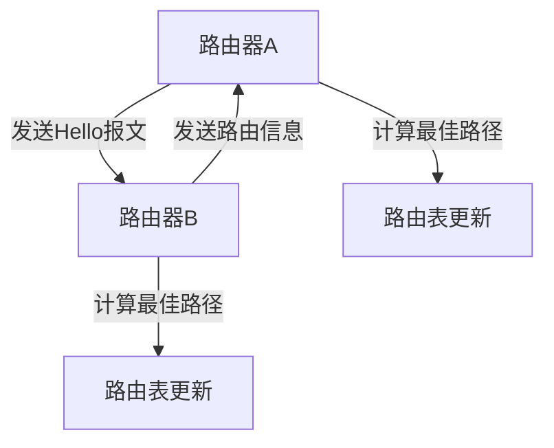

# 动态路由

动态路由是现代网络中的一种关键技术，它允许路由器自动学习和更新路由表，而无需手动配置。与静态路由相比，动态路由更加灵活，能够适应网络拓扑的变化。本文将详细介绍动态路由的概念、工作原理以及实际应用场景。

## 什么是动态路由？

动态路由是指路由器通过动态路由协议（如RIP、OSPF、EIGRP等）自动学习和更新路由表的过程。与静态路由不同，动态路由不需要管理员手动配置每一条路由，而是通过路由器之间的通信来交换路由信息，从而实现网络的自动优化和故障恢复。

:::tip
动态路由特别适用于大型网络，因为手动配置静态路由在这些环境中会变得非常繁琐且容易出错。
:::

## 动态路由的工作原理

动态路由的核心在于路由器之间通过路由协议交换信息。这些信息包括网络的可达性、路径的度量值（如跳数、带宽、延迟等）以及其他相关参数。路由器根据这些信息计算出最佳路径，并更新自己的路由表。

### 动态路由协议的类型

常见的动态路由协议包括：

1. **RIP（Routing Information Protocol）**：一种基于距离向量的路由协议，使用跳数作为度量值。
2. **OSPF（Open Shortest Path First）**：一种基于链路状态的路由协议，使用Dijkstra算法计算最短路径。
3. **EIGRP（Enhanced Interior Gateway Routing Protocol）**：一种混合型路由协议，结合了距离向量和链路状态的特点。

### 动态路由的工作流程

1. **邻居发现**：路由器通过发送Hello报文来发现相邻的路由器。
2. **路由信息交换**：路由器之间交换路由信息，包括网络的可达性和路径的度量值。
3. **路由计算**：路由器根据收到的路由信息，使用特定的算法（如Dijkstra算法）计算出最佳路径。
4. **路由表更新**：路由器将计算出的最佳路径更新到自己的路由表中。

## 动态路由的实际应用

### 案例1：企业网络

在一个大型企业网络中，可能有数百台设备分布在不同的楼层或建筑物中。使用动态路由协议（如OSPF）可以自动调整路由，确保数据包能够通过最佳路径传输，即使网络拓扑发生变化（如新增设备或链路故障）。

### 案例2：互联网服务提供商（ISP）

互联网服务提供商通常使用BGP（Border Gateway Protocol）来管理不同自治系统（AS）之间的路由。BGP是一种动态路由协议，能够处理大规模的路由信息，并确保数据包在全球范围内高效传输。

## 总结

动态路由是现代网络中不可或缺的一部分，它通过自动学习和更新路由表，极大地简化了网络管理，并提高了网络的可靠性和灵活性。无论是企业网络还是互联网服务提供商，动态路由都发挥着至关重要的作用。

## 附加资源与练习

- **练习1**：尝试在模拟器（如GNS3或Packet Tracer）中配置RIP协议，并观察路由表的更新过程。
- **练习2**：研究OSPF协议的工作原理，并尝试在模拟器中配置一个多区域OSPF网络。

:::note
如果你对动态路由协议有更深入的学习需求，可以参考RFC文档或相关的网络技术书籍。
:::