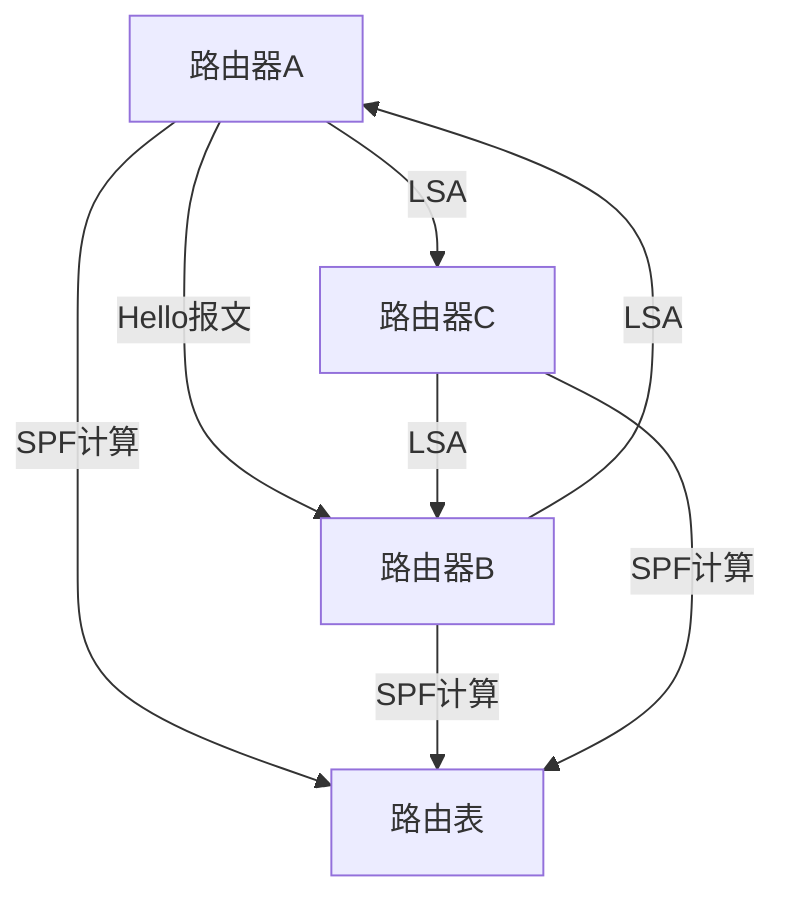

# 链路状态路由协议

链路状态路由协议（Link-State Routing Protocol）是一种用于计算机网络中动态路由的协议。它通过让每个路由器了解整个网络的拓扑结构，来计算最佳路径。与距离矢量路由协议不同，链路状态路由协议提供了更快的收敛速度和更高的网络稳定性。

## 什么是链路状态路由协议？

链路状态路由协议的核心思想是让每个路由器都维护一个关于整个网络的拓扑图。每个路由器通过发送链路状态通告（LSA）来告知其他路由器它的邻居和链路状态。这些信息被收集到一个链路状态数据库（LSDB）中，然后使用最短路径优先（SPF）算法来计算到每个目的地的最佳路径。

:::note
**关键点：**
- 每个路由器都知道整个网络的拓扑结构。
- 使用最短路径优先（SPF）算法计算最佳路径。
:::

## 链路状态路由协议的工作原理

1. **发现邻居**：路由器通过发送Hello报文来发现它的邻居路由器。
2. **交换链路状态信息**：路由器通过链路状态通告（LSA）来交换链路状态信息。
3. **构建链路状态数据库（LSDB）**：每个路由器都会收集所有的LSA，并构建一个链路状态数据库。
4. **计算最短路径**：使用Dijkstra的最短路径优先（SPF）算法来计算到每个目的地的最短路径。
5. **更新路由表**：根据计算出的最短路径更新路由表。

## 实际案例

假设我们有一个由三个路由器组成的网络：路由器A、路由器B和路由器C。每个路由器都连接到其他两个路由器。路由器A首先发送Hello报文，发现它的邻居路由器B和C。然后，路由器A发送LSA，告知路由器B和C它的链路状态。路由器B和C也会发送它们的LSA。最终，每个路由器都会有一个完整的链路状态数据库，并使用SPF算法计算出到每个目的地的最短路径。

:::tip
**提示：** 在实际网络中，链路状态路由协议通常用于大型网络，因为它提供了更快的收敛速度和更高的网络稳定性。
:::

## 总结

链路状态路由协议通过让每个路由器了解整个网络的拓扑结构，来计算最佳路径。它使用最短路径优先（SPF）算法来确保数据包以最有效的方式传输。链路状态路由协议在网络中广泛应用，特别是在需要快速收敛和高稳定性的环境中。

## 附加资源

- [OSPF协议详解](https://example.com/ospf)
- [IS-IS协议介绍](https://example.com/isis)
- [Dijkstra算法](https://example.com/dijkstra)

## 练习

1. 描述链路状态路由协议与距离矢量路由协议的主要区别。
2. 解释SPF算法在链路状态路由协议中的作用。
3. 在一个由四个路由器组成的网络中，绘制链路状态数据库的拓扑图，并使用SPF算法计算最短路径。

:::caution
**注意：** 在实际操作中，确保网络中的所有路由器都配置正确，以避免路由环路和其他网络问题。
:::