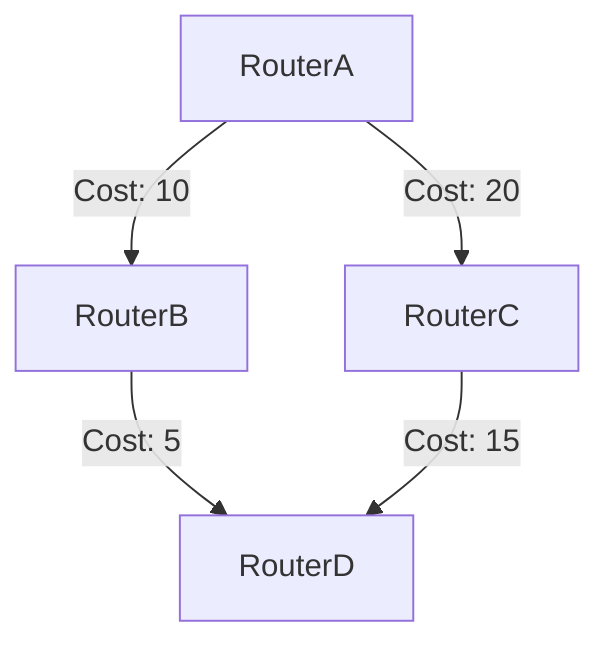

# OSPF协议

## 介绍

OSPF（Open Shortest Path First，开放最短路径优先）是一种链路状态路由协议，广泛用于大型企业网络和互联网服务提供商（ISP）中。OSPF通过计算最短路径树（SPT）来确定数据包的最佳传输路径，并使用Dijkstra算法来实现这一目标。

OSPF协议的主要特点包括：
- **快速收敛**：当网络拓扑发生变化时，OSPF能够快速重新计算路由。
- **分层设计**：OSPF支持区域划分，允许网络管理员将大型网络划分为多个区域，从而减少路由更新的传播范围。
- **支持VLSM**：OSPF支持可变长子网掩码（VLSM），允许更灵活地分配IP地址。

## OSPF的工作原理

### 1. 邻居发现

OSPF路由器通过发送Hello报文来发现相邻的OSPF路由器。Hello报文包含路由器的ID、优先级、网络掩码等信息。如果两个路由器在同一个子网中，并且配置了相同的OSPF区域ID，它们就会成为邻居。

```plaintext
RouterA -> Hello -> RouterB
```

### 2. 链路状态数据库（LSDB）

每个OSPF路由器都会维护一个链路状态数据库（LSDB），其中包含了网络中所有路由器的链路状态信息。这些信息通过链路状态通告（LSA）在OSPF区域内传播。

### 3. 最短路径树（SPT）

OSPF使用Dijkstra算法计算最短路径树（SPT），以确定到达每个目的地的最佳路径。SPT的根节点是计算该树的路由器本身。



### 4. 路由表生成

根据SPT，OSPF路由器生成路由表，其中包含到达每个目的地的最佳路径和相应的下一跳地址。

## 实际应用场景

### 企业网络

在一个大型企业网络中，OSPF通常用于连接多个分支机构。通过将网络划分为多个OSPF区域，可以减少路由更新的传播范围，从而提高网络的稳定性和性能。

```plaintext
总部（Area 0） -- 区域边界路由器（ABR） --> 分支机构（Area 1）
```

### 互联网服务提供商（ISP）

ISP通常使用OSPF来管理其核心网络。OSPF的分层设计和快速收敛特性使其非常适合处理大规模网络中的动态路由需求。

## 总结

OSPF是一种功能强大且灵活的路由协议，适用于各种规模的网络。通过理解OSPF的基本概念和工作原理，网络管理员可以更好地设计和维护复杂的网络环境。

## 附加资源与练习

- **练习**：尝试在模拟器中配置一个简单的OSPF网络，观察路由表的生成过程。
- **资源**：阅读RFC 2328，了解OSPF协议的详细规范。

:::tip
在实际配置OSPF时，确保所有路由器的区域ID和网络掩码配置一致，以避免邻居关系无法建立的问题。
:::