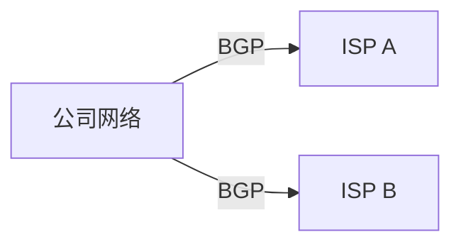

# BGP协议

BGP（Border Gateway Protocol，边界网关协议）是一种用于在互联网中交换路由信息的协议。它是互联网的核心协议之一，负责在不同自治系统（AS，Autonomous System）之间传递路由信息。BGP的主要目标是确保数据包能够高效、可靠地从源地址传输到目标地址。

## 什么是BGP？

BGP是一种路径向量协议，用于在不同的自治系统（AS）之间交换路由信息。每个自治系统是一个由单一管理机构控制的路由器集合，通常代表一个组织或服务提供商。BGP的主要任务是找到从源到目标的最佳路径，并确保数据包能够沿着这条路径传输。

:::note
BGP协议通常用于大型网络，如互联网服务提供商（ISP）之间的路由交换。
:::

## BGP的工作原理

BGP通过建立TCP连接（端口179）来交换路由信息。两个BGP路由器之间建立连接后，它们会交换完整的路由表。之后，只有路由表发生变化时，才会发送更新消息。

### BGP消息类型

BGP使用以下几种消息类型：

1. **OPEN**：用于建立BGP对等体之间的连接。
2. **UPDATE**：用于交换路由信息。
3. **KEEPALIVE**：用于保持连接活跃。
4. **NOTIFICATION**：用于报告错误并关闭连接。

### BGP路由选择

BGP使用多种属性来决定最佳路径。以下是一些关键的BGP属性：

- **AS_PATH**：记录了路由经过的自治系统列表。
- **NEXT_HOP**：指定了下一跳的IP地址。
- **LOCAL_PREF**：本地优先级，用于在本地AS内选择最佳路径。
- **MED（Multi-Exit Discriminator）**：用于在多个出口点之间选择最佳路径。

:::tip
BGP路由选择过程非常复杂，通常涉及多个属性的比较和权衡。
:::

## BGP的实际应用

### 案例1：多宿主网络

假设一个公司连接到两个不同的ISP（ISP A和ISP B）。公司希望在某些情况下通过ISP A传输数据，而在其他情况下通过ISP B传输数据。BGP可以帮助公司实现这种多宿主连接，并根据网络状况动态选择最佳路径。



### 案例2：流量工程

大型ISP使用BGP进行流量工程，以优化网络性能。通过调整BGP属性（如LOCAL_PREF和MED），ISP可以控制流量如何通过其网络传输，从而避免拥塞并提高网络效率。

## BGP配置示例

以下是一个简单的BGP配置示例，展示了如何在Cisco路由器上配置BGP：

```bash
router bgp 65001
 neighbor 192.168.1.2 remote-as 65002
 network 10.0.0.0 mask 255.255.255.0
```

在这个示例中，路由器配置了BGP，并指定了一个邻居（192.168.1.2），该邻居属于AS 65002。路由器还通告了一个网络（10.0.0.0/24）。

:::caution
在实际配置BGP时，务必确保所有配置正确无误，以避免路由泄露或其他网络问题。
:::

## 总结

BGP是互联网中最重要的路由协议之一，负责在不同自治系统之间交换路由信息。通过理解BGP的基本概念、工作原理和实际应用，您可以更好地理解互联网的路由机制。

## 附加资源

- [RFC 4271 - A Border Gateway Protocol 4 (BGP-4)](https://tools.ietf.org/html/rfc4271)
- [BGP Best Practices](https://www.cisco.com/c/en/us/support/docs/ip/border-gateway-protocol-bgp/13753-25.html)

## 练习

1. 配置一个简单的BGP网络，模拟两个自治系统之间的路由交换。
2. 研究BGP属性（如AS_PATH、LOCAL_PREF等），并解释它们如何影响路由选择。

通过以上内容，您应该对BGP协议有了一个全面的了解。继续深入学习BGP的高级特性和配置技巧，将有助于您更好地掌握网络路由的核心技术。