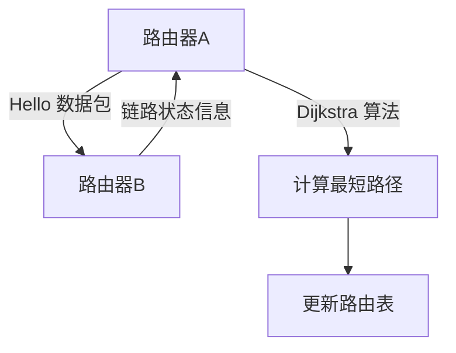
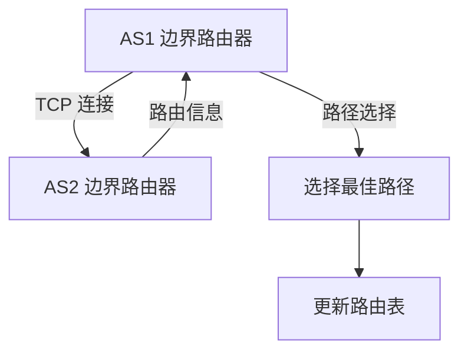

# 内部网关协议与外部网关协议

在网络通信中，路由协议是确保数据包能够正确传输的关键技术。根据其应用范围的不同，路由协议可以分为**内部网关协议（IGP，Interior Gateway Protocol）**和**外部网关协议（EGP，Exterior Gateway Protocol）**。本文将详细介绍这两种协议的区别、工作原理以及实际应用场景。

---

## 什么是内部网关协议（IGP）？

内部网关协议（IGP）用于在**同一个自治系统（AS，Autonomous System）**内部的路由器之间交换路由信息。自治系统是指由单一组织管理的一组网络设备，它们共享相同的路由策略。IGP 的主要目标是确保自治系统内部的数据包能够高效、准确地传输。

常见的 IGP 协议包括：
- **RIP（Routing Information Protocol）**：一种基于距离向量的协议，适用于小型网络。
- **OSPF（Open Shortest Path First）**：一种基于链路状态的协议，适用于中大型网络。
- **EIGRP（Enhanced Interior Gateway Routing Protocol）**：一种混合协议，结合了距离向量和链路状态的优点。

### IGP 的工作原理

IGP 的核心任务是计算从源路由器到目标路由器的最短路径。以 OSPF 为例，其工作流程如下：

1. **邻居发现**：路由器通过发送 Hello 数据包来发现相邻的路由器。
2. **链路状态信息交换**：路由器之间交换链路状态信息，构建网络的拓扑结构。
3. **最短路径计算**：使用 Dijkstra 算法计算到达目标网络的最短路径。
4. **路由表更新**：将计算出的最短路径更新到路由表中。

---

## 什么是外部网关协议（EGP）？

外部网关协议（EGP）用于在**不同自治系统之间**交换路由信息。它的主要任务是确保不同自治系统之间的数据包能够正确传输。EGP 的核心协议是 **BGP（Border Gateway Protocol）**，它是互联网中最重要的路由协议之一。

### EGP 的工作原理

BGP 的工作流程如下：

1. **建立邻居关系**：不同自治系统的边界路由器通过 TCP 连接建立邻居关系。
2. **路由信息交换**：邻居路由器之间交换路由信息，包括目标网络和路径属性。
3. **路径选择**：根据路径属性（如 AS 路径长度、优先级等）选择最佳路径。
4. **路由表更新**：将最佳路径更新到路由表中。

---

## IGP 与 EGP 的区别

| 特性                | IGP（内部网关协议）               | EGP（外部网关协议）               |
|---------------------|----------------------------------|----------------------------------|
| **应用范围**         | 同一自治系统内部                  | 不同自治系统之间                  |
| **主要协议**         | RIP、OSPF、EIGRP                 | BGP                              |
| **路由信息交换方式** | 基于链路状态或距离向量            | 基于路径属性                     |
| **复杂性**           | 相对简单                         | 复杂，需要考虑策略和安全性        |
| **适用场景**         | 企业内网、数据中心                | 互联网骨干网、ISP 之间的路由      |

---

## 实际应用场景

### 场景 1：企业网络中的 IGP
在一家大型企业的内部网络中，使用 OSPF 作为 IGP 协议。所有路由器通过 OSPF 交换路由信息，确保数据包能够在不同部门之间高效传输。

### 场景 2：互联网中的 EGP
在互联网中，ISP（互联网服务提供商）使用 BGP 协议与其他 ISP 交换路由信息。例如，当用户访问一个位于国外的网站时，BGP 会确保数据包通过最佳路径传输。

---

## 总结

- **IGP** 用于自治系统内部的路由，常见协议包括 RIP、OSPF 和 EIGRP。
- **EGP** 用于不同自治系统之间的路由，核心协议是 BGP。
- IGP 和 EGP 在网络中扮演着不同的角色，但它们共同确保了数据包的高效传输。

---

## 附加资源与练习

### 推荐资源
- [OSPF 协议详解](https://example.com/ospf)
- [BGP 协议入门指南](https://example.com/bgp)

### 练习
1. 使用模拟工具（如 GNS3 或 Packet Tracer）配置一个简单的 OSPF 网络。
2. 研究 BGP 的路径属性，并尝试解释它们如何影响路由选择。

:::tip
如果你对路由协议感兴趣，建议深入学习 OSPF 和 BGP 的高级特性，如 OSPF 的区域划分和 BGP 的路由策略。
:::