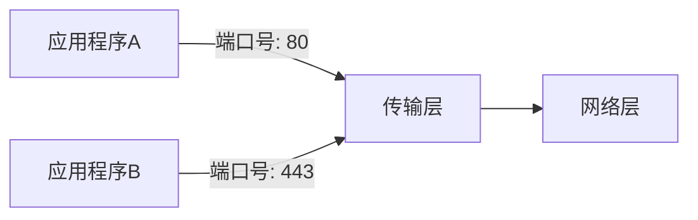

## 传输层概述

传输层是计算机网络体系结构中的关键组成部分，位于网络层之上，应用层之下。它的主要职责是为运行在不同主机上的应用程序提供端到端的通信服务。传输层通过确保数据的可靠传输、流量控制和错误检测等功能，使得应用程序能够高效、安全地交换数据。

### 传输层的作用

传输层的主要功能包括：

1. **端到端通信**：传输层负责在源主机和目标主机之间建立逻辑连接，确保数据能够正确地从发送方传输到接收方。
2. **可靠数据传输**：通过确认、重传和校验等机制，传输层确保数据在传输过程中不会丢失或损坏。
3. **流量控制**：传输层通过流量控制机制，防止发送方发送数据过快，导致接收方无法处理。
4. **多路复用和多路分解**：传输层允许多个应用程序同时使用网络服务，通过端口号将数据正确地传递给相应的应用程序。

### 传输层协议

传输层主要有两种协议：**传输控制协议（TCP）** 和 **用户数据报协议（UDP）**。

- **TCP**：提供可靠的、面向连接的服务。它通过三次握手建立连接，确保数据的顺序和完整性。TCP适用于需要高可靠性的应用，如网页浏览、文件传输等。
- **UDP**：提供无连接的服务，传输速度快，但不保证数据的可靠性和顺序。UDP适用于实时性要求高的应用，如视频流、在线游戏等。

### 实际应用场景

#### 1. 网页浏览（TCP）

当你访问一个网站时，浏览器会通过TCP协议与服务器建立连接。TCP确保网页数据能够完整、有序地传输到你的设备上。

```python
# 示例：使用Python的socket库建立TCP连接
import socket

# 创建TCP套接字
sock = socket.socket(socket.AF_INET, socket.SOCK_STREAM)

# 连接到服务器
server_address = ('www.example.com', 80)
sock.connect(server_address)

# 发送HTTP请求
request = b"GET / HTTP/1.1\r\nHost: www.example.com\r\n\r\n"
sock.sendall(request)

# 接收响应
response = sock.recv(4096)
print(response.decode())

# 关闭连接
sock.close()
```

#### 2. 在线游戏（UDP）

在线游戏通常使用UDP协议，因为它对延迟要求较高。UDP允许游戏客户端快速发送和接收数据包，即使偶尔丢失一些数据包，也不会对游戏体验造成太大影响。

```python
# 示例：使用Python的socket库发送UDP数据包
import socket

# 创建UDP套接字
sock = socket.socket(socket.AF_INET, socket.SOCK_DGRAM)

# 发送数据到服务器
server_address = ('game.example.com', 12345)
message = b"Player position update"
sock.sendto(message, server_address)

# 接收响应
data, server = sock.recvfrom(4096)
print(data.decode())

# 关闭套接字
sock.close()
```

### 传输层的工作原理

传输层通过端口号来区分不同的应用程序。每个应用程序在传输层上都有一个唯一的端口号，数据包通过端口号被正确地传递给相应的应用程序。



:::note
端口号的范围是0到65535，其中0到1023是众所周知的端口号，通常用于系统服务。
:::

### 总结

传输层在计算机网络中扮演着至关重要的角色，它通过提供端到端的通信服务，确保数据能够高效、可靠地传输。无论是浏览网页还是玩在线游戏，传输层都在背后默默地支持着这些应用的正常运行。

### 附加资源与练习

- **练习**：尝试使用Python的`socket`库编写一个简单的TCP服务器和客户端，模拟数据传输过程。
- **资源**：阅读更多关于TCP和UDP的详细文档，了解它们的具体实现和优化方法。

通过学习和实践，你将更深入地理解传输层的工作原理及其在实际应用中的重要性。