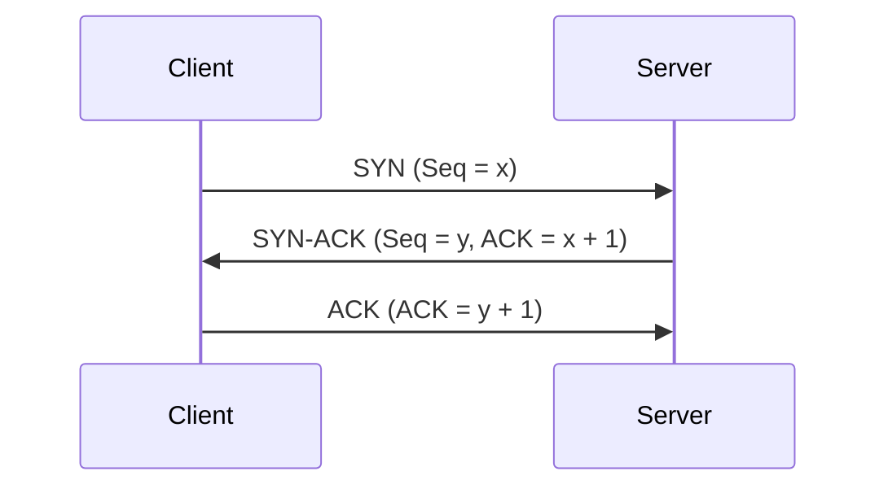
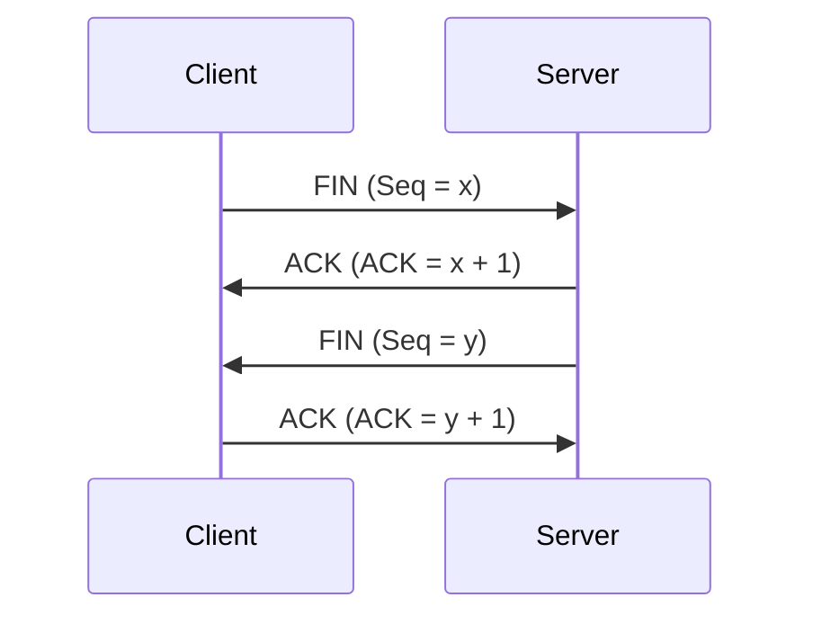

## 介绍

在计算机网络中，TCP（传输控制协议）是一种面向连接的协议，确保数据在传输过程中的可靠性和顺序性。为了实现可靠的通信，TCP 使用了一种称为“三次握手”的机制来建立连接，以及“四次挥手”的机制来终止连接。本文将详细解释这两个过程的工作原理及其重要性。

## 三次握手

三次握手是 TCP 连接建立的过程，确保客户端和服务器双方都准备好进行通信。以下是三次握手的步骤：

1. **第一次握手**：客户端向服务器发送一个 SYN（同步）包，其中包含一个随机生成的序列号（Seq = x）。这表示客户端请求建立连接。
2. **第二次握手**：服务器收到 SYN 包后，会回复一个 SYN-ACK（同步-确认）包。这个包包含服务器的序列号（Seq = y）以及对客户端序列号的确认号（ACK = x + 1）。
3. **第三次握手**：客户端收到 SYN-ACK 包后，会发送一个 ACK（确认）包，其中包含对服务器序列号的确认号（ACK = y + 1）。此时，连接正式建立。

:::note
**注意**：三次握手的目的是确保双方都能发送和接收数据，并且序列号同步。
:::

## 四次挥手

四次挥手是 TCP 连接终止的过程，确保双方都能安全地关闭连接。以下是四次挥手的步骤：

1. **第一次挥手**：客户端发送一个 FIN（结束）包，表示客户端没有更多数据要发送，请求关闭连接。
2. **第二次挥手**：服务器收到 FIN 包后，发送一个 ACK 包，确认收到客户端的关闭请求。
3. **第三次挥手**：服务器发送一个 FIN 包，表示服务器也没有更多数据要发送，请求关闭连接。
4. **第四次挥手**：客户端收到 FIN 包后，发送一个 ACK 包，确认收到服务器的关闭请求。此时，连接正式关闭。

:::tip
**提示**：四次挥手确保了双方都能安全地关闭连接，避免数据丢失或连接异常。
:::

## 实际应用场景

### 1. Web 服务器与浏览器
当你在浏览器中输入一个网址时，浏览器会与 Web 服务器建立 TCP 连接。这个过程就是通过三次握手完成的。当你关闭浏览器或离开页面时，连接会通过四次挥手安全关闭。

### 2. 文件传输
在 FTP（文件传输协议）中，客户端与服务器之间的文件传输也是通过 TCP 连接进行的。三次握手确保连接建立，而四次挥手确保文件传输完成后连接安全关闭。

## 总结

三次握手和四次挥手是 TCP 协议中建立和终止连接的关键步骤。通过三次握手，客户端和服务器可以确保双方都准备好进行通信；通过四次挥手，双方可以安全地关闭连接，避免数据丢失或连接异常。

理解这些概念对于学习网络编程和调试网络问题非常重要。希望本文能帮助你更好地掌握 TCP 连接的工作原理。

## 附加资源与练习

- **练习**：使用 Wireshark 等网络抓包工具，观察三次握手和四次挥手的过程。
- **资源**：
  - [TCP/IP 详解，卷1：协议](https://www.amazon.com/TCP-Illustrated-Vol-Addison-Wesley-Professional/dp/0201633469)
  - [RFC 793 - Transmission Control Protocol](https://tools.ietf.org/html/rfc793)

:::caution
**注意**：在实际应用中，网络延迟、丢包等问题可能会影响三次握手和四次挥手的过程。因此，理解这些机制对于解决网络问题至关重要。
:::