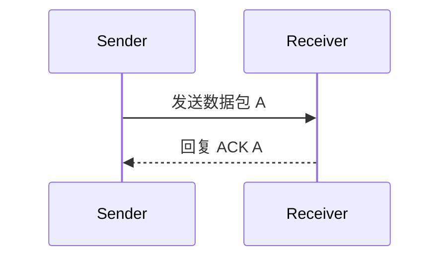
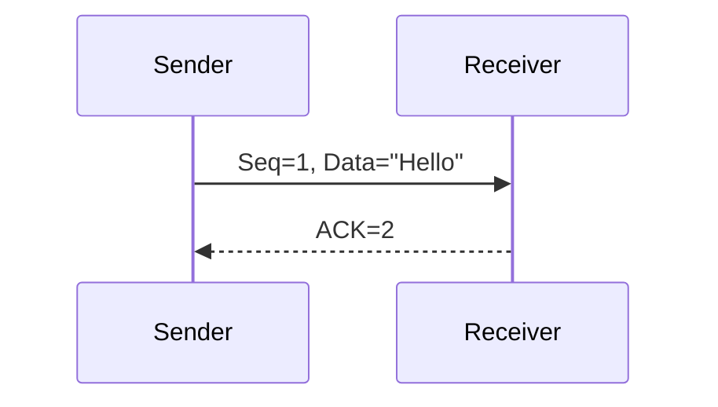

# TCP可靠传输机制

TCP（传输控制协议）是互联网中最常用的传输层协议之一，它的核心目标是为应用程序提供可靠的、面向连接的数据传输服务。本文将详细介绍TCP如何通过一系列机制确保数据的可靠传输。

## 什么是可靠传输？

在网络通信中，数据包可能会因为网络拥塞、硬件故障或其他原因丢失、重复或乱序。可靠传输机制的目标是确保数据能够准确无误地从发送方传递到接收方。TCP通过以下机制实现这一目标：

1. **确认应答（ACK）机制**
2. **超时重传**
3. **序列号和确认号**
4. **流量控制**
5. **拥塞控制**

接下来，我们将逐一讲解这些机制。

---

## 1. 确认应答（ACK）机制

TCP使用确认应答机制来确保数据包被成功接收。每当接收方收到一个数据包，它会向发送方发送一个确认（ACK）消息，表示数据已成功接收。

### 示例
假设发送方发送了数据包`A`，接收方收到后回复`ACK A`。如果发送方没有收到`ACK A`，它会认为数据包丢失并重新发送。

:::note
如果发送方在一定时间内没有收到ACK，它会触发**超时重传**机制。
:::

---

## 2. 超时重传

超时重传是TCP确保数据可靠传输的重要机制。当发送方发送数据包后，会启动一个计时器。如果在计时器超时前没有收到ACK，发送方会重新发送该数据包。

### 实际案例
假设你在下载一个大文件时网络突然中断，TCP会检测到数据包丢失并重新发送，直到文件完整下载。

---

## 3. 序列号和确认号

TCP为每个数据包分配一个唯一的序列号（Sequence Number），接收方通过确认号（Acknowledgment Number）告诉发送方下一个期望接收的数据包序列号。

### 示例
- 发送方发送数据包`Seq=1, Data="Hello"`。
- 接收方回复`ACK=2`，表示期望接收序列号为2的数据包。

:::tip
序列号和确认号不仅用于确认数据包，还能解决数据包乱序的问题。
:::

---

## 4. 流量控制

流量控制机制通过滑动窗口（Sliding Window）来调节发送方的发送速率，避免接收方缓冲区溢出。

### 滑动窗口示例
- 接收方告诉发送方自己的窗口大小为`Win=1000`，表示可以接收1000字节的数据。
- 发送方根据窗口大小调整发送速率。

---

## 5. 拥塞控制

拥塞控制机制通过动态调整发送速率来避免网络拥塞。TCP使用以下算法实现拥塞控制：
- **慢启动（Slow Start）**
- **拥塞避免（Congestion Avoidance）**
- **快速重传（Fast Retransmit）**
- **快速恢复（Fast Recovery）**

### 实际案例
当网络拥塞时，TCP会减少发送速率，避免进一步加剧拥塞。例如，视频流媒体服务会根据网络状况动态调整视频质量。

---

## 总结

TCP通过确认应答、超时重传、序列号和确认号、流量控制以及拥塞控制等机制，确保了数据在网络中的可靠传输。这些机制共同作用，使得TCP成为互联网中最可靠的传输协议之一。

---

## 附加资源与练习

### 资源
- [RFC 793 - TCP协议规范](https://tools.ietf.org/html/rfc793)
- 《计算机网络：自顶向下方法》 - 第3章

### 练习
1. 使用Wireshark抓包工具，观察TCP数据包的序列号和确认号。
2. 编写一个简单的TCP客户端和服务器程序，模拟数据丢失和重传的场景。
3. 研究TCP拥塞控制算法，尝试用代码实现慢启动和拥塞避免。

:::caution
在实际编程中，确保正确处理TCP连接和异常情况，例如连接超时或数据包丢失。
:::