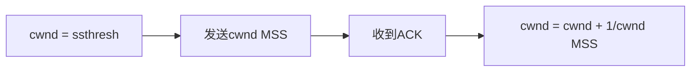

# TCP拥塞控制

## 介绍

TCP（传输控制协议）是互联网中最常用的传输层协议之一，它负责在不可靠的网络中提供可靠的数据传输。然而，当网络中的流量过大时，可能会导致网络拥塞，从而影响数据传输的效率和质量。为了避免这种情况，TCP引入了**拥塞控制**机制。

拥塞控制的主要目标是确保网络中的数据传输不会超过网络的承载能力，从而避免网络拥塞的发生。TCP通过动态调整发送数据的速率来实现这一目标。

## TCP拥塞控制的基本原理

TCP拥塞控制的核心思想是通过**拥塞窗口**（Congestion Window, cwnd）来控制发送方的数据发送速率。拥塞窗口的大小决定了发送方在没有收到确认（ACK）的情况下可以发送的最大数据量。

TCP拥塞控制主要包括以下几个阶段：

1. **慢启动（Slow Start）**
2. **拥塞避免（Congestion Avoidance）**
3. **快速重传（Fast Retransmit）**
4. **快速恢复（Fast Recovery）**

### 1. 慢启动（Slow Start）

在连接刚建立时，TCP发送方并不知道网络的承载能力，因此会从一个较小的拥塞窗口开始，并逐渐增加发送的数据量。这个过程称为**慢启动**。

在慢启动阶段，拥塞窗口的大小会随着每个收到的ACK呈指数增长。具体来说，每收到一个ACK，拥塞窗口的大小就会增加一个MSS（最大段大小）。

### 2. 拥塞避免（Congestion Avoidance）

当拥塞窗口达到一个阈值（称为**慢启动阈值**，ssthresh）时，TCP会进入**拥塞避免**阶段。在这个阶段，拥塞窗口的增长速度会放缓，从指数增长变为线性增长。具体来说，每收到一个ACK，拥塞窗口的大小会增加1/cwnd。

### 3. 快速重传（Fast Retransmit）

当发送方检测到数据包丢失时，通常会等待超时重传。然而，TCP引入了**快速重传**机制，可以在不等待超时的情况下快速重传丢失的数据包。

快速重传的触发条件是发送方收到3个重复的ACK（即接收方连续发送了3个相同的ACK，表示某个数据包丢失）。此时，发送方会立即重传丢失的数据包，而不必等待超时。

### 4. 快速恢复（Fast Recovery）

在快速重传之后，TCP会进入**快速恢复**阶段。在这个阶段，拥塞窗口的大小会被减半，并且TCP会继续发送数据，而不是重新进入慢启动阶段。这样可以更快地恢复网络的正常传输。

## 实际应用场景

TCP拥塞控制在现代互联网中有着广泛的应用。例如，在视频流媒体服务中，TCP拥塞控制可以确保视频数据在网络拥塞时仍然能够平稳传输，避免视频卡顿或中断。

另一个例子是文件传输。当用户下载大文件时，TCP拥塞控制可以动态调整传输速率，确保文件能够高效、可靠地传输，而不会导致网络拥塞。

## 总结

TCP拥塞控制是TCP协议中非常重要的机制，它通过动态调整发送方的数据发送速率来避免网络拥塞。拥塞控制主要包括慢启动、拥塞避免、快速重传和快速恢复四个阶段。理解这些机制对于掌握TCP的工作原理至关重要。

## 附加资源与练习

- **练习**：尝试编写一个简单的TCP客户端和服务器程序，观察在不同网络条件下拥塞窗口的变化。
- **资源**：阅读RFC 5681，了解TCP拥塞控制的详细规范。

:::tip
在实际编程中，你可以使用Wireshark等网络分析工具来捕获和分析TCP流量，观察拥塞控制机制的实际运行情况。
:::