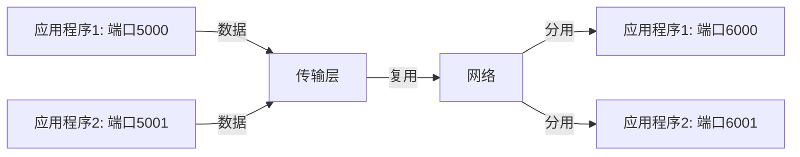

# 复用与分用

在计算机网络中，传输层的主要任务之一是为应用程序提供可靠的数据传输服务。为了实现这一目标，传输层引入了**复用（Multiplexing）**和**分用（Demultiplexing）**的概念。这两个概念是网络通信中不可或缺的部分，它们确保了数据能够正确地从一个应用程序传输到另一个应用程序。

## 什么是复用与分用？

### 复用（Multiplexing）
复用是指将多个应用程序的数据流合并到一个传输层协议（如TCP或UDP）中，并通过同一个网络连接发送出去。换句话说，复用允许多个应用程序共享同一个网络连接，从而提高了网络资源的利用率。

### 分用（Demultiplexing）
分用则是复用的逆过程。当数据到达目标主机时，传输层协议会根据数据包中的信息（如端口号）将数据正确地分发给相应的应用程序。分用确保了数据能够被正确地传递给目标应用程序。

## 复用与分用的工作原理

为了更好地理解复用与分用，我们可以通过一个简单的例子来说明。

假设有两台主机：主机A和主机B。主机A上有两个应用程序，分别使用端口号`5000`和`5001`。主机B上也有两个应用程序，分别使用端口号`6000`和`6001`。

1. **复用**：主机A上的两个应用程序通过各自的端口号将数据发送到传输层。传输层将这些数据合并，并通过同一个网络连接发送到主机B。
2. **分用**：当数据到达主机B时，传输层会根据数据包中的端口号将数据分发给相应的应用程序。例如，端口号`6000`的数据会被发送到使用`6000`端口的应用程序，端口号`6001`的数据则会被发送到使用`6001`端口的应用程序。



## 实际应用场景

### 1. 多任务网络通信
在现代操作系统中，多个应用程序可能同时需要访问网络资源。例如，你可能会同时打开一个网页浏览器和一个电子邮件客户端。复用与分用机制确保了这些应用程序能够共享同一个网络连接，而不会相互干扰。

### 2. 服务器处理多个客户端请求
在服务器端，复用与分用机制尤为重要。服务器通常需要同时处理多个客户端的请求。通过复用，服务器可以将多个客户端的数据流合并到一个网络连接中发送；通过分用，服务器可以将接收到的数据正确地分发给相应的客户端处理程序。

## 代码示例

以下是一个简单的Python代码示例，展示了如何使用`socket`库实现复用与分用。

```python
import socket

# 服务器端
def start_server():
    server_socket = socket.socket(socket.AF_INET, socket.SOCK_STREAM)
    server_socket.bind(('localhost', 6000))
    server_socket.listen(5)
    print("服务器已启动，等待连接...")
    
    while True:
        client_socket, addr = server_socket.accept()
        print(f"接收到来自 {addr} 的连接")
        data = client_socket.recv(1024)
        print(f"接收到数据: {data.decode()}")
        client_socket.close()

# 客户端
def send_data(port, message):
    client_socket = socket.socket(socket.AF_INET, socket.SOCK_STREAM)
    client_socket.connect(('localhost', port))
    client_socket.send(message.encode())
    client_socket.close()

# 启动服务器
start_server()

# 客户端发送数据
send_data(6000, "Hello from client 1")
send_data(6000, "Hello from client 2")
```

:::note
**注意**：在实际应用中，服务器通常会使用多线程或多进程来处理多个客户端的请求，以避免阻塞。
:::

## 总结

复用与分用是传输层中非常重要的概念，它们确保了多个应用程序能够共享同一个网络连接，并且数据能够被正确地传递给目标应用程序。通过理解复用与分用的工作原理，你可以更好地掌握网络通信的基本机制。

## 附加资源与练习

- **练习**：尝试修改上面的代码示例，使其能够处理多个客户端的并发请求。
- **资源**：阅读更多关于TCP/IP协议栈的资料，深入了解传输层的工作原理。

:::tip
**提示**：如果你对网络编程感兴趣，可以进一步学习如何使用`socket`库实现更复杂的网络应用。
:::