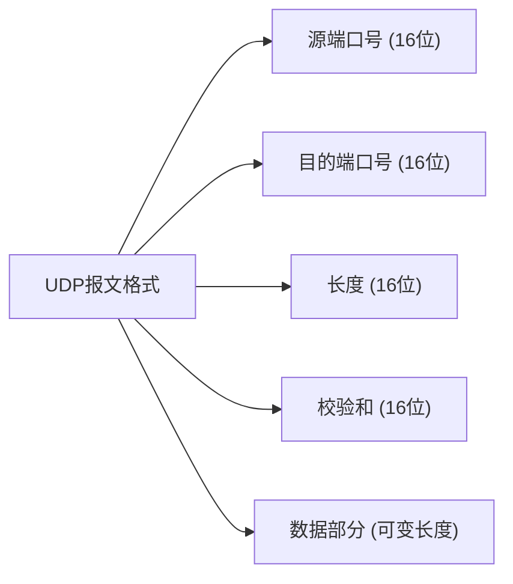

## 介绍

UDP（User Datagram Protocol，用户数据报协议）是一种无连接的传输层协议，它提供了一种简单的、不可靠的数据传输服务。与TCP不同，UDP不保证数据的可靠传输，也不提供流量控制、拥塞控制等机制。然而，UDP的简单性和低开销使其在实时应用（如视频流、在线游戏）中非常受欢迎。

UDP报文是UDP协议中传输数据的基本单位。了解UDP报文格式对于理解UDP协议的工作原理至关重要。

## UDP报文格式

UDP报文由两部分组成：**UDP头部**和**数据部分**。UDP头部包含四个字段，每个字段占2个字节（16位），总共8个字节。以下是UDP报文的格式：



### 字段详解

1. **源端口号（Source Port）**  
   源端口号标识发送方的端口。它是一个16位的字段，取值范围为0到65535。如果不需要指定源端口号，可以将其设置为0。

2. **目的端口号（Destination Port）**  
   目的端口号标识接收方的端口。它也是一个16位的字段，取值范围为0到65535。目的端口号用于将数据报传递到正确的应用程序。

3. **长度（Length）**  
   长度字段表示整个UDP报文的长度，包括头部和数据部分。它以字节为单位，最小值为8（仅头部），最大值为65535。

4. **校验和（Checksum）**  
   校验和字段用于检测UDP报文在传输过程中是否发生了错误。它是一个16位的字段，计算方法与IP协议的校验和类似。如果校验和计算失败，UDP报文将被丢弃。

5. **数据部分（Data）**  
   数据部分是UDP报文的有效载荷，包含实际传输的数据。数据部分的长度是可变的，最大长度为65527字节（65535减去8字节的头部）。

## 实际案例

### 案例1：DNS查询

DNS（域名系统）是UDP协议的一个典型应用。当你在浏览器中输入一个域名时，操作系统会向DNS服务器发送一个UDP报文，查询该域名对应的IP地址。DNS查询报文通常使用UDP协议，因为它的数据量较小，且需要快速响应。

```plaintext
源端口号: 12345
目的端口号: 53 (DNS服务端口)
长度: 40字节
校验和: 0x1234
数据部分: DNS查询数据
```

### 案例2：在线游戏

在线游戏通常使用UDP协议来传输实时数据，如玩家的位置、动作等。由于UDP的低延迟特性，它非常适合这种需要快速响应的场景。

```plaintext
源端口号: 54321
目的端口号: 27015 (游戏服务器端口)
长度: 32字节
校验和: 0x5678
数据部分: 玩家位置和动作数据
```

## 总结

UDP报文格式简单明了，由8字节的头部和可变长度的数据部分组成。UDP的不可靠性和低开销使其在实时应用中非常有用，如DNS查询、在线游戏等。尽管UDP不提供可靠性保证，但它的简单性和高效性使其在许多场景中成为首选。

## 附加资源

- [RFC 768 - User Datagram Protocol](https://tools.ietf.org/html/rfc768)
- 《计算机网络：自顶向下方法》 - 第3章 传输层

## 练习

1. 编写一个简单的UDP客户端程序，发送一个UDP报文到本地服务器的某个端口，并接收响应。
2. 使用Wireshark抓取一个DNS查询的UDP报文，分析其头部字段。
3. 解释为什么在线游戏通常使用UDP而不是TCP。

:::tip
如果你对UDP协议的其他方面感兴趣，可以继续学习UDP的多播和广播功能，这些功能在视频流和实时通信中非常有用。
:::