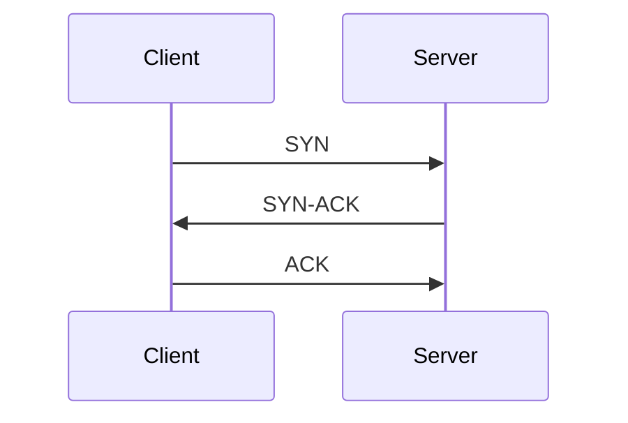
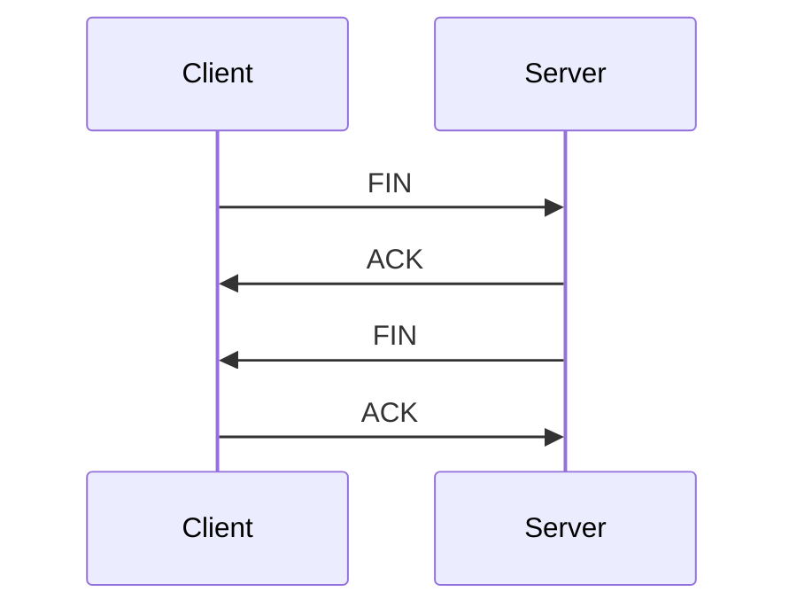

## 介绍

TCP（传输控制协议，Transmission Control Protocol）是互联网中最常用的传输层协议之一。它负责在网络上可靠地传输数据，确保数据包按顺序到达目的地，并且在传输过程中不会丢失或损坏。TCP是面向连接的协议，这意味着在数据传输之前，通信双方需要建立一个连接。

TCP协议广泛应用于Web浏览、电子邮件、文件传输等场景。理解TCP的工作原理对于学习网络编程和网络协议至关重要。

## TCP协议的核心特性

### 1. 面向连接
TCP是面向连接的协议。在数据传输之前，通信双方需要通过“三次握手”建立连接。这种机制确保了通信的可靠性。

### 2. 可靠性
TCP通过确认机制、重传机制和校验和来确保数据的可靠性。如果数据包在传输过程中丢失或损坏，TCP会自动重传。

### 3. 有序性
TCP确保数据包按发送顺序到达接收方。即使网络中的数据包乱序到达，TCP也会重新排序。

### 4. 流量控制
TCP通过滑动窗口机制实现流量控制，防止发送方发送数据过快，导致接收方无法处理。

### 5. 拥塞控制
TCP通过拥塞控制算法（如慢启动、拥塞避免等）来避免网络拥塞，确保网络的稳定性。

## TCP的三次握手

TCP连接的建立通过“三次握手”完成。以下是三次握手的步骤：

1. **SYN**：客户端向服务器发送一个SYN（同步）包，请求建立连接。
2. **SYN-ACK**：服务器收到SYN包后，回复一个SYN-ACK（同步-确认）包，表示同意建立连接。
3. **ACK**：客户端收到SYN-ACK包后，发送一个ACK（确认）包，表示连接已建立。



:::note
三次握手的目的是确保通信双方都准备好进行数据传输，并且双方都知道对方的初始序列号。
:::

## TCP的四次挥手

TCP连接的终止通过“四次挥手”完成。以下是四次挥手的步骤：

1. **FIN**：客户端发送一个FIN（结束）包，表示它不再发送数据。
2. **ACK**：服务器收到FIN包后，回复一个ACK包，确认收到FIN包。
3. **FIN**：服务器发送一个FIN包，表示它也不再发送数据。
4. **ACK**：客户端收到FIN包后，回复一个ACK包，确认收到FIN包，连接终止。



:::tip
四次挥手的目的是确保双方都同意终止连接，并且所有数据都已传输完毕。
:::

## TCP的实际应用

### 1. Web浏览
当你访问一个网站时，浏览器会通过TCP协议与服务器建立连接，请求网页内容。TCP确保网页数据完整、有序地传输到你的设备。

### 2. 文件传输
FTP（文件传输协议）使用TCP来传输文件。TCP的可靠性确保了文件在传输过程中不会丢失或损坏。

### 3. 电子邮件
SMTP（简单邮件传输协议）和POP3（邮局协议）都使用TCP来传输电子邮件。TCP确保邮件内容完整无误地到达收件人。

## 代码示例：使用Python创建TCP客户端和服务器

以下是一个简单的Python示例，展示了如何使用`socket`模块创建一个TCP服务器和客户端。

### TCP服务器

```python
import socket

# 创建TCP服务器
server_socket = socket.socket(socket.AF_INET, socket.SOCK_STREAM)
server_socket.bind(('127.0.0.1', 12345))
server_socket.listen(5)

print("服务器已启动，等待连接...")

# 接受客户端连接
client_socket, addr = server_socket.accept()
print(f"已连接客户端: {addr}")

# 接收数据
data = client_socket.recv(1024)
print(f"收到数据: {data.decode()}")

# 发送数据
client_socket.send("你好，客户端！".encode())

# 关闭连接
client_socket.close()
server_socket.close()
```

### TCP客户端

```python
import socket

# 创建TCP客户端
client_socket = socket.socket(socket.AF_INET, socket.SOCK_STREAM)
client_socket.connect(('127.0.0.1', 12345))

# 发送数据
client_socket.send("你好，服务器！".encode())

# 接收数据
data = client_socket.recv(1024)
print(f"收到数据: {data.decode()}")

# 关闭连接
client_socket.close()
```

:::caution
在实际应用中，TCP服务器通常需要处理多个客户端连接，因此需要使用多线程或异步编程技术。
:::

## 总结

TCP协议是互联网通信的基石，它通过面向连接、可靠性、有序性、流量控制和拥塞控制等机制，确保了数据在网络中的可靠传输。理解TCP的工作原理对于学习网络编程和网络协议至关重要。

## 附加资源

- [RFC 793 - Transmission Control Protocol](https://tools.ietf.org/html/rfc793)
- [TCP/IP Illustrated, Volume 1: The Protocols](https://www.amazon.com/TCP-Illustrated-Vol-Addison-Wesley-Professional/dp/0321336313)

## 练习

1. 修改上面的Python代码，使服务器能够处理多个客户端连接。
2. 使用Wireshark抓取TCP数据包，分析三次握手和四次挥手的过程。