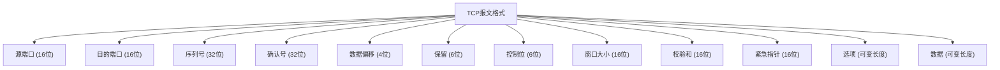

## 介绍

TCP（传输控制协议）是互联网中最重要的协议之一，用于在网络上可靠地传输数据。TCP报文是TCP协议中数据传输的基本单位，了解其格式对于理解TCP的工作原理至关重要。本文将详细介绍TCP报文的格式及其各个字段的作用。

## TCP报文格式

TCP报文由**报头**和**数据**两部分组成。报头包含多个字段，用于控制和管理数据传输。以下是TCP报头的详细结构：



### 1. 源端口和目的端口 (16位)
- **源端口**：标识发送方的端口号。
- **目的端口**：标识接收方的端口号。

### 2. 序列号 (32位)
- 用于标识发送的数据字节流中的第一个字节的序号。TCP是面向字节流的协议，每个字节都有一个唯一的序列号。

### 3. 确认号 (32位)
- 用于确认接收方期望收到的下一个字节的序列号。只有在ACK标志位被设置时，确认号字段才有效。

### 4. 数据偏移 (4位)
- 指示TCP报头的长度，以32位字为单位。由于TCP报头的长度是可变的，数据偏移字段用于确定数据部分的起始位置。

### 5. 保留 (6位)
- 保留字段，目前未使用，必须设置为0。

### 6. 控制位 (6位)
- 控制位字段包含6个标志位，用于控制TCP连接的状态和数据传输：
  - **URG**：紧急指针字段有效。
  - **ACK**：确认号字段有效。
  - **PSH**：接收方应立即将数据交给应用层。
  - **RST**：重置连接。
  - **SYN**：同步序列号，用于建立连接。
  - **FIN**：发送方已完成数据发送，用于关闭连接。

### 7. 窗口大小 (16位)
- 用于流量控制，表示接收方当前可接收的数据量。

### 8. 校验和 (16位)
- 用于检测TCP报文在传输过程中是否发生错误。

### 9. 紧急指针 (16位)
- 当URG标志位被设置时，紧急指针指示紧急数据的末尾位置。

### 10. 选项 (可变长度)
- 用于扩展TCP功能，常见的选项包括最大段大小（MSS）、窗口缩放因子等。

### 11. 数据 (可变长度)
- 实际传输的数据部分。

## 实际案例

假设我们有一个简单的TCP连接，客户端向服务器发送一个HTTP请求。以下是TCP报文的示例：

```plaintext
源端口: 12345
目的端口: 80
序列号: 1000
确认号: 0
数据偏移: 5 (20字节)
保留: 0
控制位: SYN
窗口大小: 65535
校验和: 0x1234
紧急指针: 0
选项: MSS=1460
数据: (空)
```

在这个例子中，客户端通过发送一个SYN报文来发起TCP连接。服务器收到后，会回复一个SYN-ACK报文，确认连接请求。

## 总结

TCP报文格式是理解TCP协议的基础。通过了解每个字段的作用，我们可以更好地理解TCP连接建立、数据传输和连接终止的过程。掌握这些知识对于网络编程和网络故障排查都非常重要。

## 附加资源

- [RFC 793 - Transmission Control Protocol](https://tools.ietf.org/html/rfc793)
- 《TCP/IP详解 卷1：协议》 - W. Richard Stevens

## 练习

1. 解释TCP报文中序列号和确认号的作用。
2. 描述TCP三次握手过程中，SYN和ACK标志位的变化。
3. 编写一个简单的TCP客户端程序，发送一个SYN报文并分析服务器的响应。
