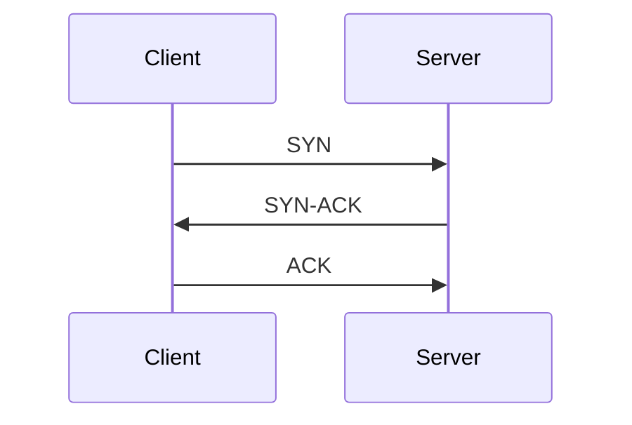
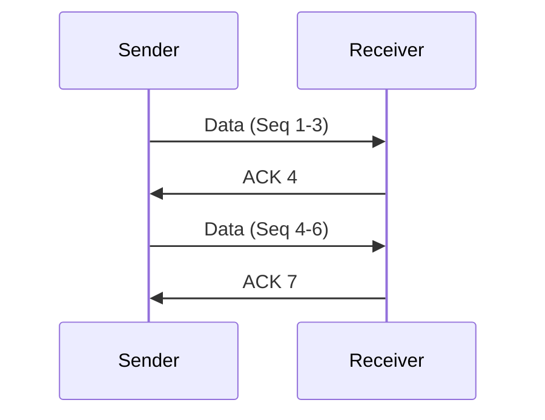
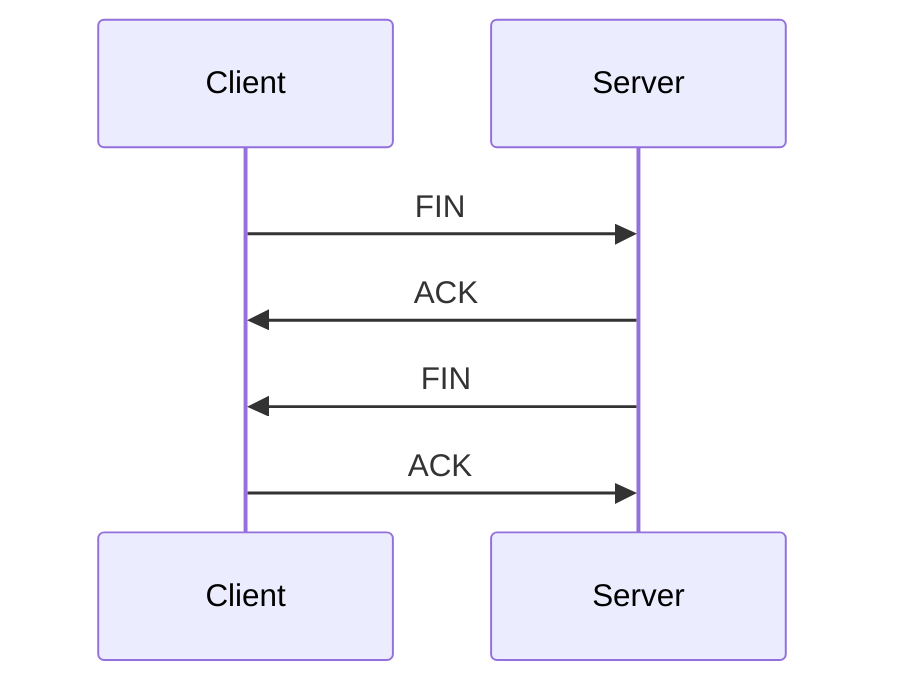

# TCP连接管理

传输控制协议（TCP）是互联网中最常用的传输层协议之一。它提供可靠的、面向连接的数据传输服务。TCP连接管理是确保数据在客户端和服务器之间正确传输的关键部分。本文将详细介绍TCP连接的建立、维护和终止过程，并通过实际案例帮助你理解这些概念。

## 什么是TCP连接管理？

TCP连接管理是指通过一系列步骤建立、维护和终止TCP连接的过程。TCP连接是双向的，意味着数据可以在客户端和服务器之间双向流动。为了确保数据的可靠传输，TCP使用“三次握手”建立连接，并在数据传输完成后通过“四次挥手”终止连接。

## TCP连接的建立：三次握手

TCP连接的建立是通过“三次握手”完成的。这个过程确保客户端和服务器都准备好进行通信。

1. **SYN（同步）**：客户端向服务器发送一个SYN报文，请求建立连接。这个报文包含一个随机生成的序列号（Seq）。
2. **SYN-ACK（同步-确认）**：服务器收到SYN报文后，回复一个SYN-ACK报文。这个报文包含服务器的序列号（Seq）和对客户端序列号的确认（ACK）。
3. **ACK（确认）**：客户端收到SYN-ACK报文后，发送一个ACK报文，确认服务器的序列号。此时，连接建立成功。

:::note
三次握手的目的是确保客户端和服务器都准备好进行通信，并且双方都知道对方的初始序列号。
:::

## TCP连接的维护

一旦连接建立，客户端和服务器就可以开始传输数据。TCP使用滑动窗口机制来管理数据的传输，确保数据的可靠性和顺序性。

### 滑动窗口机制

滑动窗口机制允许发送方在收到确认之前发送多个数据包。接收方通过发送确认（ACK）来告知发送方哪些数据已经成功接收。

在这个例子中，发送方发送了序列号为1-3的数据包，接收方确认了这些数据包，并请求下一个数据包（ACK 4）。发送方继续发送序列号为4-6的数据包，接收方再次确认（ACK 7）。

:::tip
滑动窗口机制允许TCP在网络上高效地传输数据，同时确保数据的可靠性。
:::

## TCP连接的终止：四次挥手

当数据传输完成后，TCP连接需要通过“四次挥手”来终止连接。这个过程确保双方都同意关闭连接。

1. **FIN（结束）**：客户端发送一个FIN报文，请求关闭连接。
2. **ACK（确认）**：服务器收到FIN报文后，发送一个ACK报文，确认收到关闭请求。
3. **FIN（结束）**：服务器发送一个FIN报文，请求关闭连接。
4. **ACK（确认）**：客户端收到FIN报文后，发送一个ACK报文，确认收到关闭请求。此时，连接终止。

:::caution
四次挥手的目的是确保双方都同意关闭连接，并且所有数据都已传输完毕。
:::

## 实际案例：Web服务器与浏览器的TCP连接

假设你正在访问一个网站，浏览器（客户端）和Web服务器（服务器）之间会建立一个TCP连接。以下是这个过程的具体步骤：

1. **建立连接**：浏览器向Web服务器发送一个SYN报文，服务器回复SYN-ACK报文，浏览器再发送ACK报文。此时，TCP连接建立成功。
2. **数据传输**：浏览器发送HTTP请求，服务器回复HTTP响应。数据通过TCP连接可靠地传输。
3. **终止连接**：当页面加载完成后，浏览器发送FIN报文，服务器回复ACK报文，然后发送自己的FIN报文，浏览器再回复ACK报文。此时，TCP连接终止。

:::warning
在实际应用中，TCP连接的建立和终止可能会受到网络延迟、丢包等因素的影响，因此需要仔细管理。
:::

## 总结

TCP连接管理是确保数据可靠传输的关键。通过三次握手建立连接，滑动窗口机制维护连接，以及四次挥手终止连接，TCP能够在复杂的网络环境中提供可靠的数据传输服务。

## 附加资源与练习

- **练习**：使用Wireshark等网络分析工具，捕获并分析TCP连接的建立、数据传输和终止过程。
- **资源**：阅读RFC 793，了解TCP协议的详细规范。

通过本文的学习，你应该对TCP连接管理有了基本的理解。继续探索和实践，你将能够更好地掌握TCP协议的工作原理。