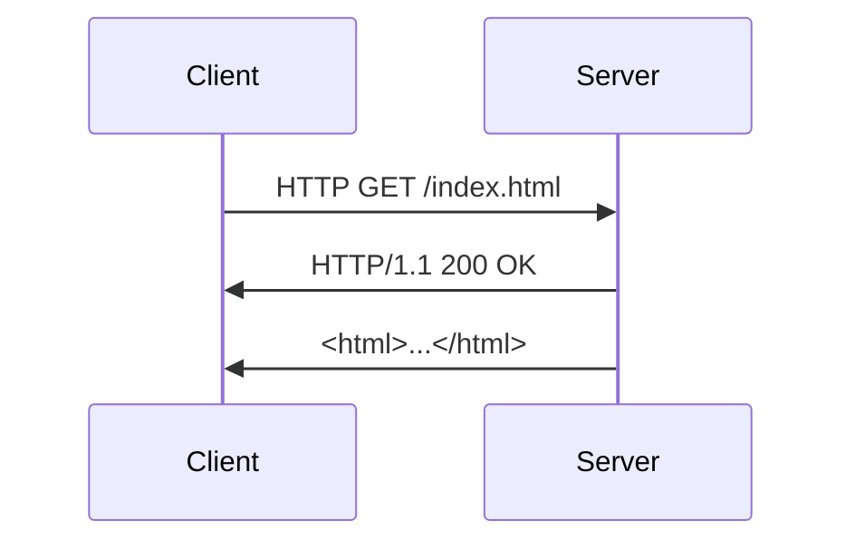

# 应用层概述

应用层是计算机网络体系结构中的最高层，直接为用户提供网络服务。它是用户与网络之间的接口，负责处理应用程序之间的通信。通过应用层，用户可以访问网络资源、发送电子邮件、浏览网页、传输文件等。

## 什么是应用层？

应用层是 OSI（开放系统互连）模型和 TCP/IP 模型中的顶层。它为用户应用程序提供网络服务，并定义了应用程序如何通过网络进行通信。应用层协议是应用程序之间通信的规则和标准。

### 应用层的主要功能

1. **提供网络服务**：应用层为应用程序提供网络服务，如文件传输、电子邮件、远程登录等。
2. **数据格式化**：应用层负责将数据格式化为适合网络传输的格式。
3. **会话管理**：应用层管理应用程序之间的会话，确保通信的顺利进行。
4. **错误处理**：应用层处理数据传输过程中可能出现的错误。

## 常见的应用层协议

以下是一些常见的应用层协议及其用途：

- **HTTP（超文本传输协议）**：用于在 Web 浏览器和服务器之间传输网页。
- **FTP（文件传输协议）**：用于在客户端和服务器之间传输文件。
- **SMTP（简单邮件传输协议）**：用于发送电子邮件。
- **DNS（域名系统）**：用于将域名解析为 IP 地址。
- **Telnet**：用于远程登录到其他计算机。

### HTTP 协议示例

HTTP 是应用层中最常用的协议之一。以下是一个简单的 HTTP 请求和响应的示例：

```http
GET /index.html HTTP/1.1
Host: www.example.com
```

服务器响应：

```http
HTTP/1.1 200 OK
Content-Type: text/html
Content-Length: 1234

<!DOCTYPE html>
<html>
<head>
    <title>Example Page</title>
</head>
<body>
    <h1>Hello, World!</h1>
</body>
</html>
```

在这个示例中，客户端向服务器发送了一个 HTTP GET 请求，请求 `index.html` 文件。服务器响应了一个状态码 `200 OK`，表示请求成功，并返回了 HTML 内容。

## 应用层的实际应用场景

### 1. 网页浏览

当你在浏览器中输入一个 URL 并按下回车键时，浏览器会使用 HTTP 协议向服务器发送请求，服务器返回网页内容，浏览器将其渲染为可视化的网页。

### 2. 电子邮件

当你发送一封电子邮件时，邮件客户端使用 SMTP 协议将邮件发送到邮件服务器，邮件服务器再将邮件转发到接收方的邮件服务器。接收方使用 POP3 或 IMAP 协议从服务器下载邮件。

### 3. 文件传输

使用 FTP 协议，用户可以从远程服务器上传或下载文件。例如，开发者可以使用 FTP 将网站文件上传到服务器。

## 应用层的工作流程

为了更好地理解应用层的工作流程，我们可以使用 Mermaid 图表来展示一个简单的 HTTP 请求和响应的过程：



在这个流程中，客户端向服务器发送一个 HTTP GET 请求，服务器响应并返回 HTML 内容。

## 总结

应用层是计算机网络中至关重要的一层，它为用户提供了丰富的网络服务。通过应用层协议，用户可以进行网页浏览、电子邮件发送、文件传输等操作。理解应用层的工作原理对于学习计算机网络和开发网络应用程序非常重要。

## 附加资源

- [HTTP 协议详解](https://developer.mozilla.org/zh-CN/docs/Web/HTTP)
- [FTP 协议入门](https://www.ietf.org/rfc/rfc959.txt)
- [SMTP 协议指南](https://tools.ietf.org/html/rfc5321)

## 练习

1. 使用 `curl` 命令发送一个 HTTP GET 请求，并查看服务器的响应。
2. 编写一个简单的 Python 脚本，使用 `smtplib` 库发送一封电子邮件。
3. 使用 `telnet` 命令连接到远程服务器，并尝试发送一个 HTTP 请求。

:::tip
在完成练习时，可以参考相关协议的文档和示例代码，以加深对应用层协议的理解。
:::