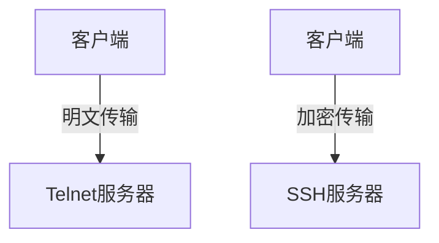

## 介绍

在网络通信中，**Telnet**和**SSH**是两种常见的远程登录协议，用于在网络上访问和管理远程计算机。尽管它们的功能相似，但在安全性和使用场景上有显著差异。本文将详细介绍这两种协议，并通过示例帮助初学者理解它们的用途和区别。

## Telnet：远程登录的基础

**Telnet**是一种早期的网络协议，允许用户通过命令行界面远程登录到另一台计算机。它使用明文传输数据，这意味着所有通信内容（包括用户名和密码）都是未加密的，容易被截获。

### Telnet的工作原理

Telnet基于客户端-服务器模型。客户端通过Telnet协议连接到服务器，服务器验证用户身份后，允许用户执行命令。

```bash
# 示例：使用Telnet连接到远程服务器
telnet example.com 23
```

:::caution 注意
Telnet的通信是明文的，因此不建议在公共网络中使用Telnet传输敏感信息。
:::

### Telnet的实际应用

尽管Telnet在现代网络中使用较少，但它仍然可以用于测试网络服务的连通性。例如，测试SMTP服务器的响应：

```bash
telnet smtp.example.com 25
```

输出可能如下：

```
220 smtp.example.com ESMTP Postfix
```

## SSH：安全的远程登录

**SSH（Secure Shell）**是Telnet的替代品，提供了加密的通信通道，确保数据在传输过程中不被窃听或篡改。SSH广泛用于远程服务器管理和文件传输。

### SSH的工作原理

SSH使用公钥加密技术来保护通信。客户端和服务器在连接时交换密钥，后续的所有通信都通过加密通道进行。

```bash
# 示例：使用SSH连接到远程服务器
ssh username@example.com
```

:::tip 提示
SSH默认使用端口22，但可以通过配置文件修改为其他端口以增强安全性。
:::

### SSH的实际应用

SSH不仅用于远程登录，还可以用于安全文件传输（如SCP和SFTP）和端口转发。

```bash
# 示例：使用SCP通过SSH传输文件
scp localfile.txt username@example.com:/remote/directory/
```

## Telnet与SSH的比较

| 特性          | Telnet          | SSH            |
|---------------|-----------------|----------------|
| **安全性**    | 明文传输，不安全 | 加密传输，安全  |
| **端口**      | 23              | 22             |
| **用途**      | 测试、调试       | 远程管理、文件传输 |
| **速度**      | 较快            | 稍慢（因加密）  |



## 实际案例

### 案例1：使用Telnet测试HTTP服务

假设你想测试一个HTTP服务器的响应，可以使用Telnet连接到服务器的80端口：

```bash
telnet example.com 80
```

输入以下内容以发送HTTP请求：

```
GET / HTTP/1.1
Host: example.com
```

服务器将返回HTTP响应头和数据。

### 案例2：使用SSH进行远程管理

假设你需要远程管理一台Linux服务器，可以使用SSH登录并执行命令：

```bash
ssh admin@example.com
```

登录后，你可以执行任何命令，例如查看系统日志：

```bash
tail -f /var/log/syslog
```

## 总结

Telnet和SSH都是远程登录的重要工具，但SSH因其安全性而成为现代网络中的首选。Telnet适用于简单的测试和调试，而SSH则适用于需要安全通信的场景。

:::note 附加资源
- [SSH官方文档](https://www.openssh.com/)
- [Telnet RFC 854](https://tools.ietf.org/html/rfc854)
:::

:::tip 练习
1. 使用Telnet连接到本地SMTP服务器并发送测试邮件。
2. 使用SSH连接到远程服务器并创建一个新用户。
:::