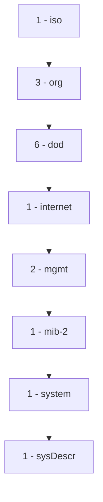

# 简单网络管理协议(SNMP)

## 介绍

简单网络管理协议（SNMP，Simple Network Management Protocol）是一种用于管理和监控网络设备的协议。它允许网络管理员从远程位置收集设备信息、配置设备以及监控网络性能。SNMP 是网络管理中最常用的协议之一，广泛应用于路由器、交换机、服务器、打印机等设备的管理。

SNMP 的核心思想是通过一个集中的管理系统（称为**管理站**）来监控和管理多个网络设备（称为**代理**）。管理站和代理之间通过 SNMP 协议进行通信，交换管理信息。

## SNMP 的基本组件

SNMP 系统通常由以下几个组件组成：

1. **管理站（Manager）**：负责监控和管理网络设备的系统。它通过 SNMP 协议与代理通信，获取设备信息或发送配置命令。
2. **代理（Agent）**：运行在网络设备上的软件，负责收集设备的状态信息，并根据管理站的请求返回数据。
3. **管理信息库（MIB，Management Information Base）**：一个结构化的数据库，存储了设备的各种管理信息。每个设备都有一个 MIB，其中包含了设备的状态、配置和性能数据。
4. **SNMP 协议**：定义了管理站和代理之间的通信规则，包括如何请求数据、如何发送命令等。

## SNMP 的工作原理

SNMP 使用一种称为**请求-响应**的通信模式。管理站向代理发送请求，代理根据请求返回相应的数据。SNMP 支持以下几种操作：

- **GET**：管理站向代理请求特定的管理信息。
- **SET**：管理站向代理发送配置命令，修改设备的状态或配置。
- **TRAP**：代理主动向管理站发送通知，报告设备的状态变化或异常事件。

### SNMP 的版本

SNMP 有多个版本，常见的有：

- **SNMPv1**：最早的版本，功能较为简单，安全性较低。
- **SNMPv2c**：在 SNMPv1 的基础上增加了一些功能，但仍然存在安全性问题。
- **SNMPv3**：最新的版本，提供了更强的安全性，支持加密和身份验证。

## SNMP 的实际应用

SNMP 广泛应用于网络设备的监控和管理。以下是一些常见的应用场景：

1. **网络性能监控**：通过 SNMP，管理员可以实时监控网络设备的性能指标，如 CPU 使用率、内存使用率、网络流量等。
2. **故障检测**：当网络设备出现故障时，代理可以通过 SNMP TRAP 消息通知管理站，管理员可以及时采取措施。
3. **配置管理**：管理员可以通过 SNMP SET 操作远程配置网络设备，如修改路由表、配置防火墙规则等。

### 示例：使用 SNMP 获取设备信息

以下是一个简单的示例，展示如何使用 Python 的 `pysnmp` 库通过 SNMP 获取网络设备的信息。

```python
from pysnmp.hlapi import *

# 定义 SNMP 参数
community = 'public'  # SNMP 社区字符串
ip_address = '192.168.1.1'  # 目标设备的 IP 地址
oid = '1.3.6.1.2.1.1.1.0'  # 要查询的 OID（系统描述）

# 创建 SNMP GET 请求
errorIndication, errorStatus, errorIndex, varBinds = next(
    getCmd(SnmpEngine(),
           CommunityData(community),
           UdpTransportTarget((ip_address, 161)),
           ContextData(),
           ObjectType(ObjectIdentity(oid)))
)

# 处理响应
if errorIndication:
    print(f"Error: {errorIndication}")
elif errorStatus:
    print(f"Error: {errorStatus} at {errorIndex}")
else:
    for varBind in varBinds:
        print(f"{varBind[0]} = {varBind[1]}")
```

**输出示例：**
```
SNMPv2-MIB::sysDescr.0 = Cisco IOS Software, 3700 Software (C3700-ADVENTERPRISEK9-M), Version 12.4(15)T1, RELEASE SOFTWARE (fc2)
```

在这个示例中，我们通过 SNMP GET 请求获取了设备的系统描述信息。

## SNMP 的 MIB 结构

MIB 是 SNMP 中非常重要的概念。它是一个树形结构的数据库，每个节点都有一个唯一的标识符（OID，Object Identifier）。OID 是一个由数字组成的字符串，用于唯一标识 MIB 中的每个对象。

例如，`1.3.6.1.2.1.1.1.0` 是一个常见的 OID，表示设备的系统描述。MIB 树的结构如下：



在这个树形结构中，`1.3.6.1.2.1.1.1.0` 表示 `iso.org.dod.internet.mgmt.mib-2.system.sysDescr`。

## 总结

SNMP 是一种强大的网络管理协议，广泛应用于网络设备的监控和管理。通过 SNMP，管理员可以远程获取设备信息、配置设备以及监控网络性能。SNMP 的核心组件包括管理站、代理、MIB 和 SNMP 协议。SNMP 的版本从 SNMPv1 到 SNMPv3，安全性逐渐增强。

对于初学者来说，理解 SNMP 的基本概念和工作原理是掌握网络管理的第一步。通过实际应用和代码示例，可以更好地理解 SNMP 的使用方法。

## 附加资源

- [SNMP 官方文档](https://www.ietf.org/rfc/rfc1157.txt)
- [pysnmp 库文档](https://pysnmp.readthedocs.io/)
- [MIB 浏览器工具](https://www.ireasoning.com/mibbrowser.shtml)

## 练习

1. 使用 `pysnmp` 库编写一个 Python 脚本，获取你本地网络路由器的系统描述信息。
2. 研究 SNMPv3 的安全性特性，并尝试配置一个支持 SNMPv3 的网络设备。
3. 使用 MIB 浏览器工具，查看你网络设备中的 MIB 结构，并尝试理解不同 OID 的含义。