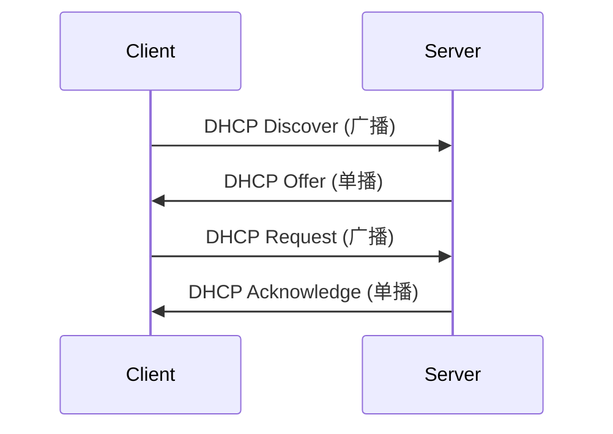

# 动态主机配置协议(DHCP)

## 介绍

动态主机配置协议（Dynamic Host Configuration Protocol，简称DHCP）是一种网络协议，用于自动分配IP地址和其他网络配置参数（如子网掩码、默认网关和DNS服务器）给网络中的设备。DHCP的主要目的是简化网络管理，减少手动配置IP地址的工作量，并避免IP地址冲突。

在大型网络中，手动为每台设备配置IP地址既繁琐又容易出错。DHCP通过自动分配IP地址，大大简化了这一过程。当设备连接到网络时，它会向DHCP服务器发送请求，服务器则会分配一个可用的IP地址，并确保该地址在网络中是唯一的。

## DHCP的工作原理

DHCP的工作过程通常分为四个步骤，称为“DORA”过程：

1. **Discover（发现）**：客户端设备发送一个DHCP Discover广播消息，寻找可用的DHCP服务器。
2. **Offer（提供）**：DHCP服务器收到Discover消息后，会向客户端发送一个DHCP Offer消息，提供一个可用的IP地址。
3. **Request（请求）**：客户端选择其中一个Offer，并发送一个DHCP Request消息，请求使用该IP地址。
4. **Acknowledge（确认）**：DHCP服务器确认请求，并发送一个DHCP Acknowledge消息，正式分配IP地址给客户端。



## DHCP的实际应用

### 家庭网络中的DHCP

在家庭网络中，路由器通常内置了DHCP服务器功能。当你将手机、笔记本电脑或其他设备连接到Wi-Fi时，路由器会自动为这些设备分配IP地址。这样，你无需手动配置每个设备的网络设置，设备就可以正常上网。

### 企业网络中的DHCP

在企业网络中，DHCP服务器通常由专门的服务器或网络设备提供。管理员可以配置DHCP服务器，使其为不同的子网分配不同的IP地址范围。此外，DHCP服务器还可以为特定设备分配固定的IP地址（称为DHCP保留），以确保这些设备每次都能获得相同的IP地址。

## 代码示例

以下是一个简单的Python脚本，用于模拟DHCP客户端发送Discover消息的过程：

```python
import socket

# 创建一个UDP套接字
client_socket = socket.socket(socket.AF_INET, socket.SOCK_DGRAM)
client_socket.setsockopt(socket.SOL_SOCKET, socket.SO_BROADCAST, 1)

# 发送DHCP Discover消息
client_socket.sendto(b"DHCP Discover", ('255.255.255.255', 67))
print("DHCP Discover消息已发送")

# 接收DHCP Offer消息
data, server = client_socket.recvfrom(4096)
print(f"收到来自 {server} 的DHCP Offer消息: {data.decode()}")

client_socket.close()
```

:::note
注意：上述代码仅为模拟DHCP客户端的基本行为，实际DHCP协议的实现要复杂得多。
:::

## 总结

DHCP是网络管理中不可或缺的一部分，它通过自动分配IP地址和其他网络配置参数，极大地简化了网络设备的配置过程。无论是在家庭网络还是企业网络中，DHCP都发挥着重要作用。

## 附加资源

- [RFC 2131 - Dynamic Host Configuration Protocol](https://tools.ietf.org/html/rfc2131)
- [DHCP协议详解](https://www.cnblogs.com/liqinglucky/p/DHCP.html)

## 练习

1. 在你的家庭网络中，尝试查看路由器中的DHCP设置，了解它如何分配IP地址。
2. 使用Wireshark等网络抓包工具，捕获并分析DHCP Discover、Offer、Request和Acknowledge消息的传输过程。