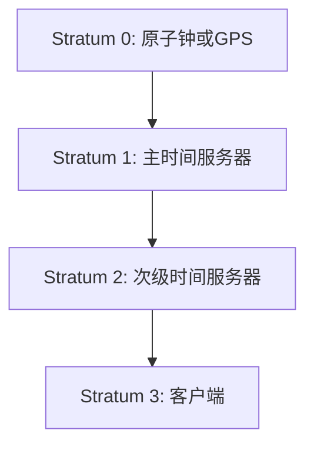

## 介绍

网络时间协议（Network Time Protocol，简称NTP）是一种用于同步计算机系统时间的协议。它通过互联网或局域网将计算机的时间与高精度的时间服务器同步，确保所有设备的时间保持一致。NTP 是互联网上最古老且广泛使用的时间同步协议之一，广泛应用于金融交易、科学实验、网络管理等领域。

## NTP 的工作原理

NTP 的工作原理基于客户端-服务器模型。客户端向时间服务器发送请求，服务器返回当前的时间信息。NTP 使用一种称为“时钟漂移”的算法来调整客户端的时间，使其与服务器的时间保持一致。

### NTP 的基本步骤

1. **时间请求**：客户端向时间服务器发送一个时间请求。
2. **时间响应**：服务器接收到请求后，返回当前的时间信息。
3. **时间调整**：客户端根据服务器返回的时间信息，调整本地时间。

### NTP 的层次结构

NTP 使用分层的时间源结构，称为“层”（Stratum）。每一层的时间服务器从更高层的时间服务器获取时间，并将时间传递给下一层的客户端。



:::note
Stratum 0 是最精确的时间源，通常是原子钟或GPS。Stratum 1 服务器直接与 Stratum 0 同步，Stratum 2 服务器与 Stratum 1 同步，以此类推。
:::

## NTP 的实际应用

### 金融交易

在金融交易中，时间同步至关重要。交易系统需要精确的时间戳来确保交易的顺序和一致性。NTP 被广泛用于同步交易服务器的时间，以避免因时间不同步而导致的交易错误。

### 科学实验

在科学实验中，特别是分布式实验中，时间同步是确保实验结果准确性的关键。NTP 可以确保所有实验设备的时间保持一致，从而避免因时间不同步而导致的实验误差。

### 网络管理

在网络管理中，时间同步对于日志记录、故障排查和安全审计至关重要。NTP 可以确保所有网络设备的时间保持一致，从而简化日志分析和故障排查过程。

## 代码示例

以下是一个简单的 Python 示例，展示如何使用 `ntplib` 库与 NTP 服务器同步时间。

```python
import ntplib
from time import ctime

# 创建 NTP 客户端
client = ntplib.NTPClient()

# 向 NTP 服务器发送请求
response = client.request('pool.ntp.org')

# 打印服务器返回的时间
print("NTP 服务器时间:", ctime(response.tx_time))
```

**输出示例：**
```
NTP 服务器时间: Wed Oct 25 12:34:56 2023
```

:::tip
在实际应用中，建议使用多个 NTP 服务器以提高时间同步的可靠性。
:::

## 总结

NTP 是一种用于同步计算机系统时间的重要协议，广泛应用于金融、科学和网络管理等领域。通过分层的时间源结构，NTP 能够提供高精度的时间同步服务。理解 NTP 的工作原理和应用场景，对于构建可靠的分布式系统至关重要。

## 附加资源

- [NTP 官方文档](https://www.ntp.org/)
- [Python ntplib 库文档](https://pypi.org/project/ntplib/)
- [NTP 层次结构详解](https://en.wikipedia.org/wiki/Network_Time_Protocol)

## 练习

1. 使用 `ntplib` 库编写一个 Python 脚本，从多个 NTP 服务器获取时间，并计算它们之间的时间差。
2. 研究并解释 NTP 的“时钟漂移”算法是如何工作的。
3. 在本地网络中配置一个 NTP 服务器，并尝试将其他设备的时间同步到该服务器。

通过以上练习，你将更深入地理解 NTP 的工作原理及其在实际中的应用。