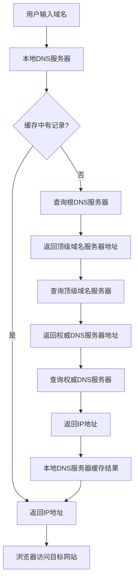

# 域名系统(DNS)

## 介绍

域名系统（DNS，Domain Name System）是互联网中用于将人类可读的域名（如 `www.example.com`）转换为机器可读的IP地址（如 `192.0.2.1`）的系统。DNS 是互联网的基础设施之一，它使得我们无需记住复杂的IP地址，只需通过简单的域名即可访问网站。

## DNS 的工作原理

DNS 的工作原理可以简单概括为以下几个步骤：

1. **用户输入域名**：当你在浏览器中输入一个域名（如 `www.example.com`）时，浏览器会首先向本地DNS服务器发送查询请求。
2. **本地DNS服务器查询**：如果本地DNS服务器缓存了该域名的IP地址，它会直接返回结果。如果没有，它会向根DNS服务器发起查询。
3. **根DNS服务器查询**：根DNS服务器会返回负责顶级域名（如 `.com`）的顶级域名服务器的地址。
4. **顶级域名服务器查询**：顶级域名服务器会返回负责该域名的权威DNS服务器的地址。
5. **权威DNS服务器查询**：权威DNS服务器会返回该域名对应的IP地址。
6. **返回结果**：本地DNS服务器将IP地址返回给浏览器，浏览器随后通过该IP地址访问目标网站。



## DNS 记录类型

DNS 系统中存在多种记录类型，每种记录类型都有不同的用途。以下是一些常见的DNS记录类型：

- **A记录**：将域名映射到IPv4地址。
- **AAAA记录**：将域名映射到IPv6地址。
- **CNAME记录**：将域名映射到另一个域名（别名）。
- **MX记录**：指定邮件服务器的地址。
- **TXT记录**：存储任意文本信息，常用于验证域名所有权或配置SPF记录。

:::tip
**A记录** 和 **CNAME记录** 是最常用的DNS记录类型。A记录用于将域名直接映射到IP地址，而CNAME记录则用于将域名映射到另一个域名。
:::

## 实际案例

假设你拥有一个域名 `example.com`，并且你想将其映射到IP地址 `192.0.2.1`。你可以在DNS管理面板中添加以下A记录：

```plaintext
example.com.    A    192.0.2.1
```

这样，当用户访问 `example.com` 时，DNS系统会将其解析为 `192.0.2.1`，用户即可访问你的网站。

## 总结

DNS 是互联网中不可或缺的一部分，它使得我们能够通过简单的域名访问复杂的网络资源。通过理解DNS的工作原理和常见记录类型，你可以更好地管理和配置你的域名。

## 附加资源

- [DNS 维基百科](https://zh.wikipedia.org/wiki/%E5%9F%9F%E5%90%8D%E7%B3%BB%E7%BB%9F)
- [DNS 记录类型详解](https://www.cloudflare.com/learning/dns/dns-records/)

## 练习

1. 尝试在你的本地计算机上使用 `nslookup` 或 `dig` 命令查询一个域名的IP地址。
2. 在DNS管理面板中为你的域名添加一个A记录，并验证其是否生效。

:::caution
在修改DNS记录时，请务必小心，错误的配置可能导致网站无法访问。
:::