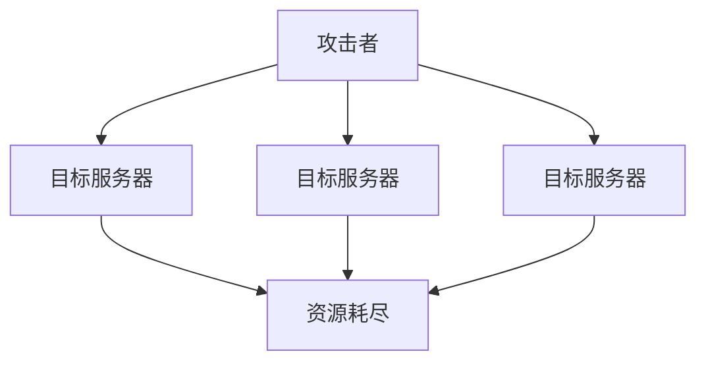

## 引言

在当今数字化的世界中，网络安全已成为每个开发者和用户必须关注的重要议题。无论是个人还是企业，都可能面临各种网络安全威胁。了解这些威胁的类型及其工作原理，是构建安全系统的第一步。本文将介绍常见的网络安全威胁与攻击类型，帮助初学者建立基本的安全意识。

---

## 常见安全威胁与攻击类型

### 1. 恶意软件（Malware）

恶意软件是指任何旨在破坏、窃取数据或控制系统的软件。常见的恶意软件类型包括：

- **病毒（Virus）**：依附于合法程序，通过感染文件传播。
- **蠕虫（Worm）**：独立运行，通过网络传播，无需用户干预。
- **木马（Trojan）**：伪装成合法软件，诱使用户安装，从而窃取数据或控制系统。

:::caution
恶意软件通常通过电子邮件附件、下载文件或恶意网站传播。请勿随意点击不明链接或下载未知来源的文件。
:::

### 2. 网络钓鱼（Phishing）

网络钓鱼是一种通过伪装成可信实体（如银行、社交媒体或公司）来诱骗用户提供敏感信息（如密码、信用卡号）的攻击方式。

**示例：**
攻击者发送一封看似来自银行的电子邮件，要求用户点击链接并输入账户信息。该链接实际上指向一个伪造的网站。

:::tip
如何识别网络钓鱼邮件？
- 检查发件人地址是否合法。
- 注意拼写和语法错误。
- 不要轻易点击邮件中的链接。
:::

### 3. 拒绝服务攻击（DoS/DDoS）

拒绝服务攻击（DoS）旨在通过耗尽目标系统的资源（如带宽、内存或处理能力）使其无法正常提供服务。分布式拒绝服务攻击（DDoS）则是通过多个来源同时发起攻击，使防御更加困难。



**实际案例：**
2016年，Dyn公司遭受了一次大规模的DDoS攻击，导致包括Twitter、Netflix和Reddit在内的多个知名网站无法访问。

### 4. SQL注入（SQL Injection）

SQL注入是一种针对数据库的攻击方式，攻击者通过在输入字段中插入恶意SQL代码，从而操纵数据库查询。

**示例：**
假设一个登录表单的SQL查询如下：
```sql
SELECT * FROM users WHERE username = '输入的用户名' AND password = '输入的密码';
```
攻击者可以输入 `' OR '1'='1` 作为用户名和密码，使查询变为：
```sql
SELECT * FROM users WHERE username = '' OR '1'='1' AND password = '' OR '1'='1';
```
这将返回所有用户的数据，导致未授权访问。

:::warning
防范SQL注入的最佳方法是使用参数化查询或ORM（对象关系映射）工具。
:::

### 5. 跨站脚本攻击（XSS）

跨站脚本攻击（XSS）是一种通过在网页中注入恶意脚本，从而在用户浏览器中执行的攻击方式。攻击者可以利用XSS窃取用户的Cookie、会话信息或其他敏感数据。

**示例：**
假设一个网站允许用户输入评论，但未对输入进行过滤。攻击者可以输入以下内容：
```html
<script>alert('XSS攻击！');</script>
```
当其他用户查看评论时，恶意脚本将在他们的浏览器中执行。

:::tip
防范XSS攻击的方法包括对用户输入进行严格的验证和过滤，以及使用内容安全策略（CSP）。
:::

### 6. 中间人攻击（Man-in-the-Middle, MITM）

中间人攻击是指攻击者在通信双方之间拦截并篡改数据。这种攻击通常发生在未加密的网络连接中。

**实际案例：**
在公共Wi-Fi网络中，攻击者可以伪装成合法的热点，诱使用户连接并窃取其数据。

:::caution
使用HTTPS和VPN可以有效防范中间人攻击。
:::

---

## 总结

网络安全威胁与攻击类型多种多样，每种攻击都有其独特的工作原理和防御方法。作为初学者，了解这些基本概念是迈向网络安全领域的第一步。通过采取适当的防护措施，如使用强密码、启用双因素认证、定期更新软件等，可以大大降低遭受攻击的风险。

---

## 附加资源与练习

- **练习：** 尝试在一个简单的Web应用中实现SQL注入防护。
- **资源：**
  - [OWASP Top Ten](https://owasp.org/www-project-top-ten/)：了解最常见的Web应用安全风险。
  - [Kali Linux](https://www.kali.org/)：一个专为网络安全测试设计的操作系统。
  - [Hack The Box](https://www.hackthebox.com/)：一个在线平台，提供网络安全挑战和练习。