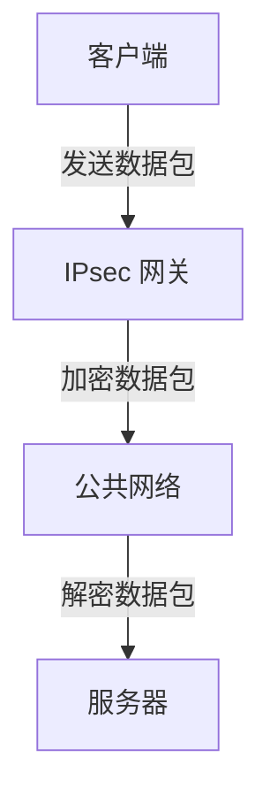

## 什么是网络安全协议？

网络安全协议是用于在网络中保护数据传输和通信安全的一组规则和标准。它们确保数据在传输过程中不会被窃取、篡改或伪造。网络安全协议广泛应用于互联网、企业内部网络以及各种通信系统中，是保障信息安全的重要工具。

## 常见的网络安全协议

### 1. SSL/TLS

SSL（Secure Sockets Layer）和 TLS（Transport Layer Security）是最常见的网络安全协议，用于在客户端和服务器之间建立加密连接。TLS 是 SSL 的继任者，目前广泛使用的是 TLS 1.2 和 TLS 1.3。

#### 工作原理
1. **握手阶段**：客户端和服务器协商加密算法和密钥。
2. **密钥交换**：双方交换密钥以建立安全连接。
3. **数据传输**：数据通过加密通道传输，确保数据的机密性和完整性。

```bash
# 示例：使用 OpenSSL 生成自签名证书
openssl req -x509 -newkey rsa:4096 -keyout key.pem -out cert.pem -days 365 -nodes
```

:::note
TLS 1.3 相较于 TLS 1.2 提供了更快的连接速度和更强的安全性。
:::

### 2. IPsec

IPsec（Internet Protocol Security）是一组协议，用于在网络层保护 IP 数据包的安全。它通常用于 VPN（虚拟专用网络）中，确保数据在公共网络中的安全传输。

#### 工作原理
1. **认证头（AH）**：提供数据完整性和身份验证。
2. **封装安全载荷（ESP）**：提供数据加密、完整性和身份验证。



:::tip
IPsec 可以与其他协议（如 IKEv2）结合使用，以提供更强大的安全性。
:::

### 3. SSH

SSH（Secure Shell）是一种用于远程登录和安全文件传输的协议。它通过加密通信来防止中间人攻击。

#### 工作原理
1. **密钥交换**：客户端和服务器交换公钥以建立安全连接。
2. **身份验证**：用户通过密码或公钥进行身份验证。
3. **数据传输**：所有通信内容都经过加密。

```bash
# 示例：使用 SSH 连接到远程服务器
ssh user@remote_host
```

:::caution
确保使用强密码或公钥认证，以防止未经授权的访问。
:::

## 实际应用场景

### 1. 电子商务网站

电子商务网站通常使用 SSL/TLS 协议来保护用户的支付信息。当你在网上购物时，浏览器地址栏中的 "https://" 表示连接是加密的。

### 2. 企业内部网络

企业使用 IPsec VPN 来确保员工在远程办公时能够安全地访问公司内部资源。通过 IPsec，数据在公共网络中的传输是加密的，防止数据泄露。

### 3. 远程服务器管理

系统管理员使用 SSH 协议来远程管理服务器。通过 SSH，管理员可以安全地执行命令、传输文件，而不必担心数据被窃听或篡改。

## 总结

网络安全协议是保障网络通信安全的核心工具。通过 SSL/TLS、IPsec 和 SSH 等协议，我们可以确保数据在传输过程中的机密性、完整性和身份验证。理解这些协议的工作原理和应用场景，对于初学者掌握网络安全知识至关重要。

## 附加资源

- [TLS 1.3 协议详解](https://tools.ietf.org/html/rfc8446)
- [IPsec 协议指南](https://tools.ietf.org/html/rfc4301)
- [SSH 协议手册](https://tools.ietf.org/html/rfc4251)

## 练习

1. 使用 OpenSSL 生成一个自签名证书，并配置到本地 Web 服务器中。
2. 配置一个简单的 IPsec VPN，并测试其安全性。
3. 使用 SSH 连接到远程服务器，并尝试传输文件。

通过实践这些练习，你将更深入地理解网络安全协议的工作原理和应用。