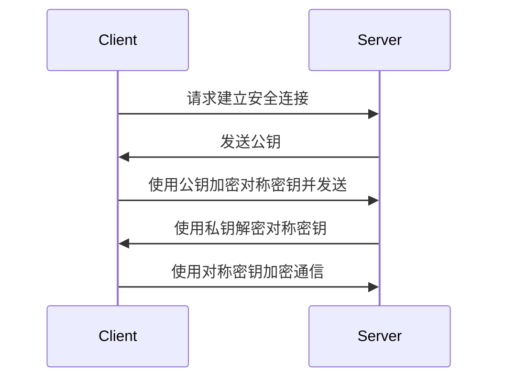

## 介绍

加密技术是网络安全的核心组成部分，它通过将信息转换为不可读的形式来保护数据的机密性、完整性和真实性。无论是保护在线交易、存储敏感数据，还是确保通信安全，加密技术都扮演着至关重要的角色。

在本指南中，我们将从基础概念入手，逐步讲解加密技术的核心原理、常见算法以及实际应用场景。

---

## 什么是加密？

加密是一种将**明文**（可读数据）转换为**密文**（不可读数据）的过程。只有拥有正确密钥的人才能将密文解密回明文。加密技术的主要目标是：

1. **机密性**：确保数据只能被授权方访问。
2. **完整性**：确保数据在传输或存储过程中未被篡改。
3. **真实性**：验证数据的来源是否可信。

---

## 加密的类型

加密技术主要分为两大类：**对称加密**和**非对称加密**。

### 1. 对称加密

对称加密使用**相同的密钥**进行加密和解密。它的优点是速度快，适合处理大量数据。常见的对称加密算法包括 AES（高级加密标准）和 DES（数据加密标准）。

#### 示例：AES 加密

以下是一个使用 Python 实现 AES 加密的简单示例：

```python
from Crypto.Cipher import AES
from Crypto.Util.Padding import pad, unpad
from Crypto.Random import get_random_bytes

# 生成随机密钥
key = get_random_bytes(16)

# 创建 AES 加密对象
cipher = AES.new(key, AES.MODE_CBC)

# 明文
plaintext = b"Hello, World!"

# 加密
ciphertext = cipher.encrypt(pad(plaintext, AES.block_size))

# 输出密文
print("密文:", ciphertext)

# 解密
decrypted = unpad(cipher.decrypt(ciphertext), AES.block_size)
print("解密后的明文:", decrypted.decode())
```

**输入**：`Hello, World!`  
**输出**：  
密文: `b'\x1a\xf3...'`  
解密后的明文: `Hello, World!`

:::note
对称加密的缺点是密钥管理复杂，因为发送方和接收方必须安全地共享密钥。
:::

### 2. 非对称加密

非对称加密使用**一对密钥**：**公钥**和**私钥**。公钥用于加密数据，私钥用于解密。常见的非对称加密算法包括 RSA 和 ECC（椭圆曲线加密）。

#### 示例：RSA 加密

以下是一个使用 Python 实现 RSA 加密的简单示例：

```python
from Crypto.PublicKey import RSA
from Crypto.Cipher import PKCS1_OAEP

# 生成 RSA 密钥对
key = RSA.generate(2048)

# 获取公钥和私钥
public_key = key.publickey()
private_key = key

# 明文
plaintext = b"Hello, World!"

# 使用公钥加密
cipher = PKCS1_OAEP.new(public_key)
ciphertext = cipher.encrypt(plaintext)

# 输出密文
print("密文:", ciphertext)

# 使用私钥解密
cipher = PKCS1_OAEP.new(private_key)
decrypted = cipher.decrypt(ciphertext)
print("解密后的明文:", decrypted.decode())
```

**输入**：`Hello, World!`  
**输出**：  
密文: `b'\x1a\xf3...'`  
解密后的明文: `Hello, World!`

:::tip
非对称加密解决了密钥分发问题，但速度较慢，通常用于加密少量数据（如对称加密的密钥）。
:::

---

## 加密的实际应用

### 1. HTTPS

HTTPS 使用 SSL/TLS 协议来加密客户端和服务器之间的通信。它结合了对称加密和非对称加密的优点：

1. 使用非对称加密交换对称密钥。
2. 使用对称加密传输实际数据。



### 2. 数字签名

数字签名用于验证数据的完整性和真实性。它使用私钥对数据进行签名，接收方使用公钥验证签名。

```python
from Crypto.Signature import pkcs1_15
from Crypto.Hash import SHA256

# 生成哈希
message = b"Important Message"
hash_obj = SHA256.new(message)

# 使用私钥签名
signature = pkcs1_15.new(private_key).sign(hash_obj)

# 使用公钥验证签名
try:
    pkcs1_15.new(public_key).verify(hash_obj, signature)
    print("签名验证成功！")
except (ValueError, TypeError):
    print("签名验证失败！")
```

---

## 总结

加密技术是保护数据安全的关键工具。通过对称加密和非对称加密的结合，我们可以实现高效、安全的通信和数据存储。无论是 HTTPS 还是数字签名，加密技术都在我们的日常生活中发挥着重要作用。

---

## 附加资源与练习

1. **练习**：尝试使用 Python 实现 DES 加密，并比较其与 AES 的性能差异。
2. **资源**：
   - [Crypto 库文档](https://pycryptodome.readthedocs.io/)
   - [HTTPS 工作原理](https://howhttps.works/)
   - [RSA 算法详解](https://en.wikipedia.org/wiki/RSA_(cryptosystem))

:::caution
请勿在实际生产环境中使用示例代码，它们仅用于学习目的。生产环境应使用经过严格测试的加密库和最佳实践。
:::