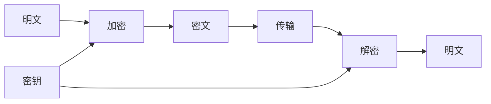

# 对称加密

对称加密是一种常见的加密技术，它使用相同的密钥进行数据的加密和解密。由于其高效性和简单性，对称加密被广泛应用于数据保护和通信安全中。本文将详细介绍对称加密的基本概念、工作原理、常见算法以及实际应用场景。

## 什么是对称加密？

对称加密是一种加密方法，它使用相同的密钥对数据进行加密和解密。这意味着发送方和接收方必须共享同一个密钥，才能安全地传输信息。对称加密的主要优点是加密和解密速度快，适合处理大量数据。

### 对称加密的工作原理

对称加密的过程可以分为以下几个步骤：

1. **密钥生成**：生成一个密钥，该密钥将用于加密和解密数据。
2. **加密**：使用密钥对明文数据进行加密，生成密文。
3. **传输**：将密文传输给接收方。
4. **解密**：接收方使用相同的密钥对密文进行解密，恢复出原始的明文数据。



## 常见的对称加密算法

以下是一些常见的对称加密算法：

- **AES（高级加密标准）**：AES 是目前最常用的对称加密算法之一，支持 128 位、192 位和 256 位密钥长度。
- **DES（数据加密标准）**：DES 是一种较老的对称加密算法，使用 56 位密钥，但由于密钥长度较短，已逐渐被 AES 取代。
- **3DES（三重 DES）**：3DES 是 DES 的增强版，通过对数据应用三次 DES 加密来提高安全性。
- **Blowfish**：Blowfish 是一种灵活的对称加密算法，支持可变长度的密钥。

### AES 加密示例

以下是一个使用 Python 和 `pycryptodome` 库进行 AES 加密的示例：

```python
from Crypto.Cipher import AES
from Crypto.Random import get_random_bytes

# 生成一个 16 字节的随机密钥
key = get_random_bytes(16)

# 创建 AES 加密器
cipher = AES.new(key, AES.MODE_EAX)

# 要加密的数据
data = b"Hello, World!"

# 加密数据
ciphertext, tag = cipher.encrypt_and_digest(data)

print(f"密钥: {key.hex()}")
print(f"密文: {ciphertext.hex()}")
print(f"认证标签: {tag.hex()}")
```

**输出示例：**

```
密钥: 3c6e0b8a9c15224a82f5f5d5f5d5f5d5
密文: 7b5c5d5f5d5f5d5f5d5f5d5f5d5f5d5f
认证标签: 5f5d5f5d5f5d5f5d5f5d5f5d5f5d5f
```

:::note
在实际应用中，密钥的管理和分发是对称加密的一个关键挑战。确保密钥的安全传输和存储是至关重要的。
:::

## 对称加密的实际应用

对称加密在许多实际场景中都有广泛应用，以下是一些常见的应用场景：

1. **文件加密**：对称加密可以用于加密存储在本地或云端的文件，确保只有拥有密钥的用户才能访问文件内容。
2. **网络通信**：对称加密常用于保护网络通信中的数据，例如 HTTPS 协议中的数据传输。
3. **数据库加密**：对称加密可以用于加密数据库中的敏感数据，防止未经授权的访问。
4. **移动设备加密**：许多移动设备使用对称加密来保护存储在设备上的数据。

:::tip
在实际应用中，对称加密通常与非对称加密结合使用，以解决密钥分发的问题。例如，在 HTTPS 协议中，对称加密用于加密数据传输，而非对称加密用于安全地交换对称密钥。
:::

## 总结

对称加密是一种高效且广泛使用的加密技术，它使用相同的密钥进行数据的加密和解密。尽管对称加密在速度和性能方面具有优势，但密钥管理和分发仍然是一个挑战。通过结合使用对称加密和非对称加密，可以在实际应用中实现更高的安全性。

## 附加资源与练习

- **练习**：尝试使用 Python 编写一个程序，使用 AES 加密和解密一段文本。
- **资源**：
  - [AES 加密标准](https://en.wikipedia.org/wiki/Advanced_Encryption_Standard)
  - [Pycryptodome 文档](https://pycryptodome.readthedocs.io/)

通过学习和实践，你将更好地理解对称加密的工作原理及其在实际中的应用。