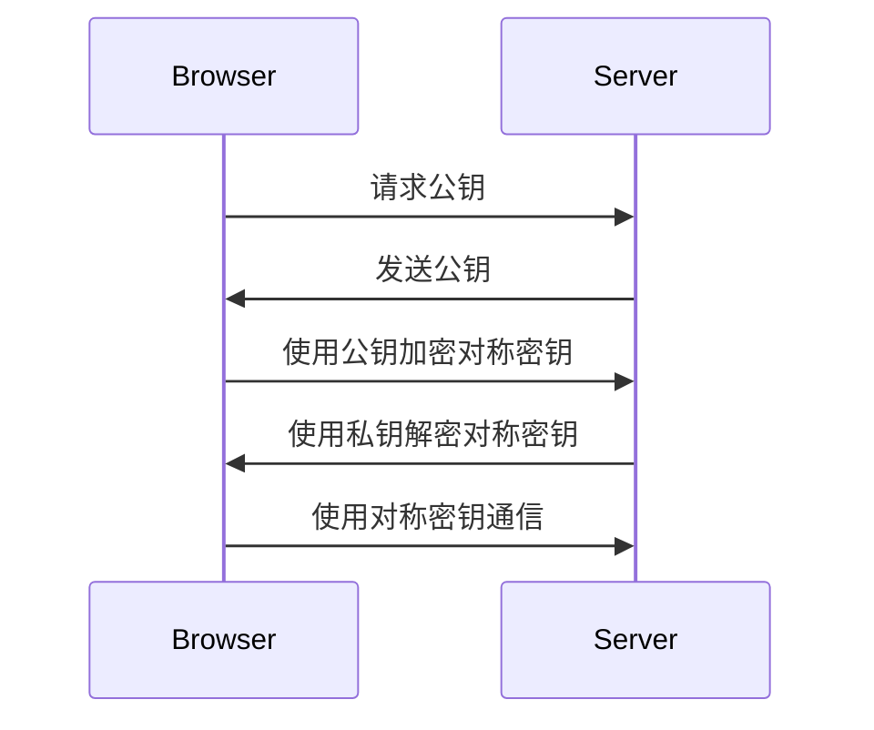

## 介绍

非对称加密（Asymmetric Encryption）是一种使用一对密钥（公钥和私钥）进行加密和解密的加密技术。与对称加密不同，非对称加密使用两个不同的密钥：一个用于加密数据，另一个用于解密数据。这种加密方式在网络安全中扮演着重要角色，尤其是在数据传输和身份验证方面。

## 非对称加密的工作原理

非对称加密的核心在于使用一对密钥：**公钥**和**私钥**。公钥可以公开分享，而私钥必须严格保密。以下是其工作原理：

1. **加密过程**：使用接收者的公钥对数据进行加密。只有接收者的私钥才能解密这些数据。
2. **解密过程**：接收者使用自己的私钥对加密数据进行解密。

:::note
公钥和私钥是数学上相关联的，但它们不能从彼此推导出来。这种特性使得非对称加密非常安全。
:::

## 非对称加密的数学基础

非对称加密通常基于复杂的数学问题，例如大整数分解（RSA算法）或椭圆曲线离散对数问题（ECC算法）。这些数学问题的复杂性保证了加密的安全性。

### RSA 算法示例

以下是一个简单的 RSA 加密和解密示例：

```python
from Crypto.PublicKey import RSA
from Crypto.Cipher import PKCS1_OAEP

# 生成密钥对
key = RSA.generate(2048)

# 获取公钥和私钥
private_key = key.export_key()
public_key = key.publickey().export_key()

# 加密数据
cipher = PKCS1_OAEP.new(RSA.import_key(public_key))
encrypted_data = cipher.encrypt(b"Hello, World!")

# 解密数据
cipher = PKCS1_OAEP.new(RSA.import_key(private_key))
decrypted_data = cipher.decrypt(encrypted_data)

print("Encrypted:", encrypted_data)
print("Decrypted:", decrypted_data.decode())
```

**输出示例：**
```
Encrypted: b'\x0b\xf4\x8a\x1d...'
Decrypted: Hello, World!
```

:::tip
在实际应用中，RSA 通常用于加密对称密钥，而不是直接加密大量数据，因为非对称加密的计算成本较高。
:::

## 非对称加密的实际应用

非对称加密在现实世界中有许多重要应用，以下是其中一些：

1. **SSL/TLS 协议**：用于保护网站与浏览器之间的通信安全。
2. **数字签名**：用于验证数据的完整性和发送者的身份。
3. **电子邮件加密**：如 PGP（Pretty Good Privacy）使用非对称加密来保护电子邮件内容。

### 案例：HTTPS 中的非对称加密

当你在浏览器中访问一个 HTTPS 网站时，非对称加密用于建立安全连接。以下是其工作流程：

1. 浏览器向服务器请求公钥。
2. 服务器将公钥发送给浏览器。
3. 浏览器使用公钥加密一个随机生成的对称密钥，并将其发送给服务器。
4. 服务器使用私钥解密对称密钥。
5. 双方使用对称密钥进行后续通信。



## 总结

非对称加密是一种强大的加密技术，广泛应用于网络安全领域。它通过使用一对密钥（公钥和私钥）来确保数据的安全传输和身份验证。尽管非对称加密的计算成本较高，但它在保护敏感信息和建立安全通信方面发挥着不可替代的作用。

## 附加资源与练习

- **资源**：
  - [RSA 算法详解](https://en.wikipedia.org/wiki/RSA_(cryptosystem))
  - [椭圆曲线加密（ECC）介绍](https://en.wikipedia.org/wiki/Elliptic-curve_cryptography)
- **练习**：
  - 使用 Python 的 `cryptography` 库实现一个简单的非对称加密和解密程序。
  - 研究并实现一个数字签名方案，验证数据的完整性和来源。

:::caution
在实际应用中，请务必妥善保管私钥，避免泄露。私钥一旦泄露，整个加密系统的安全性将受到威胁。
:::