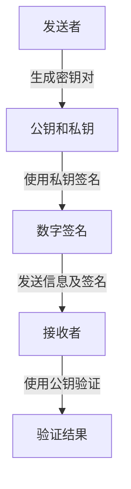

## 什么是数字签名？

数字签名是一种用于验证数字信息（如文档、消息或软件）的真实性和完整性的技术。它类似于手写签名，但更加安全且难以伪造。数字签名通过加密技术确保信息在传输过程中未被篡改，并且可以确认发送者的身份。

### 数字签名的工作原理

数字签名基于**非对称加密**技术。非对称加密使用一对密钥：**公钥**和**私钥**。公钥可以公开分享，而私钥必须严格保密。数字签名的过程通常包括以下步骤：

1. **生成密钥对**：发送者生成一对公钥和私钥。
2. **签名**：发送者使用私钥对信息进行加密，生成数字签名。
3. **验证**：接收者使用发送者的公钥解密数字签名，验证信息的真实性和完整性。



### 数字签名的实际应用

数字签名广泛应用于以下场景：

- **电子邮件安全**：确保邮件内容未被篡改，并且确认发送者的身份。
- **软件分发**：验证软件的来源和完整性，防止恶意软件篡改。
- **电子合同**：确保合同内容未被修改，并且签署方的身份真实。

### 代码示例：使用 Python 实现数字签名

以下是一个使用 Python 的 `cryptography` 库生成和验证数字签名的简单示例。

```python
from cryptography.hazmat.primitives import hashes
from cryptography.hazmat.primitives.asymmetric import padding, rsa
from cryptography.hazmat.primitives import serialization

# 生成密钥对
private_key = rsa.generate_private_key(
    public_exponent=65537,
    key_size=2048,
)
public_key = private_key.public_key()

# 要签名的消息
message = b"Hello, this is a secret message."

# 生成签名
signature = private_key.sign(
    message,
    padding.PSS(
        mgf=padding.MGF1(hashes.SHA256()),
        salt_length=padding.PSS.MAX_LENGTH
    ),
    hashes.SHA256()
)

# 验证签名
try:
    public_key.verify(
        signature,
        message,
        padding.PSS(
            mgf=padding.MGF1(hashes.SHA256()),
            salt_length=padding.PSS.MAX_LENGTH
        ),
        hashes.SHA256()
    )
    print("签名验证成功！")
except Exception as e:
    print("签名验证失败：", e)
```

**输入**：消息 `"Hello, this is a secret message."`  
**输出**：如果签名验证成功，输出 `"签名验证成功！"`；否则输出错误信息。

:::note
在实际应用中，私钥必须严格保密，而公钥可以公开分享。数字签名的安全性依赖于私钥的保密性。
:::

### 总结

数字签名是网络安全中不可或缺的工具，它通过加密技术确保信息的真实性和完整性。无论是电子邮件、软件分发还是电子合同，数字签名都在保护我们的数字世界免受篡改和伪造的威胁。

### 附加资源与练习

- **资源**：
  - [RSA 加密算法详解](https://en.wikipedia.org/wiki/RSA_(cryptosystem))
  - [Python `cryptography` 库文档](https://cryptography.io/en/latest/)
- **练习**：
  - 尝试修改上述代码中的消息内容，观察签名验证的结果。
  - 研究如何使用数字签名保护电子邮件的安全。

通过学习和实践，你将更好地理解数字签名的工作原理及其在网络安全中的重要性。