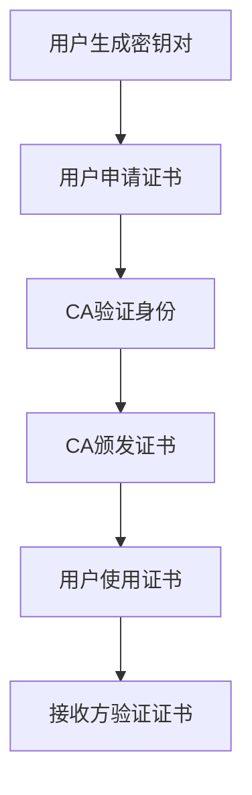

# PKI体系

## 什么是PKI？

公钥基础设施（Public Key Infrastructure，简称PKI）是一套用于管理数字证书和公钥加密的技术、策略和流程。PKI的核心目标是确保通信的安全性、完整性和身份验证。它通过使用一对密钥（公钥和私钥）来实现加密和数字签名，从而保护数据在传输过程中的安全。

PKI体系通常包括以下组件：
- **证书颁发机构（CA）**：负责颁发和管理数字证书。
- **注册机构（RA）**：验证用户身份并协助CA颁发证书。
- **数字证书**：包含公钥和用户身份信息的电子文件。
- **证书吊销列表（CRL）**：列出已吊销的证书。
- **密钥管理**：生成、存储和分发密钥。

## PKI的工作原理

PKI的核心思想是使用非对称加密技术。非对称加密使用一对密钥：公钥和私钥。公钥可以公开分享，而私钥必须严格保密。以下是PKI的基本工作流程：

1. **密钥生成**：用户生成一对密钥（公钥和私钥）。
2. **证书申请**：用户向CA提交公钥和身份信息，申请数字证书。
3. **证书颁发**：CA验证用户身份后，颁发数字证书。
4. **证书使用**：用户使用数字证书进行加密通信或数字签名。
5. **证书验证**：接收方使用CA的公钥验证证书的有效性。



## 实际应用场景

### 1. HTTPS协议
HTTPS是HTTP的安全版本，使用SSL/TLS协议进行加密通信。PKI在HTTPS中扮演了重要角色，服务器通过数字证书向客户端证明其身份，并建立安全的通信通道。

### 2. 电子邮件加密
PKI可以用于加密电子邮件，确保只有预期的收件人能够解密和阅读邮件内容。例如，使用S/MIME协议对邮件进行加密和签名。

### 3. 数字签名
PKI可以用于生成和验证数字签名，确保文档的完整性和真实性。例如，在电子合同中使用数字签名来验证签署者的身份。

## 代码示例

以下是一个使用Python和`cryptography`库生成密钥对和自签名证书的简单示例：

```python
from cryptography import x509
from cryptography.hazmat.primitives import hashes
from cryptography.hazmat.primitives.asymmetric import rsa
from cryptography.hazmat.primitives import serialization
from cryptography.x509.oid import NameOID
from cryptography.hazmat.primitives.asymmetric import padding
import datetime

# 生成私钥
private_key = rsa.generate_private_key(
    public_exponent=65537,
    key_size=2048,
)

# 生成公钥
public_key = private_key.public_key()

# 创建自签名证书
subject = issuer = x509.Name([
    x509.NameAttribute(NameOID.COUNTRY_NAME, u"US"),
    x509.NameAttribute(NameOID.STATE_OR_PROVINCE_NAME, u"California"),
    x509.NameAttribute(NameOID.LOCALITY_NAME, u"San Francisco"),
    x509.NameAttribute(NameOID.ORGANIZATION_NAME, u"My Company"),
    x509.NameAttribute(NameOID.COMMON_NAME, u"mysite.com"),
])

cert = x509.CertificateBuilder().subject_name(
    subject
).issuer_name(
    issuer
).public_key(
    public_key
).serial_number(
    x509.random_serial_number()
).not_valid_before(
    datetime.datetime.utcnow()
).not_valid_after(
    datetime.datetime.utcnow() + datetime.timedelta(days=365)
).add_extension(
    x509.BasicConstraints(ca=True, path_length=None), critical=True,
).sign(private_key, hashes.SHA256())

# 输出证书
print(cert.public_bytes(serialization.Encoding.PEM))
```

:::note
**注意**：在实际应用中，通常不会使用自签名证书，而是通过受信任的CA颁发证书。
:::

## 总结

PKI体系是网络安全中不可或缺的一部分，它通过数字证书和公钥加密技术确保了通信的安全性和身份验证。理解PKI的基本概念和工作原理对于构建安全的网络应用至关重要。

## 附加资源

- [PKI基础知识](https://en.wikipedia.org/wiki/Public_key_infrastructure)
- [OpenSSL文档](https://www.openssl.org/docs/)
- [cryptography库文档](https://cryptography.io/en/latest/)

## 练习

1. 使用`cryptography`库生成一个自签名证书，并验证其有效性。
2. 研究如何在Web服务器上配置HTTPS，并理解PKI在其中的作用。
3. 尝试使用PKI对一封电子邮件进行加密和签名。

:::tip
**提示**：在学习PKI时，建议从简单的自签名证书开始，逐步过渡到使用受信任的CA颁发的证书。
:::