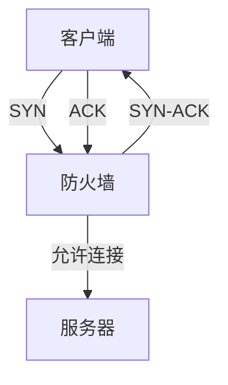

# 防火墙技术

## 介绍

防火墙是网络安全的重要组成部分，用于监控和控制进出网络的流量。它可以阻止未经授权的访问，同时允许合法的通信通过。防火墙可以是硬件设备，也可以是软件程序，通常部署在网络边界，如企业网络的入口处。

## 防火墙的工作原理

防火墙通过一系列预定义的规则来过滤流量。这些规则可以基于多种因素，如源IP地址、目标IP地址、端口号和协议类型。防火墙的主要任务是：

1. **包过滤**：检查每个数据包的头部信息，根据规则决定是否允许通过。
2. **状态检测**：跟踪连接的状态，确保只有合法的连接才能通过。
3. **应用层过滤**：深入检查数据包的内容，防止恶意软件或攻击。

## 防火墙的类型

### 1. 包过滤防火墙

包过滤防火墙是最基本的防火墙类型，它根据预定义的规则过滤数据包。例如，可以设置规则阻止来自特定IP地址的所有流量。

```bash
# 示例：使用iptables阻止来自192.168.1.100的流量
iptables -A INPUT -s 192.168.1.100 -j DROP
```

### 2. 状态检测防火墙

状态检测防火墙不仅检查单个数据包，还跟踪整个连接的状态。它可以识别并阻止异常流量，如SYN Flood攻击。



### 3. 应用层防火墙

应用层防火墙工作在OSI模型的第七层，能够深入检查数据包的内容。它可以阻止特定类型的攻击，如SQL注入或跨站脚本攻击（XSS）。

```bash
# 示例：使用ModSecurity阻止SQL注入攻击
SecRule ARGS "@detectSQLi" "id:1,deny,status:403"
```

## 实际案例

### 案例1：企业网络保护

一家企业在其网络入口处部署了防火墙，以防止外部攻击。防火墙配置了以下规则：

- 允许所有来自内部网络的流量。
- 阻止所有来自未知IP地址的流量。
- 允许特定端口（如HTTP和HTTPS）的流量通过。

### 案例2：家庭网络安全

一个家庭用户在其路由器上启用了防火墙功能，以防止恶意软件和黑客攻击。防火墙配置了以下规则：

- 阻止所有来自外部网络的Ping请求。
- 允许特定设备（如智能电视和游戏机）访问互联网。
- 阻止所有未知设备的连接请求。

## 总结

防火墙是网络安全的第一道防线，能够有效防止未经授权的访问和恶意攻击。通过合理配置防火墙规则，可以大大提高网络的安全性。

## 附加资源

- [防火墙配置指南](https://example.com/firewall-guide)
- [网络安全基础课程](https://example.com/cybersecurity-basics)
- [防火墙实战演练](https://example.com/firewall-practice)

:::tip
建议初学者从包过滤防火墙开始学习，逐步掌握状态检测和应用层防火墙的配置技巧。
:::