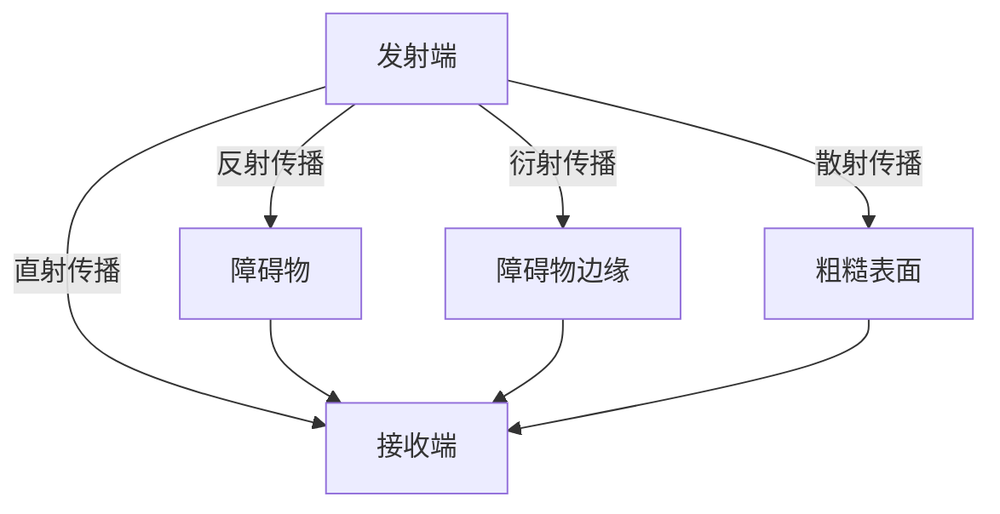
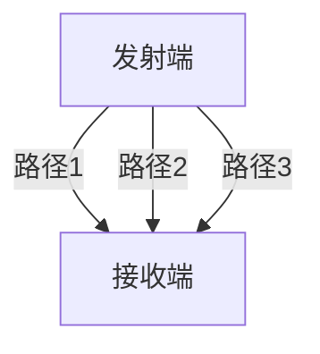

# 无线传输特性

无线传输是现代通信技术的重要组成部分，它使得设备之间无需物理连接即可进行数据传输。理解无线传输的特性对于设计和优化无线网络至关重要。本文将逐步介绍无线传输的关键特性，并通过实际案例帮助初学者更好地掌握这些概念。

## 1. 无线信号传播

无线信号通过电磁波在空气中传播。信号的传播方式主要有以下几种：

- **直射传播**：信号直接从发射端传播到接收端，适用于视线范围内（Line of Sight, LOS）的通信。
- **反射传播**：信号遇到障碍物（如墙壁、地面）时发生反射，反射后的信号可能到达接收端。
- **衍射传播**：信号遇到障碍物边缘时发生弯曲，绕过障碍物传播。
- **散射传播**：信号遇到粗糙表面或小物体时，向多个方向散射。



## 2. 信号衰减

信号在传播过程中会逐渐减弱，这种现象称为**衰减**。衰减的主要原因是：

- **自由空间损耗**：信号在传播过程中随着距离的增加而减弱。
- **障碍物吸收**：信号穿过障碍物时，部分能量被吸收。
- **多径效应**：信号通过不同路径到达接收端，导致信号叠加或抵消。

:::note
**自由空间损耗公式**：
```
L = 20 * log10(d) + 20 * log10(f) + 32.45
```
其中，`L` 是损耗（dB），`d` 是距离（km），`f` 是频率（MHz）。
:::

## 3. 干扰

无线信号容易受到其他信号或环境因素的干扰，常见的干扰源包括：

- **同频干扰**：来自相同频率的其他信号。
- **邻频干扰**：来自相邻频率的信号。
- **噪声**：来自环境中的随机电磁波。

:::caution
干扰会导致信号质量下降，甚至通信中断。因此，在设计无线网络时，需要合理规划频率使用，避免干扰。
:::

## 4. 多径效应

多径效应是指信号通过不同路径到达接收端，导致信号叠加或抵消。多径效应会引起**信号衰落**，影响通信质量。



:::tip
**多径效应的应对措施**：
- 使用分集技术（如空间分集、频率分集）。
- 采用均衡器来补偿多径效应的影响。
:::

## 5. 实际案例

### 案例1：Wi-Fi 网络中的信号衰减

在一个典型的家庭 Wi-Fi 网络中，路由器位于客厅，而用户在卧室使用笔记本电脑。由于墙壁的阻隔，信号在传播过程中会发生衰减和多径效应。为了改善信号质量，可以在卧室安装一个 Wi-Fi 中继器。

### 案例2：蜂窝网络中的干扰管理

在蜂窝网络中，多个基站使用相同的频率资源。为了避免同频干扰，运营商采用频率复用技术，确保相邻基站使用不同的频率。

## 6. 总结

无线传输特性是无线网络设计和优化的重要基础。通过理解信号传播、衰减、干扰和多径效应等概念，初学者可以更好地掌握无线通信的基本原理。

## 7. 附加资源与练习

### 附加资源
- [无线通信原理](https://example.com/wireless-communication)
- [信号处理基础](https://example.com/signal-processing)

### 练习
1. 计算在 2.4 GHz 频率下，距离 100 米处的自由空间损耗。
2. 描述多径效应在无线通信中的影响，并提出两种应对措施。

:::warning
**注意**：在实际应用中，无线传输特性会受到多种因素的影响，因此在设计和优化无线网络时，需要综合考虑各种因素。
:::