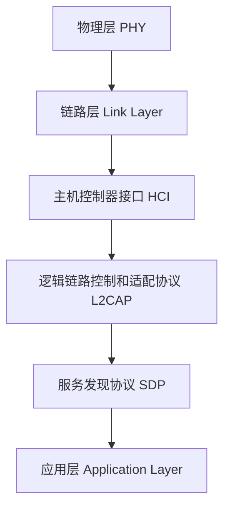

## 什么是蓝牙技术？

蓝牙技术是一种短距离无线通信技术，用于在设备之间传输数据。它最初由爱立信公司于1994年开发，旨在取代传统的有线连接方式。蓝牙技术的主要特点是低功耗、低成本和高可靠性，广泛应用于手机、耳机、键盘、鼠标、智能家居设备等。

蓝牙技术使用2.4 GHz的ISM（工业、科学和医疗）频段，支持点对点和多点通信。它的通信距离通常在10米左右，但通过增强功率，可以达到100米。

## 蓝牙的工作原理

蓝牙技术基于主从架构，其中一个设备作为主设备（Master），另一个或多个设备作为从设备（Slave）。主设备负责发起连接并控制通信过程，而从设备则响应主设备的请求。

### 蓝牙协议栈

蓝牙协议栈是蓝牙技术的核心，它定义了蓝牙设备之间通信的规则和流程。蓝牙协议栈分为以下几个主要层次：

1. **物理层（PHY）**：负责无线信号的传输和接收。
2. **链路层（Link Layer）**：负责设备之间的连接建立、维护和断开。
3. **主机控制器接口（HCI）**：负责主机和蓝牙模块之间的通信。
4. **逻辑链路控制和适配协议（L2CAP）**：负责数据的分段和重组。
5. **服务发现协议（SDP）**：用于发现和识别蓝牙设备提供的服务。
6. **应用层（Application Layer）**：包含各种蓝牙应用协议，如A2DP（高级音频分发协议）、HFP（免提协议）等。



## 蓝牙的实际应用场景

蓝牙技术广泛应用于各种设备和场景中，以下是一些常见的应用示例：

1. **无线音频传输**：蓝牙耳机、音箱等设备通过蓝牙技术传输音频数据，提供高质量的无线音频体验。
2. **数据传输**：手机与电脑之间通过蓝牙传输文件、照片等数据。
3. **智能家居**：智能灯泡、智能门锁等设备通过蓝牙与手机或网关通信，实现远程控制。
4. **健康监测**：智能手环、心率监测器等设备通过蓝牙将健康数据传输到手机或云端。

## 蓝牙代码示例

以下是一个简单的Python代码示例，展示了如何使用`pybluez`库在Linux系统上扫描附近的蓝牙设备。

```python
import bluetooth

# 扫描附近的蓝牙设备
nearby_devices = bluetooth.discover_devices(duration=8, lookup_names=True, flush_cache=True, lookup_class=False)

# 打印扫描到的设备
print("Found {} devices.".format(len(nearby_devices)))

for addr, name in nearby_devices:
    print("  {} - {}".format(addr, name))
```

**输出示例：**
```
Found 3 devices.
  00:11:22:33:44:55 - My Bluetooth Headset
  66:77:88:99:AA:BB - My Smartphone
  CC:DD:EE:FF:00:11 - My Laptop
```

:::tip
在运行上述代码之前，请确保已安装`pybluez`库。可以通过以下命令安装：
```bash
pip install pybluez
```
:::

## 总结

蓝牙技术是一种广泛应用于短距离无线通信的技术，具有低功耗、低成本和高可靠性的特点。通过本文的介绍，您应该对蓝牙技术的基本概念、工作原理以及实际应用场景有了初步的了解。希望本文能帮助您在编程学习中更好地理解和应用蓝牙技术。

## 附加资源与练习

1. **进一步学习**：阅读蓝牙技术联盟（Bluetooth SIG）的官方文档，了解更多关于蓝牙协议的细节。
2. **动手实践**：尝试使用`pybluez`库编写一个简单的蓝牙通信程序，实现两个设备之间的数据传输。
3. **扩展阅读**：了解蓝牙5.0的新特性，如更高的传输速率、更远的通信距离和更低的功耗。

:::caution
在实际开发中，蓝牙技术的实现可能会因操作系统和设备的不同而有所差异。请确保在目标平台上进行充分的测试。
:::