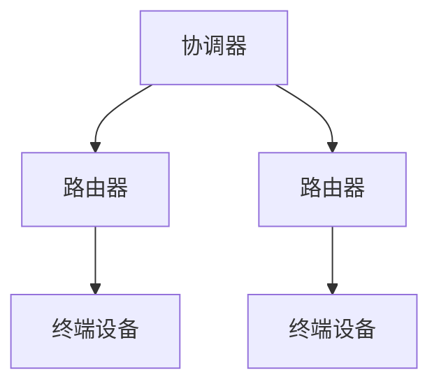

# ZigBee技术

ZigBee是一种低功耗、低数据速率的无线通信技术，专为物联网（IoT）和智能家居设备设计。它基于IEEE 802.15.4标准，适用于需要长电池寿命和低复杂度的应用场景。本文将带你深入了解ZigBee技术的基础知识、工作原理及其实际应用。

## 什么是ZigBee？

ZigBee是一种无线通信协议，主要用于短距离、低功耗的设备间通信。它通常用于家庭自动化、工业控制和医疗设备等领域。ZigBee网络支持多种拓扑结构，如星型、网状和树型网络，能够灵活适应不同的应用需求。

:::note
ZigBee的名字来源于蜜蜂的“八字舞”（Zigzag Dance），象征着设备之间的高效通信。
:::

## ZigBee的工作原理

ZigBee网络由三种类型的设备组成：

1. **协调器（Coordinator）**：负责启动和管理网络，每个ZigBee网络只有一个协调器。
2. **路由器（Router）**：负责转发数据包，扩展网络覆盖范围。
3. **终端设备（End Device）**：通常是低功耗设备，如传感器或执行器。

ZigBee使用2.4 GHz频段（全球通用），但也支持868 MHz和915 MHz频段。它的数据传输速率较低（通常为250 kbps），但具有出色的功耗效率和网络稳定性。

### ZigBee网络拓扑

ZigBee支持多种网络拓扑结构，以下是常见的三种：



- **星型拓扑**：所有设备直接连接到协调器。
- **网状拓扑**：设备之间可以相互通信，数据可以通过多个路径传输。
- **树型拓扑**：设备以层次结构连接，数据通过父节点传输。

## ZigBee的实际应用

ZigBee技术广泛应用于以下场景：

1. **智能家居**：如智能灯泡、智能插座和温控器。
2. **工业自动化**：如传感器网络和设备监控。
3. **医疗设备**：如远程健康监测和患者跟踪系统。

:::tip
ZigBee的低功耗特性使其非常适合需要长时间运行的电池供电设备。
:::

## 代码示例

以下是一个简单的ZigBee设备通信示例，使用Python模拟设备之间的数据传输：

```python
# 模拟ZigBee设备通信
class ZigBeeDevice:
    def __init__(self, name):
        self.name = name

    def send_message(self, message, target):
        print(f"{self.name} 发送消息: '{message}' 到 {target.name}")
        target.receive_message(message)

    def receive_message(self, message):
        print(f"{self.name} 收到消息: '{message}'")

# 创建设备
coordinator = ZigBeeDevice("协调器")
sensor = ZigBeeDevice("传感器")

# 发送消息
coordinator.send_message("温度数据: 25°C", sensor)
```

**输出：**
```
协调器 发送消息: '温度数据: 25°C' 到 传感器
传感器 收到消息: '温度数据: 25°C'
```

## 总结

ZigBee技术是一种高效、低功耗的无线通信协议，适用于物联网和智能家居等领域。通过支持多种网络拓扑结构和低功耗特性，ZigBee能够满足各种应用场景的需求。

:::caution
在实际部署ZigBee网络时，需注意设备之间的兼容性和网络配置，以确保通信的稳定性。
:::

## 附加资源

- [ZigBee联盟官方网站](https://zigbeealliance.org)
- IEEE 802.15.4标准文档
- 《ZigBee无线网络技术入门》书籍

## 练习

1. 尝试使用ZigBee模块（如XBee）搭建一个简单的星型网络。
2. 编写一个程序，模拟ZigBee网状网络中的数据传输。
3. 研究ZigBee与其他无线技术（如Wi-Fi和蓝牙）的优缺点比较。

希望这篇内容能帮助你更好地理解ZigBee技术！如果你有任何问题，欢迎在评论区留言。