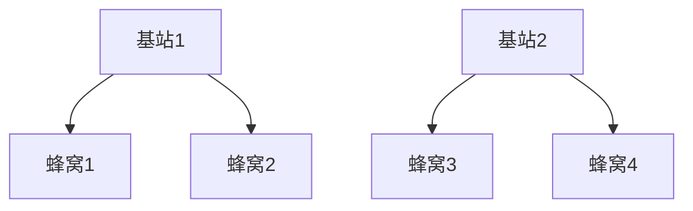

## 介绍

蜂窝移动通信是一种无线通信技术，它通过将地理区域划分为多个“蜂窝”来实现高效的无线通信。每个蜂窝由一个基站负责，基站与移动设备（如手机）进行通信。这种技术是现代移动通信网络的基础，支持语音通话、短信、互联网接入等多种服务。

## 蜂窝移动通信的基本概念

### 蜂窝结构

蜂窝移动通信的核心思想是将服务区域划分为多个六边形的蜂窝。每个蜂窝由一个基站覆盖，基站负责与蜂窝内的移动设备进行通信。这种结构允许频率的重复使用，从而提高频谱利用率。

### 频率复用

频率复用是蜂窝移动通信的关键技术之一。由于频谱资源有限，蜂窝网络通过在不相邻的蜂窝中重复使用相同的频率来提高频谱效率。例如，蜂窝1和蜂窝3可以使用相同的频率，因为它们之间的距离足够远，不会产生干扰。

### 切换技术

当移动设备从一个蜂窝移动到另一个蜂窝时，网络需要将通信从当前基站切换到新的基站。这个过程称为“切换”或“漫游”。切换技术确保通信的连续性，用户不会察觉到通话或数据传输的中断。

## 蜂窝移动通信的工作原理

1. **基站与移动设备的通信**：基站通过无线电波与移动设备进行通信。基站发送和接收信号，处理来自移动设备的请求。
2. **频率分配**：每个基站被分配一组频率，用于与蜂窝内的移动设备通信。频率分配需要避免相邻蜂窝之间的干扰。
3. **切换过程**：当移动设备移动到另一个蜂窝时，网络会自动将通信切换到新的基站，确保通信的连续性。

## 实际应用案例

### 4G LTE 网络

4G LTE（长期演进）网络是蜂窝移动通信技术的一个典型应用。它提供了高速的数据传输速率，支持高清视频流、在线游戏和实时视频通话等应用。LTE网络通过更高效的频谱利用和先进的调制技术，显著提高了网络性能。

### 5G 网络

5G网络是蜂窝移动通信的最新发展，它提供了更高的数据传输速率、更低的延迟和更大的连接密度。5G网络支持物联网（IoT）、自动驾驶和增强现实（AR）等新兴应用。

## 总结

蜂窝移动通信是现代无线通信的基础技术，它通过蜂窝结构、频率复用和切换技术实现了高效的无线通信。从4G LTE到5G，蜂窝移动通信技术不断演进，支持着越来越多的应用场景。

## 附加资源与练习

- **练习**：尝试绘制一个简单的蜂窝网络图，标注基站和蜂窝的位置。
- **资源**：阅读更多关于5G网络的资料，了解其技术细节和应用场景。

:::tip
如果你对蜂窝移动通信的某个方面特别感兴趣，可以深入研究相关的技术标准，如3GPP（第三代合作伙伴计划）发布的规范。
:::