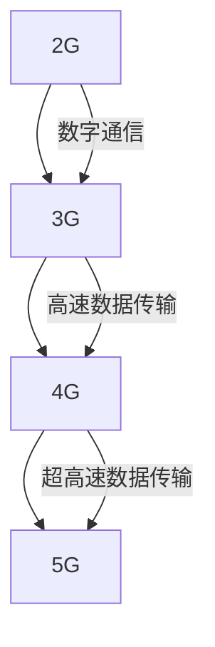

# 2G/3G/4G/5G技术演进

无线通信技术在过去几十年中经历了巨大的变革，从2G到5G，每一代技术都带来了显著的性能提升和新功能。本文将带你了解这些技术的演进历程，帮助你理解每一代技术的关键特性和应用场景。

## 1. 2G：数字通信的起点

2G（第二代移动通信技术）标志着从模拟通信向数字通信的转变。2G技术的主要特点是引入了数字信号处理，使得通信更加高效和安全。

### 关键技术
- **GSM（全球移动通信系统）**：2G时代最广泛使用的标准，支持语音通话和短信服务。
- **GPRS（通用分组无线服务）**：在GSM基础上引入了数据通信功能，支持低速互联网接入。

### 实际应用
- 语音通话和短信服务是2G的主要应用场景。
- GPRS使得早期的移动互联网成为可能，尽管速度较慢。

:::note
2G技术的最大贡献是引入了数字通信，为后续技术的发展奠定了基础。
:::

## 2. 3G：移动互联网的兴起

3G（第三代移动通信技术）带来了更高的数据传输速率，使得移动互联网应用成为可能。

### 关键技术
- **UMTS（通用移动通信系统）**：3G的主要标准，支持更高的数据传输速率。
- **HSPA（高速分组接入）**：在UMTS基础上进一步提升了数据传输速率。

### 实际应用
- 视频通话和移动互联网浏览成为3G的主要应用场景。
- 智能手机的普及推动了3G技术的广泛应用。

:::tip
3G技术的最大特点是支持高速数据传输，为移动互联网应用提供了基础。
:::

## 3. 4G：高速移动宽带

4G（第四代移动通信技术）进一步提升了数据传输速率，支持高清视频流媒体和在线游戏等应用。

### 关键技术
- **LTE（长期演进）**：4G的主要标准，支持更高的数据传输速率和更低的延迟。
- **VoLTE（语音 over LTE）**：在LTE网络上实现高质量的语音通话。

### 实际应用
- 高清视频流媒体、在线游戏和移动办公成为4G的主要应用场景。
- 4G技术推动了移动互联网的快速发展。

:::caution
4G技术的最大挑战是网络覆盖和容量，尤其是在高密度区域。
:::

## 4. 5G：万物互联的未来

5G（第五代移动通信技术）是当前最新的无线通信技术，支持超高速数据传输、超低延迟和大规模设备连接。

### 关键技术
- **NR（新无线电）**：5G的主要标准，支持更高的频率和更宽的带宽。
- **网络切片**：根据不同的应用需求，动态分配网络资源。

### 实际应用
- 自动驾驶、远程医疗和工业物联网成为5G的主要应用场景。
- 5G技术将推动智能城市和万物互联的发展。

:::warning
5G技术的最大挑战是基础设施建设和频谱资源的分配。
:::

## 5. 技术演进对比

## 6. 总结

从2G到5G，无线通信技术经历了巨大的变革，每一代技术都带来了显著的性能提升和新功能。2G引入了数字通信，3G推动了移动互联网的兴起，4G实现了高速移动宽带，而5G则将引领万物互联的未来。

## 7. 附加资源

- [3GPP官方网站](https://www.3gpp.org/)
- [5G技术白皮书](https://www.5gamericas.org/)
- [无线通信技术入门指南](https://www.example.com/wireless-communication-guide)

## 8. 练习

1. 解释2G和3G的主要区别。
2. 描述4G技术的关键特性及其应用场景。
3. 讨论5G技术如何推动智能城市的发展。

:::tip
完成练习后，可以访问我们的论坛与其他学习者交流心得。
:::