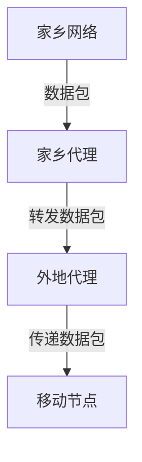

# 移动IP

## 介绍

移动IP（Mobile IP）是一种网络协议，允许设备在保持其IP地址不变的情况下，从一个网络移动到另一个网络。这对于移动设备（如智能手机、笔记本电脑等）在无线网络中保持连接至关重要。移动IP的核心目标是确保设备在移动过程中能够无缝地继续通信，而不会中断连接。

## 移动IP的工作原理

移动IP的工作原理可以分为以下几个步骤：

1. **家乡代理（Home Agent, HA）**：这是设备在家乡网络中的代理服务器，负责跟踪设备的当前位置。
2. **外地代理（Foreign Agent, FA）**：这是设备在外地网络中的代理服务器，负责将数据包转发给设备。
3. **移动节点（Mobile Node, MN）**：这是移动设备本身，它在移动过程中会连接到不同的网络。

当移动节点离开家乡网络并连接到外地网络时，它会向家乡代理注册其新的位置（即外地代理的地址）。家乡代理会将发送到移动节点家乡地址的数据包转发到外地代理，外地代理再将数据包传递给移动节点。



## 移动IP的实际应用

移动IP在许多实际场景中都有应用，例如：

- **移动办公**：员工可以在不同的办公地点之间移动，而无需重新配置网络设置。
- **物联网（IoT）**：物联网设备可以在不同的网络中移动，而不会中断数据传输。
- **移动通信**：智能手机在移动过程中可以无缝切换基站，保持通话和数据传输的连续性。

## 代码示例

以下是一个简单的Python代码示例，模拟移动IP的基本工作原理：

```python
class HomeAgent:
    def __init__(self):
        self.mobile_node_location = None

    def register_location(self, location):
        self.mobile_node_location = location

    def forward_packet(self, packet):
        if self.mobile_node_location:
            print(f"Forwarding packet to {self.mobile_node_location}")
        else:
            print("Mobile node location unknown")

class ForeignAgent:
    def __init__(self, location):
        self.location = location

    def receive_packet(self, packet):
        print(f"Received packet at {self.location}")

class MobileNode:
    def __init__(self, home_agent):
        self.home_agent = home_agent

    def move_to(self, foreign_agent):
        self.home_agent.register_location(foreign_agent.location)

# 示例使用
home_agent = HomeAgent()
foreign_agent = ForeignAgent("New York")
mobile_node = MobileNode(home_agent)

mobile_node.move_to(foreign_agent)
home_agent.forward_packet("Data packet")
```

**输出：**
```
Forwarding packet to New York
Received packet at New York
```

## 总结

移动IP是一种重要的网络协议，它使得设备在移动过程中能够保持网络连接。通过家乡代理和外地代理的协作，移动IP确保了数据包能够正确地传递到移动节点。移动IP在移动办公、物联网和移动通信等领域有着广泛的应用。

## 附加资源

- [RFC 3344 - IP Mobility Support for IPv4](https://tools.ietf.org/html/rfc3344)
- [移动IP的维基百科页面](https://en.wikipedia.org/wiki/Mobile_IP)

## 练习

1. 修改上述Python代码，使其支持多个移动节点。
2. 研究移动IPv6与移动IPv4的区别，并写一篇简短的比较文章。

:::tip
如果你对移动IP的工作原理还有疑问，可以尝试在模拟网络环境中进行实验，这将帮助你更好地理解其工作机制。
:::