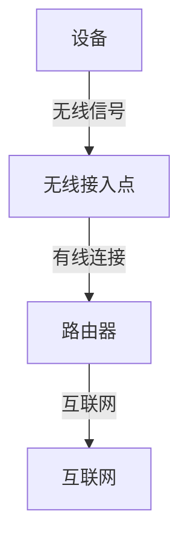

# 无线局域网标准

无线局域网（Wireless Local Area Network, WLAN）是一种通过无线信号连接设备的技术，允许设备在没有物理电缆的情况下进行通信。无线局域网标准由 IEEE（电气和电子工程师协会）制定，其中最著名的标准系列是 IEEE 802.11。本文将介绍无线局域网标准的基础知识，帮助初学者理解其工作原理和应用场景。

## 1. 什么是无线局域网标准？

无线局域网标准定义了无线网络设备之间如何通信的规则和协议。这些标准确保了不同厂商生产的设备能够相互兼容，并且能够在相同的频段上工作。IEEE 802.11 是最常见的无线局域网标准系列，它涵盖了从 802.11a 到 802.11ax 等多个版本。

## 2. IEEE 802.11 系列标准

IEEE 802.11 系列标准是无线局域网的核心标准。以下是一些常见的 802.11 标准及其主要特点：

### 2.1 802.11a
- **频段**: 5 GHz
- **最大速率**: 54 Mbps
- **特点**: 802.11a 使用 5 GHz 频段，避免了 2.4 GHz 频段的干扰，但信号穿透能力较弱。

### 2.2 802.11b
- **频段**: 2.4 GHz
- **最大速率**: 11 Mbps
- **特点**: 802.11b 是最早的无线局域网标准之一，使用 2.4 GHz 频段，信号穿透能力较强，但速率较低。

### 2.3 802.11g
- **频段**: 2.4 GHz
- **最大速率**: 54 Mbps
- **特点**: 802.11g 是 802.11b 的升级版，提供了更高的速率，同时保持了与 802.11b 设备的兼容性。

### 2.4 802.11n (Wi-Fi 4)
- **频段**: 2.4 GHz 和 5 GHz
- **最大速率**: 600 Mbps
- **特点**: 802.11n 引入了 MIMO（多输入多输出）技术，显著提高了无线网络的速率和覆盖范围。

### 2.5 802.11ac (Wi-Fi 5)
- **频段**: 5 GHz
- **最大速率**: 1.3 Gbps
- **特点**: 802.11ac 进一步提高了速率，支持更宽的频道带宽和更多的 MIMO 流。

### 2.6 802.11ax (Wi-Fi 6)
- **频段**: 2.4 GHz 和 5 GHz
- **最大速率**: 9.6 Gbps
- **特点**: 802.11ax 引入了 OFDMA（正交频分多址）技术，提高了网络的效率和容量，特别适合高密度环境。

## 3. 无线局域网的工作原理

无线局域网通过无线电波传输数据。设备（如笔记本电脑、智能手机）通过无线接入点（Access Point, AP）连接到网络。无线接入点通常连接到有线网络，并通过无线电波与设备通信。

## 4. 实际应用场景

无线局域网广泛应用于家庭、办公室、公共场所等场景。以下是一些常见的应用场景：

### 4.1 家庭网络
在家庭中，无线局域网允许家庭成员通过 Wi-Fi 连接互联网，共享文件、流媒体和在线游戏。

### 4.2 企业网络
在企业中，无线局域网为员工提供灵活的办公环境，允许他们在办公室的任何地方访问公司网络和资源。

### 4.3 公共场所
在咖啡馆、机场、酒店等公共场所，无线局域网为顾客提供免费的互联网接入服务。

## 5. 总结

无线局域网标准是无线通信的基础，IEEE 802.11 系列标准定义了无线网络的通信规则和协议。从 802.11a 到 802.11ax，无线局域网技术不断进步，提供了更高的速率、更好的覆盖范围和更高的网络效率。理解这些标准有助于我们更好地选择和使用无线网络设备。

## 6. 附加资源与练习

- **资源**:
  - [IEEE 802.11 标准文档](https://standards.ieee.org/standard/802_11-2016.html)
  - [Wi-Fi Alliance 官方网站](https://www.wi-fi.org/)

- **练习**:
  1. 研究你家中使用的无线路由器，查看它支持哪些 802.11 标准。
  2. 尝试在不同的位置测试 Wi-Fi 信号强度，并记录结果。

:::tip
如果你对无线局域网标准有更多疑问，可以参考 IEEE 官方文档或 Wi-Fi Alliance 的网站获取更多信息。
:::