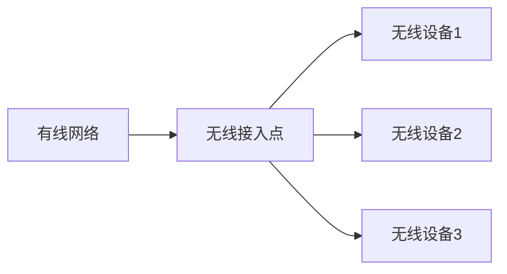

# 无线接入点

无线接入点（Wireless Access Point, WAP）是无线网络中的关键设备，它允许无线设备（如笔记本电脑、智能手机等）连接到有线网络。通过无线接入点，用户可以访问互联网、共享文件和其他网络资源。

## 什么是无线接入点？

无线接入点是一种网络设备，它通过无线信号将有线网络扩展到无线设备。它通常连接到路由器或交换机，并通过 Wi-Fi 技术（如 IEEE 802.11 标准）与无线设备通信。

:::note
无线接入点与无线路由器的区别在于，无线路由器通常集成了路由功能，而无线接入点仅负责无线信号的传输。
:::

## 无线接入点的工作原理

无线接入点通过以下步骤工作：

1. **接收有线网络信号**：无线接入点通过以太网电缆连接到路由器或交换机，接收来自有线网络的数据。
2. **转换为无线信号**：接入点将接收到的有线信号转换为无线信号，并通过天线广播。
3. **与无线设备通信**：无线设备（如智能手机、笔记本电脑）通过 Wi-Fi 连接到接入点，并与之通信。
4. **数据传输**：接入点在无线设备和有线网络之间传输数据，确保网络连接的稳定性和速度。

## 无线接入点的配置

配置无线接入点通常涉及以下步骤：

1. **物理连接**：将无线接入点通过以太网电缆连接到路由器或交换机。
2. **访问管理界面**：通过浏览器访问接入点的管理界面（通常通过 IP 地址访问）。
3. **设置网络名称（SSID）**：为无线网络设置一个唯一的名称，以便设备识别。
4. **配置安全设置**：启用 WPA2 或 WPA3 加密，以保护无线网络免受未经授权的访问。
5. **保存并应用设置**：保存配置并重启接入点，使设置生效。

:::tip
在配置无线接入点时，建议使用强密码并定期更新，以提高网络安全性。
:::

## 实际应用场景

### 家庭网络

在家庭网络中，无线接入点通常用于扩展 Wi-Fi 覆盖范围。例如，如果家中的某些区域 Wi-Fi 信号较弱，可以通过安装无线接入点来增强信号。

### 企业网络

在企业环境中，无线接入点用于为员工提供无线网络接入。多个接入点可以部署在办公楼的各个区域，以确保整个办公区域都有稳定的 Wi-Fi 覆盖。

### 公共场所

在咖啡馆、机场等公共场所，无线接入点用于为顾客提供免费的 Wi-Fi 服务。这些接入点通常连接到公共网络，并可能需要进行身份验证才能访问。

## 总结

无线接入点是现代无线网络的重要组成部分，它通过将有线网络扩展到无线设备，为用户提供了灵活的网络接入方式。通过了解无线接入点的工作原理和配置方法，您可以更好地管理和优化您的无线网络。

## 附加资源与练习

- **练习**：尝试在家中或办公室配置一个无线接入点，并测试其覆盖范围和性能。
- **资源**：阅读 IEEE 802.11 标准文档，深入了解 Wi-Fi 技术的工作原理。

:::caution
在配置无线接入点时，请确保遵循网络安全最佳实践，以防止未经授权的访问。
:::