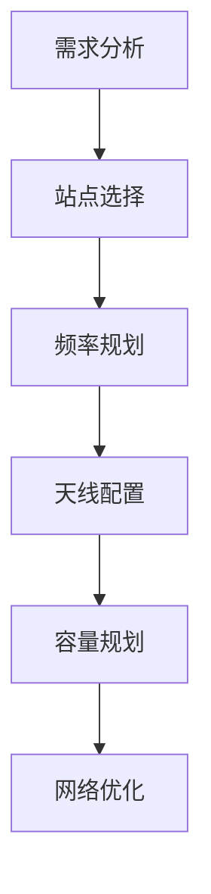

# 无线网络规划

无线网络规划是设计和部署无线通信系统的关键步骤。它涉及对网络覆盖、容量、性能以及资源分配的全面分析，以确保网络能够满足用户需求并提供高质量的服务。对于初学者来说，理解无线网络规划的基本概念和流程是掌握无线网络技术的重要一步。

## 什么是无线网络规划？

无线网络规划是指在特定区域内设计和部署无线网络的过程。它包括确定基站的位置、频率分配、天线配置以及网络容量规划等。目标是确保网络覆盖范围广、信号质量高、干扰最小化，并能够支持预期的用户数量和数据流量。

:::note
无线网络规划的核心目标是优化网络性能，同时降低成本。
:::

## 无线网络规划的步骤

无线网络规划通常包括以下几个步骤：

### 1. 需求分析
在规划无线网络之前，首先需要明确网络的需求。这包括：
- **覆盖范围**：需要覆盖的地理区域。
- **用户数量**：预计的用户数量和数据流量。
- **服务质量**：所需的网络性能指标，如延迟、吞吐量等。

### 2. 站点选择
选择合适的基站位置是无线网络规划的关键。需要考虑以下因素：
- **地形**：地形对信号传播的影响。
- **建筑物**：建筑物对信号的阻挡和反射。
- **干扰源**：其他无线设备或自然干扰源。

### 3. 频率规划
频率规划是确保无线网络高效运行的重要步骤。它包括：
- **频率分配**：为每个基站分配适当的频率。
- **干扰管理**：避免频率冲突和干扰。

### 4. 天线配置
天线的配置直接影响网络的覆盖范围和信号质量。需要考虑：
- **天线类型**：定向天线或全向天线。
- **天线高度**：天线的高度对信号传播的影响。
- **天线方向**：天线的方向对覆盖范围的影响。

### 5. 容量规划
容量规划是确保网络能够支持预期用户数量和数据流量的关键。它包括：
- **带宽分配**：为每个用户分配足够的带宽。
- **负载均衡**：确保网络负载均匀分布。

### 6. 网络优化
网络优化是无线网络规划的最后一步。它包括：
- **性能监控**：监控网络的性能指标。
- **调整参数**：根据监控结果调整网络参数。

## 实际案例

假设我们需要在一个大学校园内规划一个无线网络。以下是具体的规划步骤：

1. **需求分析**：校园内有5000名学生和教职工，预计每个用户每天使用1GB的数据流量。
2. **站点选择**：在校园内的主要建筑物顶部安装基站，确保信号覆盖整个校园。
3. **频率规划**：为每个基站分配不同的频率，避免干扰。
4. **天线配置**：使用定向天线，确保信号覆盖每个建筑物。
5. **容量规划**：为每个用户分配足够的带宽，确保网络能够支持高流量。
6. **网络优化**：监控网络性能，根据实际情况调整参数。

## 总结

无线网络规划是设计和部署无线通信系统的关键步骤。通过需求分析、站点选择、频率规划、天线配置、容量规划和网络优化，可以确保网络覆盖范围广、信号质量高、干扰最小化，并能够支持预期的用户数量和数据流量。

:::tip
在实际应用中，无线网络规划需要结合具体的地理环境和用户需求进行调整和优化。
:::

## 附加资源

- [无线网络规划指南](https://example.com/wireless-network-planning-guide)
- [无线网络优化技巧](https://example.com/wireless-network-optimization-tips)
- [无线网络规划工具](https://example.com/wireless-network-planning-tools)

## 练习

1. 在一个小型社区内规划一个无线网络，列出具体的规划步骤。
2. 分析一个现有的无线网络，找出可能的优化点。
