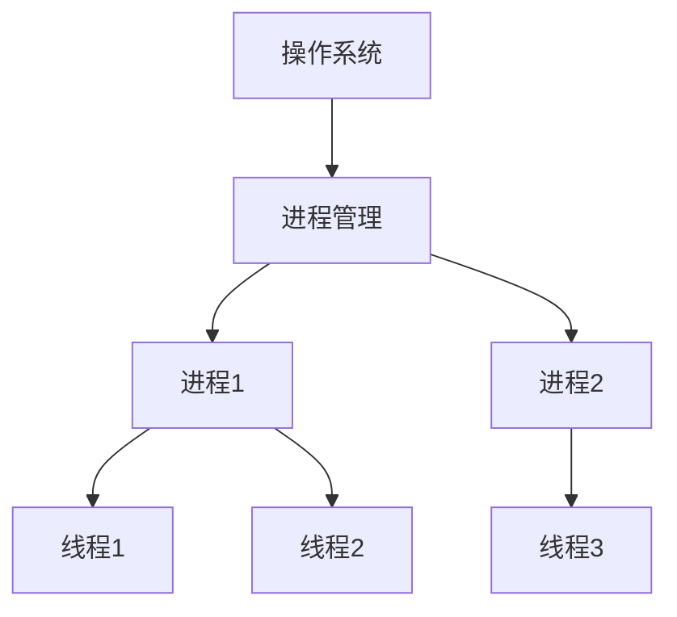

## 什么是操作系统？

操作系统（Operating System，简称 OS）是管理计算机硬件和软件资源的系统软件。它是计算机系统的核心，负责协调和控制计算机的所有活动。操作系统为用户和应用程序提供了一个与硬件交互的接口，使得用户无需直接操作复杂的硬件即可完成各种任务。

### 操作系统的主要功能

操作系统的主要功能包括：

1. **进程管理**：管理正在运行的程序（进程），分配 CPU 时间，确保多个程序能够高效运行。
2. **内存管理**：管理计算机的内存，分配和回收内存空间，确保程序能够正常运行。
3. **文件系统管理**：管理文件和目录，提供文件的存储、检索和共享功能。
4. **设备管理**：管理计算机的硬件设备，如键盘、鼠标、打印机等，提供设备驱动程序。
5. **用户界面**：提供用户与计算机交互的界面，如命令行界面（CLI）或图形用户界面（GUI）。

### 操作系统的类型

操作系统可以分为以下几类：

1. **单用户单任务操作系统**：一次只允许一个用户运行一个程序，例如早期的 MS-DOS。
2. **单用户多任务操作系统**：允许一个用户同时运行多个程序，例如 Windows 和 macOS。
3. **多用户操作系统**：允许多个用户同时使用计算机，例如 Unix 和 Linux。
4. **实时操作系统**：用于需要快速响应的系统，如工业控制系统和嵌入式系统。

### 操作系统的实际应用

操作系统广泛应用于各种设备和场景中，例如：

- **个人计算机**：Windows、macOS、Linux 等操作系统为用户提供了丰富的功能和友好的界面。
- **服务器**：Linux 和 Windows Server 等操作系统用于管理网络服务器和数据中心。
- **移动设备**：Android 和 iOS 是智能手机和平板电脑的主流操作系统。
- **嵌入式系统**：实时操作系统用于汽车、家电和工业设备中。

### 代码示例：查看操作系统信息

在 Linux 系统中，您可以使用以下命令查看操作系统的信息：

```bash
uname -a
```

**输出示例：**

```
Linux mycomputer 5.4.0-42-generic #46-Ubuntu SMP Fri Jul 10 00:24:02 UTC 2020 x86_64 GNU/Linux
```

这个命令显示了操作系统的名称、内核版本、系统架构等信息。

### 操作系统的核心概念

#### 1. 进程与线程

进程是正在运行的程序的实例，而线程是进程中的执行单元。操作系统通过调度算法管理多个进程和线程，确保它们能够高效地共享 CPU 资源。



#### 2. 内存管理

操作系统负责分配和回收内存空间，确保每个程序都有足够的内存运行。它还通过虚拟内存技术扩展物理内存的容量。

:::tip
虚拟内存允许操作系统将部分数据存储在硬盘上，从而扩展可用的内存空间。
:::

#### 3. 文件系统

文件系统是操作系统用于管理文件和目录的机制。它提供了文件的存储、检索和共享功能。常见的文件系统包括 FAT32、NTFS（Windows）和 ext4（Linux）。

### 实际案例：操作系统的调度算法

假设您正在使用一台计算机运行多个程序，例如浏览器、文本编辑器和音乐播放器。操作系统通过调度算法决定哪个程序优先使用 CPU 资源。常见的调度算法包括：

- **先来先服务（FCFS）**：按照程序到达的顺序分配 CPU 时间。
- **短作业优先（SJF）**：优先运行执行时间较短的程序。
- **时间片轮转（RR）**：每个程序轮流使用 CPU 一段时间。

:::note
调度算法的选择会影响系统的响应速度和效率。
:::

### 总结

操作系统是计算机系统的核心，负责管理硬件和软件资源，为用户和应用程序提供接口。通过本文，您了解了操作系统的基本概念、功能以及实际应用场景。希望这些知识能够帮助您更好地理解计算机的工作原理。

### 附加资源与练习

- **推荐阅读**：
  - 《操作系统概念》—— Abraham Silberschatz 等
  - 《现代操作系统》—— Andrew S. Tanenbaum
- **练习**：
  - 在您的计算机上查看操作系统的版本信息。
  - 尝试使用任务管理器（Windows）或系统监视器（Linux）查看正在运行的进程。

通过不断学习和实践，您将逐步掌握操作系统的核心知识！