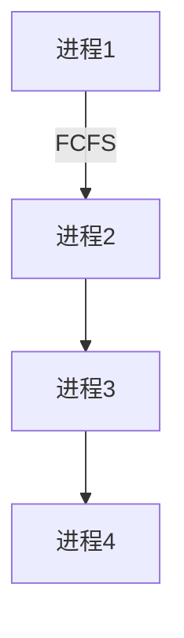

## 介绍

操作系统（Operating System, OS）是计算机系统中最重要的软件之一，它管理硬件资源并为应用程序提供运行环境。在学习操作系统时，理解一些关键术语是至关重要的。本文将介绍一些常见的操作系统术语，帮助初学者更好地理解操作系统的工作原理。

## 关键术语

### 1. 进程（Process）

进程是操作系统中的一个基本概念，指的是正在执行的程序实例。每个进程都有自己独立的内存空间和系统资源。

:::note
**注意**：进程与程序不同。程序是静态的代码，而进程是动态的执行实体。
:::

#### 示例
```c
#include <stdio.h>
#include <unistd.h>

int main() {
    printf("进程ID: %d\n", getpid());
    return 0;
}
```
**输出**：
```
进程ID: 1234
```

### 2. 线程（Thread）

线程是进程中的一个执行单元，一个进程可以包含多个线程。线程共享进程的内存空间和资源，但每个线程有自己的栈和寄存器。

:::tip
**提示**：多线程可以提高程序的并发性，但也可能引入线程安全问题。
:::

#### 示例
```python
import threading

def print_numbers():
    for i in range(5):
        print(i)

thread = threading.Thread(target=print_numbers)
thread.start()
thread.join()
```
**输出**：
```
0
1
2
3
4
```

### 3. 调度（Scheduling）

调度是操作系统决定哪个进程或线程使用CPU的过程。常见的调度算法包括先来先服务（FCFS）、最短作业优先（SJF）和轮转调度（Round Robin）。



### 4. 死锁（Deadlock）

死锁是指两个或多个进程互相等待对方释放资源，导致所有进程都无法继续执行的状态。死锁的四个必要条件是：互斥条件、占有并等待、非抢占条件和循环等待条件。

:::caution
**警告**：死锁会导致系统资源浪费，甚至系统崩溃。
:::

#### 示例
```java
public class DeadlockExample {
    public static void main(String[] args) {
        final Object resource1 = new Object();
        final Object resource2 = new Object();

        Thread thread1 = new Thread(() -> {
            synchronized (resource1) {
                System.out.println("Thread 1: Holding resource 1...");
                try { Thread.sleep(100); } catch (InterruptedException e) {}
                synchronized (resource2) {
                    System.out.println("Thread 1: Holding resource 1 & 2...");
                }
            }
        });

        Thread thread2 = new Thread(() -> {
            synchronized (resource2) {
                System.out.println("Thread 2: Holding resource 2...");
                try { Thread.sleep(100); } catch (InterruptedException e) {}
                synchronized (resource1) {
                    System.out.println("Thread 2: Holding resource 1 & 2...");
                }
            }
        });

        thread1.start();
        thread2.start();
    }
}
```
**输出**：
```
Thread 1: Holding resource 1...
Thread 2: Holding resource 2...
```

### 5. 虚拟内存（Virtual Memory）

虚拟内存是一种内存管理技术，它使得应用程序认为自己拥有连续的内存空间，而实际上这些内存可能分散在物理内存和磁盘上。

:::tip
**提示**：虚拟内存可以提高内存利用率，并支持多任务处理。
:::

#### 示例
```c
#include <stdio.h>
#include <stdlib.h>

int main() {
    int *ptr = (int *)malloc(1024 * sizeof(int));
    if (ptr == NULL) {
        printf("内存分配失败\n");
        return 1;
    }
    printf("内存分配成功\n");
    free(ptr);
    return 0;
}
```
**输出**：
```
内存分配成功
```

### 6. 文件系统（File System）

文件系统是操作系统用于管理文件和目录的机制。常见的文件系统包括FAT32、NTFS和ext4。

:::note
**注意**：文件系统不仅管理文件的存储，还负责文件的权限和访问控制。
:::

#### 示例
```bash
$ ls -l
-rw-r--r-- 1 user group 4096 Oct 10 12:34 example.txt
```

### 7. 中断（Interrupt）

中断是硬件或软件发出的信号，用于通知CPU有重要事件需要处理。中断处理是操作系统响应外部事件的关键机制。

:::warning
**警告**：中断处理不当可能导致系统不稳定。
:::

#### 示例
```c
#include <signal.h>
#include <stdio.h>
#include <unistd.h>

void handle_signal(int signal) {
    printf("接收到信号: %d\n", signal);
}

int main() {
    signal(SIGINT, handle_signal);
    while (1) {
        printf("运行中...\n");
        sleep(1);
    }
    return 0;
}
```
**输出**：
```
运行中...
运行中...
接收到信号: 2
```

## 实际案例

### 案例1：多线程下载器

一个多线程下载器可以利用多个线程同时下载文件的不同部分，从而提高下载速度。每个线程负责下载文件的一个片段，最后将所有片段合并成一个完整的文件。

### 案例2：虚拟内存管理

在大型应用程序中，虚拟内存管理可以确保即使物理内存不足，应用程序仍然可以正常运行。操作系统会将不常用的内存页交换到磁盘上，从而释放物理内存。

## 总结

本文介绍了一些操作系统中的关键术语，包括进程、线程、调度、死锁、虚拟内存、文件系统和中断。理解这些术语是学习操作系统的基础，希望本文能帮助初学者更好地掌握这些概念。

## 附加资源

- **书籍**：《操作系统概念》 by Abraham Silberschatz
- **在线课程**：Coursera 上的《操作系统原理》
- **练习**：尝试编写一个简单的多线程程序，观察线程之间的交互。

:::tip
**提示**：实践是掌握操作系统概念的最佳方式，建议多动手编写代码并进行实验。
:::