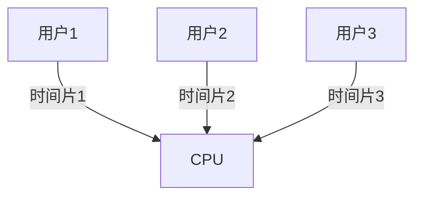
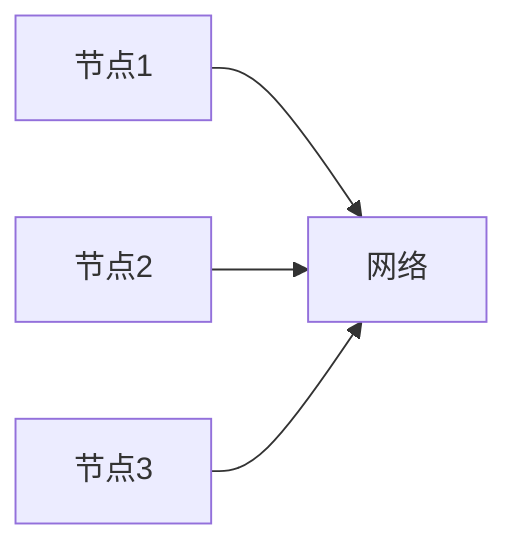

# 操作系统类型

操作系统（Operating System, OS）是计算机系统的核心软件，负责管理硬件资源并为应用程序提供运行环境。根据其设计目标和使用场景，操作系统可以分为多种类型。本文将介绍几种常见的操作系统类型，并探讨它们的特点和应用场景。

## 1. 批处理操作系统（Batch Operating System）

批处理操作系统是最早的操作系统类型之一，主要用于处理大量相似的任务。用户将任务提交给系统，系统按照顺序依次执行这些任务，而无需用户干预。

### 特点：
- **非交互式**：用户无法与正在运行的任务进行交互。
- **高效性**：适合处理大量重复性任务，如数据处理、报表生成等。

### 应用场景：
- 早期的银行系统用于批量处理交易记录。
- 科学计算中的大规模数据处理。

:::note
批处理操作系统在现代计算机中已较少使用，但其设计思想对现代操作系统仍有影响。
:::

## 2. 分时操作系统（Time-Sharing Operating System）

分时操作系统允许多个用户同时使用计算机资源，每个用户都感觉自己独占整个系统。系统通过快速切换任务来实现多用户共享资源。

### 特点：
- **交互性**：用户可以与系统实时交互。
- **公平性**：系统为每个用户分配固定的时间片，确保资源公平分配。

### 应用场景：
- 大学计算机实验室的多用户环境。
- 远程登录系统（如SSH）。

:::tip
分时操作系统是现代多用户操作系统的基础，如Unix和Linux。
:::

## 3. 实时操作系统（Real-Time Operating System, RTOS）

实时操作系统用于需要严格时间约束的应用场景，系统必须在规定的时间内完成任务。

### 特点：
- **确定性**：任务必须在规定的时间内完成。
- **高可靠性**：系统必须稳定运行，避免任务失败。

### 应用场景：
- 航空航天控制系统。
- 工业自动化设备。

:::caution
实时操作系统的设计目标是确保任务的及时完成，而不是最大化吞吐量。
:::

## 4. 分布式操作系统（Distributed Operating System）

分布式操作系统管理多个独立的计算机系统，使它们像一个单一系统一样工作。资源分布在多个节点上，系统通过通信网络协调任务。

### 特点：
- **透明性**：用户无需关心资源的具体位置。
- **可扩展性**：系统可以通过增加节点来扩展计算能力。

### 应用场景：
- 云计算平台（如AWS、Google Cloud）。
- 分布式数据库系统。

:::warning
分布式操作系统的设计和实现复杂度较高，需要解决一致性和容错性问题。
:::

## 5. 嵌入式操作系统（Embedded Operating System）

嵌入式操作系统专为嵌入式设备设计，通常运行在资源有限的硬件上，如微控制器或专用芯片。

### 特点：
- **资源受限**：内存和处理能力有限。
- **专用性**：针对特定应用场景优化。

### 应用场景：
- 智能家居设备（如智能灯泡、智能插座）。
- 汽车电子系统（如车载娱乐系统）。

:::note
嵌入式操作系统通常需要高度优化，以确保在有限的资源下高效运行。
:::

## 6. 网络操作系统（Network Operating System）

网络操作系统用于管理网络资源，如文件共享、打印机共享和用户权限管理。

### 特点：
- **网络中心化**：专注于网络资源的管理和共享。
- **多用户支持**：支持多个用户同时访问网络资源。

### 应用场景：
- 企业内部的文件服务器。
- 网络打印机管理。

## 总结

操作系统类型多种多样，每种类型都有其独特的设计目标和应用场景。理解这些类型有助于我们更好地选择和使用适合的操作系统。

### 附加资源
- [操作系统概念（第10版）](https://example.com) - 一本深入讲解操作系统原理的经典书籍。
- [Linux 命令行教程](https://example.com) - 学习如何在分时操作系统中使用命令行工具。

### 练习
1. 列举三种不同类型的操作系统，并描述它们的主要特点。
2. 选择一个你熟悉的嵌入式设备，分析其使用的操作系统类型及其特点。
