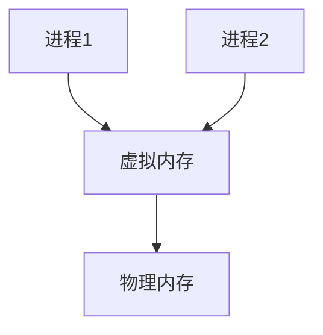

## 介绍

操作系统（Operating System, OS）是计算机系统的核心软件，负责管理硬件资源并为应用程序提供服务。操作系统的架构决定了它如何组织和管理这些资源。理解操作系统的架构是学习计算机科学的重要一步，因为它帮助我们了解计算机如何高效地运行程序和管理资源。

本文将逐步介绍操作系统的基本架构，包括内核、系统调用、进程管理、内存管理等核心概念，并通过实际案例展示这些概念的应用。

## 操作系统的基本架构

操作系统的架构可以分为以下几个主要部分：

1. **内核（Kernel）**
2. **系统调用（System Calls）**
3. **进程管理（Process Management）**
4. **内存管理（Memory Management）**
5. **文件系统（File System）**
6. **设备管理（Device Management）**

### 1. 内核（Kernel）

内核是操作系统的核心部分，负责管理系统的硬件资源，如CPU、内存和I/O设备。内核通常运行在特权模式下，可以直接访问硬件。

:::note
内核的主要功能包括：
- 进程调度
- 内存管理
- 设备驱动管理
- 系统调用处理
:::

### 2. 系统调用（System Calls）

系统调用是应用程序与操作系统内核之间的接口。通过系统调用，应用程序可以请求内核执行某些操作，如创建进程、读写文件等。

例如，在Linux系统中，`fork()` 是一个常见的系统调用，用于创建一个新的进程：

```c
#include <stdio.h>
#include <unistd.h>

int main() {
    pid_t pid = fork();
    if (pid == 0) {
        printf("这是子进程\n");
    } else {
        printf("这是父进程\n");
    }
    return 0;
}
```

**输出：**
```
这是父进程
这是子进程
```

### 3. 进程管理（Process Management）

进程是正在运行的程序的实例。操作系统负责创建、调度和终止进程。进程管理包括进程调度、进程同步和进程间通信（IPC）。

:::tip
进程调度算法决定了哪个进程可以获得CPU时间。常见的调度算法包括先来先服务（FCFS）、短作业优先（SJF）和时间片轮转（Round Robin）。
:::

### 4. 内存管理（Memory Management）

内存管理负责分配和回收内存资源，确保每个进程都有足够的内存空间运行。内存管理还包括虚拟内存管理，它允许进程使用比物理内存更大的地址空间。



### 5. 文件系统（File System）

文件系统负责管理存储在磁盘上的文件和目录。它提供了文件的创建、读取、写入和删除等操作。

:::caution
文件系统的设计对系统性能有重要影响。常见的文件系统包括FAT32、NTFS和ext4。
:::

### 6. 设备管理（Device Management）

设备管理负责管理计算机的硬件设备，如键盘、鼠标、打印机等。操作系统通过设备驱动程序与硬件设备进行通信。

## 实际案例

### 案例1：Linux 操作系统

Linux 是一个典型的开源操作系统，其架构包括内核、系统调用、进程管理、内存管理等模块。Linux 内核是操作系统的核心，负责管理硬件资源和提供系统调用接口。

### 案例2：Windows 操作系统

Windows 操作系统采用了微内核架构，将部分内核功能移出内核空间，以提高系统的稳定性和安全性。Windows 的系统调用接口（Win32 API）为应用程序提供了丰富的功能。

## 总结

操作系统的架构是计算机科学中的核心概念，理解它有助于我们更好地理解计算机系统的工作原理。本文介绍了操作系统的基本架构，包括内核、系统调用、进程管理、内存管理、文件系统和设备管理，并通过实际案例展示了这些概念的应用。

## 附加资源

- **书籍推荐**：
  - 《操作系统概念》（Operating System Concepts）
  - 《现代操作系统》（Modern Operating Systems）
- **在线课程**：
  - [Coursera: Operating Systems and You: Becoming a Power User](https://www.coursera.org/learn/os-power-user)
  - [edX: Introduction to Operating Systems](https://www.edx.org/course/introduction-to-operating-systems)

## 练习

1. 编写一个简单的C程序，使用 `fork()` 系统调用创建子进程，并观察输出结果。
2. 研究Linux内核的源代码，了解其进程调度算法的实现。
3. 比较Windows和Linux的文件系统，分析它们的优缺点。

通过以上学习和练习，你将能够更深入地理解操作系统的架构及其在计算机系统中的作用。