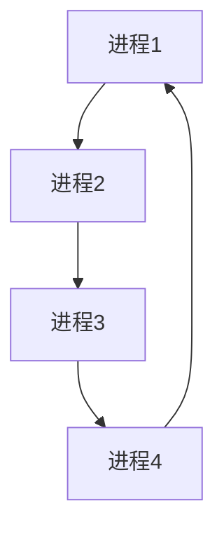

## 介绍

操作系统（Operating System, OS）是计算机系统中最重要的软件之一，它管理硬件资源并为应用程序提供运行环境。操作系统的主要功能包括进程管理、内存管理、文件系统管理、设备管理和用户界面等。本文将逐步介绍这些功能，并通过实际案例帮助初学者理解操作系统的作用。

## 进程管理

进程是操作系统中最基本的概念之一。进程管理负责创建、调度和终止进程，确保多个程序能够高效地共享 CPU 资源。

### 进程调度

操作系统通过调度算法决定哪个进程可以使用 CPU。常见的调度算法包括：

- **先来先服务（FCFS）**：按照进程到达的顺序进行调度。
- **短作业优先（SJF）**：优先调度执行时间较短的进程。
- **时间片轮转（Round Robin）**：每个进程分配一个固定的时间片，轮流执行。



### 实际案例

假设你有三个进程需要执行，它们的执行时间分别为 5ms、3ms 和 8ms。使用 FCFS 调度算法，进程将按照到达顺序执行，总执行时间为 16ms。而使用 SJF 调度算法，执行顺序为 3ms、5ms、8ms，总执行时间为 14ms。

## 内存管理

内存管理负责分配和回收内存空间，确保每个进程都有足够的内存运行。

### 虚拟内存

虚拟内存是一种内存管理技术，它允许进程使用比实际物理内存更大的地址空间。操作系统通过分页机制将虚拟内存映射到物理内存。


### 实际案例

假设你的计算机有 4GB 物理内存，但你运行的程序需要 6GB 内存。操作系统会使用虚拟内存技术，将部分数据存储在磁盘上，并在需要时将其加载到物理内存中。

## 文件系统管理

文件系统管理负责组织、存储和检索文件。常见的文件系统包括 FAT32、NTFS 和 ext4。

### 文件操作

操作系统提供了一系列文件操作 API，如 `open`、`read`、`write` 和 `close`。以下是一个简单的文件读写示例：

```python
# 打开文件
file = open("example.txt", "w")
# 写入数据
file.write("Hello, World!")
# 关闭文件
file.close()

# 读取文件
file = open("example.txt", "r")
content = file.read()
print(content)  # 输出: Hello, World!
file.close()
```

### 实际案例

假设你需要编写一个程序来记录用户输入的日志。你可以使用文件系统管理功能将日志写入文件，并在需要时读取和显示日志内容。

## 设备管理

设备管理负责控制和管理计算机的硬件设备，如键盘、鼠标、打印机等。

### 设备驱动程序

设备驱动程序是操作系统与硬件设备之间的接口。操作系统通过设备驱动程序与硬件设备通信。


### 实际案例

当你按下键盘上的一个键时，键盘驱动程序会将按键信息传递给操作系统，操作系统再将信息传递给应用程序，如文本编辑器。

## 用户界面

操作系统提供了用户与计算机交互的界面，包括命令行界面（CLI）和图形用户界面（GUI）。

### 命令行界面

命令行界面允许用户通过输入命令与操作系统交互。以下是一个简单的命令行示例：

```bash
$ ls
file1.txt  file2.txt  file3.txt
```

### 实际案例

假设你需要查看当前目录下的所有文件，你可以使用 `ls` 命令来列出文件。

## 总结

操作系统是计算机系统的核心，它通过进程管理、内存管理、文件系统管理、设备管理和用户界面等功能，确保计算机资源的高效利用和用户操作的便捷性。理解这些功能对于深入学习计算机科学至关重要。

## 附加资源

- [操作系统概念](https://example.com/os-concepts)
- [进程调度算法详解](https://example.com/scheduling-algorithms)
- [虚拟内存技术](https://example.com/virtual-memory)

## 练习

1. 编写一个简单的程序，使用文件系统管理功能创建一个文件并写入数据。
2. 研究并比较不同的进程调度算法，分析它们的优缺点。
3. 了解虚拟内存的工作原理，并解释为什么它对于现代操作系统至关重要。
