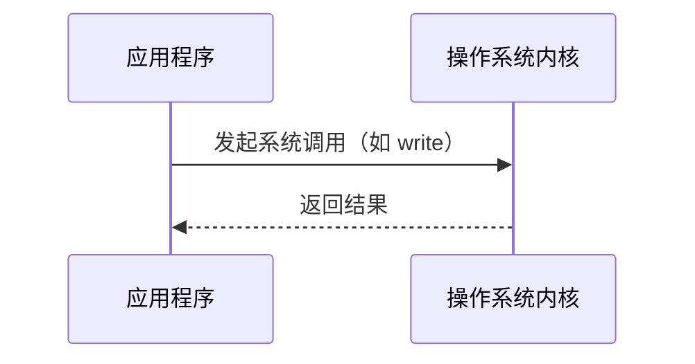

## 介绍

操作系统接口是用户与操作系统之间进行交互的桥梁。它允许用户或应用程序通过一组定义良好的方法（如系统调用、命令行接口或图形用户界面）来访问操作系统的功能。理解操作系统接口是学习操作系统基础的重要一步。

## 操作系统接口的类型

操作系统接口主要分为以下几类：

1. **命令行接口 (CLI)**  
   命令行接口通过文本命令与操作系统交互。用户输入命令，操作系统执行并返回结果。例如，在 Linux 中，`ls` 命令用于列出目录内容。

   ```bash
   $ ls
   file1.txt  file2.txt  directory1
   ```

2. **图形用户界面 (GUI)**  
   图形用户界面通过图形元素（如窗口、图标、按钮）与用户交互。它更直观，适合普通用户使用。例如，Windows 的资源管理器。

3. **系统调用 (System Calls)**  
   系统调用是操作系统提供给应用程序的编程接口。应用程序通过系统调用请求操作系统执行特定任务，如文件操作、进程管理等。

   ```c
   #include <unistd.h>
   int main() {
       write(1, "Hello, World!\n", 14); // 系统调用：向标准输出写入数据
       return 0;
   }
   ```

4. **应用程序编程接口 (API)**  
   API 是一组函数或方法，允许应用程序与操作系统或其他软件组件交互。例如，Windows API 提供了访问系统资源的函数。

## 系统调用的工作原理

系统调用是操作系统接口的核心部分。当应用程序需要访问硬件资源或执行特权操作时，它会通过系统调用请求操作系统提供服务。

以下是一个简单的系统调用流程：



1. 应用程序调用系统调用函数（如 `write`）。
2. 操作系统内核接管控制权，执行请求的操作。
3. 内核将结果返回给应用程序。

## 实际案例

### 案例 1：文件操作

在 Linux 中，文件操作通常通过系统调用完成。以下是一个使用 `open` 和 `read` 系统调用读取文件的示例：

```c
#include <fcntl.h>
#include <unistd.h>
#include <stdio.h>

int main() {
    int fd = open("example.txt", O_RDONLY); // 打开文件
    if (fd == -1) {
        perror("open");
        return 1;
    }

    char buffer[100];
    ssize_t bytesRead = read(fd, buffer, sizeof(buffer)); // 读取文件内容
    if (bytesRead == -1) {
        perror("read");
        close(fd);
        return 1;
    }

    printf("Read: %.*s\n", (int)bytesRead, buffer);
    close(fd); // 关闭文件
    return 0;
}
```

**输入文件 `example.txt` 内容：**
```
Hello, World!
```

**输出：**
```
Read: Hello, World!
```

### 案例 2：进程管理

操作系统接口还用于管理进程。以下是一个使用 `fork` 系统调用创建子进程的示例：

```c
#include <unistd.h>
#include <stdio.h>

int main() {
    pid_t pid = fork(); // 创建子进程
    if (pid == 0) {
        printf("This is the child process.\n");
    } else if (pid > 0) {
        printf("This is the parent process.\n");
    } else {
        perror("fork");
        return 1;
    }
    return 0;
}
```

**输出：**
```
This is the parent process.
This is the child process.
```

:::note
注意：`fork` 系统调用会创建一个与父进程几乎完全相同的子进程。子进程从 `fork` 返回的地方开始执行。
:::

## 总结

操作系统接口是用户和应用程序与操作系统交互的关键。通过命令行接口、图形用户界面、系统调用和 API，我们可以访问操作系统的功能并管理计算机资源。理解这些接口的工作原理对于编写高效、可靠的程序至关重要。

## 附加资源

- [Linux 系统调用手册](https://man7.org/linux/man-pages/dir_section_2.html)
- [Windows API 文档](https://docs.microsoft.com/en-us/windows/win32/api/)
- 《操作系统概念》—— Abraham Silberschatz 等

## 练习

1. 编写一个 C 程序，使用 `open` 和 `write` 系统调用创建一个文件并写入内容。
2. 在 Linux 终端中尝试使用 `ls`、`cd` 和 `mkdir` 命令，观察它们的行为。
3. 阅读 `fork` 系统调用的文档，尝试修改示例程序，使父进程和子进程执行不同的任务。