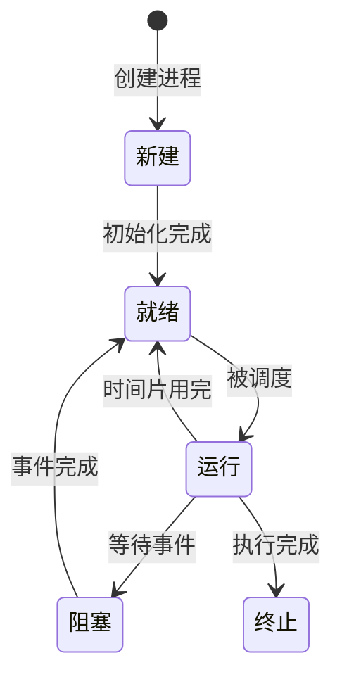

## 介绍

在操作系统中，**进程**是一个核心概念。简单来说，进程是正在执行的程序的实例。它不仅包含程序的代码，还包括程序运行时的状态、内存、打开的文件、寄存器值等信息。操作系统通过管理进程来实现多任务处理，使得多个程序可以同时运行。

进程是操作系统资源分配的基本单位。理解进程的概念对于学习操作系统的工作原理至关重要。

## 进程的定义

进程可以定义为：
- **程序的执行实例**：一个程序可以有多个进程实例。
- **资源的容器**：进程拥有独立的内存空间、文件描述符、CPU 寄存器等资源。
- **调度的基本单位**：操作系统通过调度进程来分配 CPU 时间。

:::note
进程与程序的区别：
- **程序**是静态的，存储在磁盘上的代码和数据。
- **进程**是动态的，是程序在内存中的执行状态。
:::

## 进程的生命周期

一个进程从创建到终止会经历多个状态。以下是进程的典型生命周期：



### 1. 新建（New）
进程刚刚被创建，操作系统为其分配资源，但尚未开始执行。

### 2. 就绪（Ready）
进程已经准备好运行，等待操作系统分配 CPU 时间。

### 3. 运行（Running）
进程正在 CPU 上执行。

### 4. 阻塞（Blocked）
进程因等待某些事件（如 I/O 操作）而暂停执行。

### 5. 终止（Terminated）
进程执行完毕或被强制终止，操作系统回收其资源。

## 进程的状态转换

进程的状态会根据系统调度和事件的发生而转换。以下是常见的状态转换：

- **就绪 → 运行**：进程被调度器选中，开始执行。
- **运行 → 就绪**：进程的时间片用完，被调度器暂停。
- **运行 → 阻塞**：进程需要等待某个事件（如 I/O 操作）。
- **阻塞 → 就绪**：事件完成，进程可以继续执行。
- **运行 → 终止**：进程执行完毕或被强制终止。

## 实际案例：多任务处理

现代操作系统支持多任务处理，即同时运行多个进程。例如，你可以在电脑上同时打开浏览器、文本编辑器和音乐播放器。操作系统通过快速切换进程来模拟“同时运行”的效果。

:::tip
多任务处理的实现依赖于进程调度算法，如时间片轮转、优先级调度等。
:::

## 代码示例：创建进程

以下是一个简单的 Python 示例，展示如何使用 `multiprocessing` 模块创建进程：

```python
import multiprocessing
import time

def worker(name):
    print(f"进程 {name} 开始执行")
    time.sleep(2)  # 模拟工作
    print(f"进程 {name} 执行完毕")

if __name__ == "__main__":
    # 创建两个进程
    p1 = multiprocessing.Process(target=worker, args=("A",))
    p2 = multiprocessing.Process(target=worker, args=("B",))

    # 启动进程
    p1.start()
    p2.start()

    # 等待进程结束
    p1.join()
    p2.join()

    print("所有进程执行完毕")
```

**输出：**
```
进程 A 开始执行
进程 B 开始执行
进程 A 执行完毕
进程 B 执行完毕
所有进程执行完毕
```

## 总结

进程是操作系统中的核心概念，理解其定义、生命周期和状态转换是学习操作系统的基础。通过多任务处理，操作系统能够高效地管理多个进程，为用户提供流畅的使用体验。

## 附加资源

- **书籍推荐**：
  - 《操作系统概念》（Operating System Concepts）
  - 《现代操作系统》（Modern Operating Systems）
- **练习**：
  - 编写一个程序，创建多个进程并观察它们的执行顺序。
  - 研究操作系统的进程调度算法，并尝试模拟简单的调度过程。

:::caution
在学习进程管理时，务必注意资源竞争和死锁问题，这是多进程编程中的常见挑战。
:::