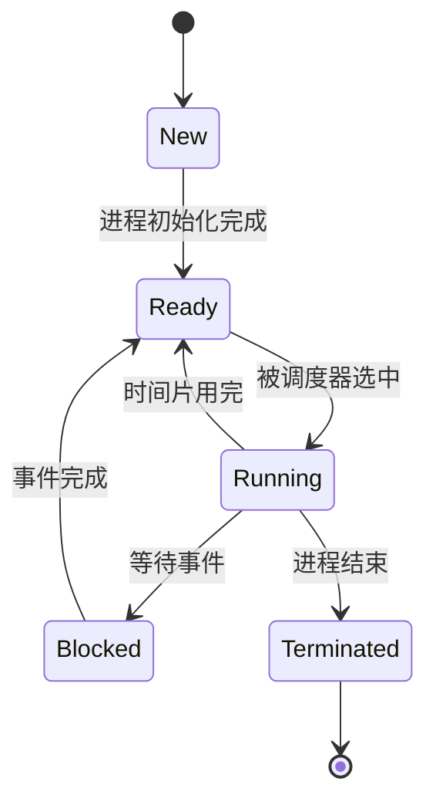

# 操作系统进程状态

在操作系统中，**进程**是程序执行的基本单位。每个进程在执行过程中会经历不同的状态，这些状态反映了进程在系统中的活动情况。理解进程状态及其转换是学习操作系统进程管理的基础。

## 什么是进程状态？

进程状态是指进程在其生命周期中所处的不同阶段。操作系统通过管理这些状态来调度进程，确保系统资源的高效利用。常见的进程状态包括：

1. **新建（New）**：进程刚被创建，尚未被操作系统调度。
2. **就绪（Ready）**：进程已准备好运行，等待 CPU 分配时间片。
3. **运行（Running）**：进程正在 CPU 上执行。
4. **阻塞（Blocked）**：进程因等待某些事件（如 I/O 操作）而暂停执行。
5. **终止（Terminated）**：进程执行完毕或被强制终止。

## 进程状态转换

进程状态之间会随着系统调度和进程行为的变化而转换。以下是常见的状态转换：



### 状态转换详解

1. **新建 → 就绪**  
   当进程被创建并初始化完成后，操作系统会将其放入就绪队列，等待调度。

2. **就绪 → 运行**  
   当 CPU 空闲时，调度器会从就绪队列中选择一个进程，分配 CPU 时间片，使其进入运行状态。

3. **运行 → 就绪**  
   如果进程的时间片用完，或者有更高优先级的进程需要运行，当前进程会被放回就绪队列。

4. **运行 → 阻塞**  
   如果进程需要等待某些事件（如 I/O 操作），它会主动放弃 CPU，进入阻塞状态。

5. **阻塞 → 就绪**  
   当等待的事件完成后，进程会被唤醒，重新进入就绪队列。

6. **运行 → 终止**  
   当进程完成其任务或被强制终止时，它会进入终止状态，释放所有资源。

## 实际案例

假设我们有一个简单的程序，需要从文件中读取数据并处理：

```python
import time

def read_file():
    print("开始读取文件...")
    time.sleep(2)  # 模拟 I/O 操作
    print("文件读取完成")

def process_data():
    print("开始处理数据...")
    time.sleep(1)  # 模拟数据处理
    print("数据处理完成")

read_file()
process_data()
```

### 进程状态分析

1. **新建**：程序启动时，操作系统为其创建一个进程。
2. **就绪**：进程初始化完成后，进入就绪队列。
3. **运行**：进程被调度，开始执行 `read_file` 函数。
4. **阻塞**：在 `time.sleep(2)` 期间，进程等待 I/O 操作完成，进入阻塞状态。
5. **就绪**：I/O 操作完成后，进程被唤醒，重新进入就绪队列。
6. **运行**：进程再次被调度，执行 `process_data` 函数。
7. **终止**：程序执行完毕，进程进入终止状态。

## 总结

进程状态是操作系统进程管理的核心概念之一。通过理解进程状态及其转换，我们可以更好地掌握操作系统的调度机制和资源管理策略。以下是关键点总结：

- 进程状态包括新建、就绪、运行、阻塞和终止。
- 进程状态会随着系统调度和进程行为的变化而转换。
- 实际应用中，进程状态转换是操作系统高效管理资源的基础。

## 附加资源与练习

### 推荐阅读
- 《操作系统概念》—— Abraham Silberschatz 等
- 《现代操作系统》—— Andrew S. Tanenbaum

### 练习
1. 编写一个简单的多进程程序，观察进程状态的变化。
2. 使用工具（如 `top` 或 `htop`）监控系统中进程的状态。
3. 思考：如果一个进程长时间处于阻塞状态，可能是什么原因？如何解决？

通过学习和实践，你将逐步掌握进程管理的核心知识，为进一步学习操作系统打下坚实基础。