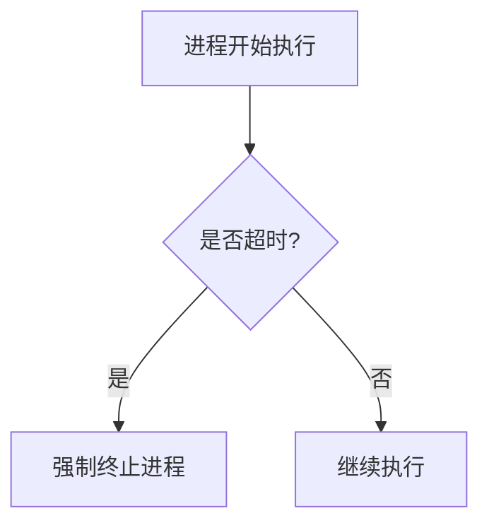

# 操作系统进程终止

在操作系统中，进程是程序执行的基本单位。进程的终止是进程生命周期的最后一个阶段，它标志着进程的执行结束。理解进程终止的机制对于编写高效、稳定的程序至关重要。本文将详细介绍进程终止的概念、类型以及实际应用场景。

## 什么是进程终止？

进程终止是指操作系统结束一个进程的执行，并释放其占用的资源。进程终止可以是**正常终止**，也可以是**异常终止**。正常终止通常是由于进程完成了它的任务，而异常终止则可能是由于错误或外部干预导致的。

## 进程终止的类型

### 1. 正常终止

正常终止是指进程按照预期完成了它的任务，并主动请求操作系统终止它。在大多数编程语言中，进程可以通过调用特定的系统调用来正常终止自己。

例如，在C语言中，可以使用 `exit()` 函数来正常终止进程：

```c
#include <stdlib.h>
#include <stdio.h>

int main() {
    printf("进程即将正常终止...\n");
    exit(0);  // 正常终止进程
}
```

**输出：**
```
进程即将正常终止...
```

### 2. 异常终止

异常终止是指进程由于某种错误或外部干预而被迫终止。常见的异常终止原因包括：

- **段错误**：进程试图访问未分配的内存。
- **除零错误**：进程试图进行除以零的操作。
- **外部信号**：用户或操作系统发送信号强制终止进程。

例如，在C语言中，以下代码会导致除零错误，从而导致进程异常终止：

```c
#include <stdio.h>

int main() {
    int a = 10;
    int b = 0;
    int c = a / b;  // 除零错误
    printf("结果: %d\n", c);
    return 0;
}
```

**输出：**
```
Floating point exception (core dumped)
```

## 进程终止的实际应用场景

### 1. 进程超时终止

在某些情况下，进程可能会因为执行时间过长而被强制终止。例如，操作系统可能会设置一个时间限制，如果进程在规定时间内没有完成任务，操作系统将强制终止该进程。



### 2. 用户干预终止

用户可以通过发送信号来终止进程。例如，在Unix/Linux系统中，用户可以使用 `kill` 命令发送 `SIGTERM` 或 `SIGKILL` 信号来终止进程。

```bash
kill -9 <进程ID>
```

## 总结

进程终止是操作系统管理进程的重要机制之一。理解进程终止的类型和原因，可以帮助我们编写更加健壮的程序。无论是正常终止还是异常终止，操作系统都会确保进程占用的资源被正确释放，从而避免资源泄漏。

:::tip 提示
在实际编程中，建议使用适当的错误处理机制来捕获和处理可能导致进程异常终止的错误，以提高程序的稳定性。
:::

## 附加资源

- [操作系统进程管理](https://example.com/process-management)
- [C语言中的进程控制](https://example.com/c-process-control)
- [Unix/Linux信号处理](https://example.com/unix-signals)

## 练习

1. 编写一个C程序，使用 `exit()` 函数正常终止进程，并输出一条消息。
2. 编写一个C程序，故意引发一个段错误，观察进程的异常终止行为。
3. 在Linux系统中，使用 `kill` 命令终止一个正在运行的进程，并记录其行为。

通过完成这些练习，你将更深入地理解进程终止的机制及其在实际编程中的应用。