## 介绍

在操作系统中，**进程优先级**是决定进程调度顺序的关键因素之一。操作系统通过为每个进程分配一个优先级值，来决定哪个进程应该优先获得 CPU 时间。优先级高的进程会优先执行，而优先级低的进程则需要等待。理解进程优先级的概念对于优化系统性能和资源管理至关重要。

## 什么是进程优先级？

进程优先级是一个数值，表示进程在竞争 CPU 资源时的优先程度。操作系统根据这个值来决定哪个进程应该先执行。优先级通常是一个整数，范围从最低优先级（如 0）到最高优先级（如 99）。不同的操作系统可能有不同的优先级范围和实现方式。

:::note
**注意**：优先级越高，进程获得 CPU 时间的可能性越大，但这并不意味着低优先级的进程永远不会执行。操作系统通常会采用某种调度算法来确保所有进程都能获得一定的 CPU 时间。
:::

## 进程优先级的类型

在大多数操作系统中，进程优先级可以分为两类：

1. **静态优先级**：在进程创建时分配，并且在进程的生命周期内保持不变。
2. **动态优先级**：在进程运行过程中，操作系统会根据进程的行为和系统负载动态调整优先级。

### 静态优先级

静态优先级通常在进程创建时由操作系统或用户指定。例如，在 Linux 系统中，用户可以通过 `nice` 命令来设置进程的静态优先级。

```bash
nice -n 10 ./my_program
```

上面的命令将 `my_program` 的静态优先级设置为 10。`nice` 值的范围通常是 -20（最高优先级）到 19（最低优先级）。

### 动态优先级

动态优先级会根据进程的行为进行调整。例如，如果一个进程长时间占用 CPU，操作系统可能会降低其优先级，以防止它独占系统资源。相反，如果一个进程长时间处于等待状态，操作系统可能会提高其优先级，以确保它能够及时获得 CPU 时间。

## 进程优先级的调度算法

操作系统使用调度算法来决定哪个进程应该获得 CPU 时间。常见的调度算法包括：

1. **先来先服务（FCFS）**：按照进程到达的顺序进行调度。
2. **最短作业优先（SJF）**：优先调度预计运行时间最短的进程。
3. **优先级调度**：根据进程的优先级进行调度，优先级高的进程先执行。
4. **轮转调度（Round Robin）**：每个进程轮流获得固定的 CPU 时间片。

### 优先级调度示例

假设我们有三个进程，它们的优先级和预计运行时间如下：

| 进程 | 优先级 | 预计运行时间 |
|------|--------|--------------|
| P1   | 3      | 10ms         |
| P2   | 1      | 5ms          |
| P3   | 2      | 8ms          |

根据优先级调度算法，进程的执行顺序将是：P1 -> P3 -> P2。

```mermaid
gantt
    title 优先级调度示例
    dateFormat  HH:mm:ss
    axisFormat  %H:%M:%S
    section 进程
    P1 :a1, 00:00:00, 10ms
    P3 :a2, after a1, 8ms
    P2 :a3, after a2, 5ms
```



## 实际应用场景

### 实时系统

在实时系统中，进程优先级尤为重要。例如，在自动驾驶汽车的控制系统中，处理传感器数据的进程必须具有最高优先级，以确保系统能够及时响应环境变化。

### 多任务操作系统

在多任务操作系统中，进程优先级可以帮助系统更好地管理资源。例如，在服务器上运行的后台任务可以设置为低优先级，而用户交互的任务可以设置为高优先级，以确保用户体验。

## 总结

进程优先级是操作系统中用于调度进程的重要机制。通过合理设置进程优先级，可以优化系统性能，确保关键任务能够及时执行。理解静态优先级和动态优先级的区别，以及常见的调度算法，对于系统管理员和开发者来说都是非常重要的。

## 附加资源与练习

- **练习**：在 Linux 系统中使用 `nice` 和 `renice` 命令调整进程优先级，观察进程行为的变化。
- **进一步阅读**：了解操作系统中其他调度算法，如多级反馈队列调度（MLFQ）和最短剩余时间优先（SRTF）。

:::tip
**提示**：在实际应用中，合理设置进程优先级可以显著提升系统性能，但过度依赖优先级调度也可能导致低优先级进程“饿死”。因此，在设计系统时，需要综合考虑各种因素。
:::