# 操作系统实时调度

## 介绍

实时调度是操作系统中的一个重要概念，特别是在需要严格时间约束的系统中。实时调度确保任务能够在规定的时间内完成，这对于实时系统（如航空航天、工业自动化、医疗设备等）至关重要。实时调度分为**硬实时**和**软实时**两种类型：

- **硬实时系统**：任务必须在严格的时间限制内完成，否则会导致系统失败或严重后果。
- **软实时系统**：任务的时间限制较为宽松，即使任务未能按时完成，系统仍能继续运行，但性能可能会下降。

本文将逐步介绍实时调度的基本原理、常见调度算法以及实际应用场景。

---

## 实时调度的基本原理

实时调度的核心目标是确保任务在截止时间（deadline）之前完成。为了实现这一目标，操作系统需要根据任务的优先级、执行时间和截止时间来分配 CPU 资源。

### 实时任务的特征

实时任务通常具有以下特征：

1. **周期性任务**：任务以固定的时间间隔重复执行。
2. **非周期性任务**：任务在特定事件触发时执行。
3. **截止时间**：任务必须在规定的时间内完成。
4. **优先级**：任务根据其重要性分配优先级。

---

## 实时调度算法

实时调度算法是实现实时调度的核心。以下是几种常见的实时调度算法：

### 1. 速率单调调度（Rate-Monotonic Scheduling, RMS）

速率单调调度是一种静态优先级调度算法，适用于周期性任务。任务的优先级与其周期成反比，周期越短，优先级越高。

#### 示例

假设有两个周期性任务：

- 任务 A：周期为 10ms，执行时间为 3ms。
- 任务 B：周期为 20ms，执行时间为 5ms。

根据 RMS，任务 A 的优先级高于任务 B，因为它的周期更短。

```mermaid
gantt
    title 速率单调调度示例
    dateFormat  HH:mm:ss
    axisFormat  %H:%M:%S
    section 任务 A
    执行 :a1, 00:00:00, 3s
    执行 :a2, 00:00:10, 3s
    section 任务 B
    执行 :b1, 00:00:00, 5s
    执行 :b2, 00:00:20, 5s
```

### 2. 最早截止时间优先（Earliest Deadline First, EDF）

最早截止时间优先是一种动态优先级调度算法。任务的优先级根据其截止时间动态调整，截止时间越早，优先级越高。

#### 示例

假设有两个任务：

- 任务 A：截止时间为 10ms，执行时间为 3ms。
- 任务 B：截止时间为 15ms，执行时间为 5ms。

根据 EDF，任务 A 的优先级高于任务 B，因为它的截止时间更早。

```mermaid
gantt
    title 最早截止时间优先示例
    dateFormat  HH:mm:ss
    axisFormat  %H:%M:%S
    section 任务 A
    执行 :a1, 00:00:00, 3s
    section 任务 B
    执行 :b1, 00:00:03, 5s
```

---

## 实际应用场景

### 1. 航空航天系统

在航空航天系统中，实时调度用于确保飞行控制任务能够按时完成。例如，飞行器的姿态控制任务必须在毫秒级的时间内完成，否则可能导致飞行事故。

### 2. 工业自动化

在工业自动化中，实时调度用于控制机器人、传感器和执行器的操作。例如，生产线上的机器人必须在规定的时间内完成装配任务，以确保生产效率。

### 3. 医疗设备

在医疗设备中，实时调度用于确保关键任务（如心脏起搏器的电脉冲发送）能够按时执行。任何延迟都可能导致严重的健康风险。

---

## 总结

实时调度是操作系统中一个关键的概念，特别是在需要严格时间约束的系统中。通过理解实时任务的特征和调度算法（如 RMS 和 EDF），我们可以设计出高效且可靠的实时系统。

:::tip 提示
如果你对实时调度感兴趣，可以尝试实现一个简单的调度算法，例如 EDF，并观察任务在不同优先级下的执行情况。
:::

---

## 附加资源与练习

### 资源
- [《操作系统概念》](https://example.com) - 一本经典的教材，深入讲解操作系统的各个方面。
- [实时系统调度算法研究论文](https://example.com) - 了解最新的实时调度算法研究。

### 练习
1. 实现一个简单的速率单调调度算法，模拟两个周期性任务的执行过程。
2. 修改上述算法，使其支持动态优先级（如 EDF），并观察任务调度的变化。
