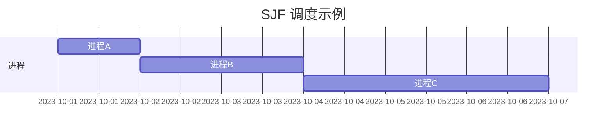
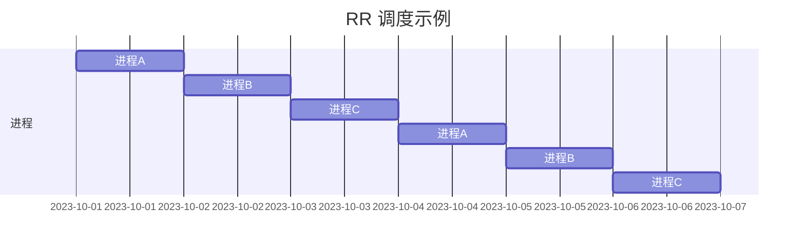

# 操作系统进程调度

## 介绍

在操作系统中，**进程调度**是指操作系统决定哪个进程可以访问 CPU 资源的过程。由于 CPU 是计算机的核心资源，操作系统需要高效地管理多个进程的竞争，以确保系统的高效运行和公平性。进程调度是操作系统的核心功能之一，它直接影响系统的性能、响应时间和资源利用率。

## 进程调度的基本概念

### 什么是进程？

进程是正在运行的程序的实例。每个进程都有自己的内存空间、寄存器和状态。操作系统通过进程调度来决定哪个进程可以占用 CPU 时间。

### 为什么需要进程调度？

在多任务操作系统中，多个进程可能同时竞争 CPU 资源。由于 CPU 一次只能执行一个进程的指令，操作系统需要通过调度算法来决定哪个进程可以运行，以及运行多长时间。进程调度的目标是最大化 CPU 利用率、减少响应时间，并确保公平性。

## 进程调度算法

操作系统使用多种调度算法来决定进程的执行顺序。以下是几种常见的调度算法：

### 1. 先来先服务（FCFS, First-Come, First-Served）

这是最简单的调度算法。进程按照它们到达的顺序依次执行。先到达的进程先执行，直到完成。

**优点**：实现简单，公平性较好。<br />
**缺点**：可能导致“饥饿”现象，即长进程占用 CPU 时间过长，短进程需要等待很久。


### 2. 最短作业优先（SJF, Shortest Job First）

SJF 算法选择预计运行时间最短的进程优先执行。这种算法可以最小化平均等待时间。

**优点**：平均等待时间较短。<br />
**缺点**：可能导致长进程“饥饿”，且需要预先知道进程的运行时间。



### 3. 时间片轮转（RR, Round Robin）

RR 算法为每个进程分配一个固定的时间片（time slice），当时间片用完后，操作系统将 CPU 分配给下一个进程。如果进程在时间片内未完成，它将被放回队列的末尾，等待下一次调度。

**优点**：公平性好，响应时间短。<br />
**缺点**：如果时间片设置不当，可能导致过多的上下文切换，降低系统效率。



### 4. 优先级调度（Priority Scheduling）

每个进程被赋予一个优先级，优先级高的进程优先执行。优先级可以是静态的（在进程创建时确定）或动态的（根据进程的行为动态调整）。

**优点**：可以根据进程的重要性进行调度。<br />
**缺点**：可能导致低优先级进程“饥饿”。


## 实际应用场景

### 1. 多任务操作系统

在 Windows、Linux 等操作系统中，进程调度是确保多个应用程序能够同时运行的关键。操作系统通过调度算法来决定哪个应用程序可以占用 CPU 时间，从而提供流畅的用户体验。

### 2. 实时系统

在实时系统中，进程调度需要确保关键任务能够在规定的时间内完成。例如，自动驾驶系统中的传感器数据处理任务必须优先执行，以确保车辆的安全。

### 3. 服务器负载均衡

在高负载的服务器环境中，进程调度算法可以帮助分配 CPU 资源，确保每个请求都能得到及时处理，避免某些请求长时间等待。

## 代码示例

以下是一个简单的 Python 示例，模拟了 FCFS 调度算法：

```python
# 进程类
class Process:
    def __init__(self, name, arrival_time, burst_time):
        self.name = name
        self.arrival_time = arrival_time
        self.burst_time = burst_time

# FCFS 调度算法
def fcfs_scheduling(processes):
    processes.sort(key=lambda x: x.arrival_time)  # 按到达时间排序
    current_time = 0
    for process in processes:
        print(f"进程 {process.name} 在时间 {current_time} 开始执行")
        current_time += process.burst_time
        print(f"进程 {process.name} 在时间 {current_time} 完成")

# 示例进程
processes = [
    Process("P1", 0, 5),
    Process("P2", 1, 3),
    Process("P3", 2, 8)
]

# 执行 FCFS 调度
fcfs_scheduling(processes)
```

**输出**：
```
进程 P1 在时间 0 开始执行
进程 P1 在时间 5 完成
进程 P2 在时间 5 开始执行
进程 P2 在时间 8 完成
进程 P3 在时间 8 开始执行
进程 P3 在时间 16 完成
```

## 总结

进程调度是操作系统的核心功能之一，它决定了多个进程如何共享 CPU 资源。不同的调度算法有不同的优缺点，适用于不同的应用场景。理解这些算法有助于我们更好地理解操作系统的工作原理，并在实际应用中做出合适的选择。

## 附加资源

- **书籍推荐**：
  - 《操作系统概念》（Operating System Concepts） by Abraham Silberschatz
  - 《现代操作系统》（Modern Operating Systems） by Andrew S. Tanenbaum

- **练习**：
  - 尝试实现 SJF 和 RR 调度算法，并比较它们的性能。
  - 思考在实时系统中，如何设计一个调度算法来确保关键任务的及时执行。