# 操作系统调度算法

在操作系统中，**调度算法**是决定哪个进程可以访问 CPU 的核心机制。由于 CPU 是计算机中最宝贵的资源之一，操作系统需要通过调度算法来高效地分配 CPU 时间，确保系统资源得到合理利用，同时满足用户的需求。

本文将介绍几种常见的调度算法，并通过代码示例和实际案例帮助你理解它们的原理和应用。

## 1. 调度算法的基本概念

调度算法的核心目标是决定哪个进程可以进入 CPU 执行。操作系统需要根据不同的策略来选择合适的进程，这些策略通常基于以下因素：

- **公平性**：确保每个进程都能获得一定的 CPU 时间。
- **效率**：最大化 CPU 利用率，减少空闲时间。
- **响应时间**：减少用户交互式任务的等待时间。
- **吞吐量**：在单位时间内完成尽可能多的任务。

接下来，我们将逐步介绍几种常见的调度算法。

---

## 2. 先来先服务调度算法（FCFS）

**先来先服务（First-Come, First-Served, FCFS）** 是最简单的调度算法。它按照进程到达的顺序分配 CPU 时间，先到达的进程先执行。

### 2.1 算法原理

- 进程按照到达时间排队。
- CPU 依次执行队列中的进程，直到当前进程完成。

### 2.2 示例

假设有三个进程，它们的到达时间和执行时间如下：

| 进程 | 到达时间 | 执行时间 |
|------|----------|----------|
| P1   | 0        | 5        |
| P2   | 1        | 3        |
| P3   | 2        | 8        |

使用 FCFS 算法，进程的执行顺序为：P1 → P2 → P3。

```mermaid
gantt
    title FCFS 调度算法示例
    dateFormat  X
    axisFormat %s
    section 进程
    P1 : 0, 5
    P2 : 5, 8
    P3 : 8, 16
```

### 2.3 优缺点

- **优点**：实现简单，易于理解。
- **缺点**：可能导致“护航效应”，即短任务需要等待长任务完成，导致平均等待时间较长。

---

## 3. 短作业优先调度算法（SJF）

**短作业优先（Shortest Job First, SJF）** 是一种非抢占式调度算法，它选择执行时间最短的进程优先执行。

### 3.1 算法原理

- 在所有就绪进程中，选择执行时间最短的进程。
- 如果多个进程的执行时间相同，则按照 FCFS 的顺序执行。

### 3.2 示例

使用与 FCFS 相同的进程数据：

| 进程 | 到达时间 | 执行时间 |
|------|----------|----------|
| P1   | 0        | 5        |
| P2   | 1        | 3        |
| P3   | 2        | 8        |

SJF 的执行顺序为：P1 → P2 → P3。

```mermaid
gantt
    title SJF 调度算法示例
    dateFormat  X
    axisFormat %s
    section 进程
    P1 : 0, 5
    P2 : 5, 8
    P3 : 8, 16
```

:::note
虽然 SJF 在这个例子中的执行顺序与 FCFS 相同，但在其他情况下，SJF 通常会减少平均等待时间。
:::

### 3.3 优缺点

- **优点**：可以最小化平均等待时间。
- **缺点**：可能导致长任务“饥饿”，即长任务可能永远得不到执行。

---

## 4. 时间片轮转调度算法（RR）

**时间片轮转（Round Robin, RR）** 是一种抢占式调度算法，它为每个进程分配一个固定的时间片（Time Slice），当时间片用完后，CPU 会切换到下一个进程。

### 4.1 算法原理

- 每个进程被分配一个固定的时间片。
- 当时间片用完时，进程被放到队列的末尾，CPU 切换到下一个进程。

### 4.2 示例

假设时间片为 2，进程数据如下：

| 进程 | 到达时间 | 执行时间 |
|------|----------|----------|
| P1   | 0        | 5        |
| P2   | 1        | 3        |
| P3   | 2        | 8        |

RR 的执行顺序为：P1 → P2 → P3 → P1 → P2 → P3 → P3 → P3。

```mermaid
gantt
    title RR 调度算法示例（时间片=2）
    dateFormat  X
    axisFormat %s
    section 进程
    P1 : 0, 2
    P2 : 2, 4
    P3 : 4, 6
    P1 : 6, 8
    P2 : 8, 9
    P3 : 9, 11
    P3 : 11, 13
    P3 : 13, 16
```

### 4.3 优缺点

- **优点**：公平性高，适合交互式系统。
- **缺点**：如果时间片设置不当，可能导致过多的上下文切换，降低效率。

---

## 5. 实际应用场景

调度算法在操作系统中有着广泛的应用。例如：

- **FCFS**：适用于批处理系统，如打印任务队列。
- **SJF**：适用于任务执行时间已知的场景，如科学计算。
- **RR**：适用于交互式系统，如桌面操作系统。

---

## 6. 总结

调度算法是操作系统的核心组成部分，它决定了 CPU 资源的分配方式。本文介绍了三种常见的调度算法：FCFS、SJF 和 RR。每种算法都有其优缺点，适用于不同的场景。

:::tip
如果你想进一步学习，可以尝试实现这些调度算法，并比较它们在不同场景下的性能。
:::

---

## 7. 附加资源与练习

- **练习 1**：编写一个简单的程序，模拟 FCFS 调度算法。
- **练习 2**：修改练习 1 的程序，实现 SJF 和 RR 算法。
- **资源推荐**：阅读《操作系统概念》一书，深入了解调度算法的更多细节。

通过本文的学习，你应该对操作系统调度算法有了初步的了解。继续实践和探索，你将掌握更多高级调度算法的知识！